<div align="center">

# Pelagic

**Real-Time Procedural Jellyfish, Soft-Body Animation, Underwater Optics, and Interactive Liquid Glass in Three.js**

**Mani Marami Milani**

[Live Demo](https://denoax.github.io/pelagic-jellyfish-webgl/) · [Technical Overview](#technical-overview) · [Reproduce](#reproducibility) · [Cite](#citation)

</div>


*Four excerpts from the existing approved-runtime recordings, edited in that order; not one continuous camera take. All motion on this page is actual browser output. Diagrams are labeled separately.*

## Abstract

Real-time organism scenes become difficult to maintain when anatomy, motion,
environmental effects, camera control and interface optics evolve as unrelated
demonstrations. Pelagic is a browser-based rendering study that connects these
systems while preserving an art-directed jellyfish identity. Its implementation
combines a procedural mantle and folded oral membranes, pulse-coupled locomotion,
persistent constrained appendages, bounded world-space currents, projected-size
population detail, and an input-driven six-degree-of-freedom camera journey.
A shared optical compositor samples one live ocean image for refractive bubbles,
localized thermal shimmer and an interactive liquid clock. The clock combines
authored implicit-surface choreography with a low-resolution persistent
spring/advection field. This paper describes the actual Three.js 0.175.0
implementation, distinguishes code-equivalent equations from abstractions and
artistic heuristics, and links the methods to reproducible source locations.
The accompanying artifact includes browser motion evidence, deterministic tests,
historical rejected approaches and fresh frame-interval measurements of the
approved runtime. The work is a systems and visual-engineering study, not a
fluid–structure interaction model, calibrated biological simulation or claim of
algorithmic priority. Image-space optics cannot recover unseen radiance; liquid
topology is not mass-conserving; performance and compatibility evidence remain
specific to the tested hardware and backend.

## System at a glance

| Layer | Implementation | Evidence |
| --- | --- | --- |
| Organism | Procedural bell/folded arms, pulse-coupled velocity, persistent constrained chains | Geometry and motion below |
| Water/population | Bounded current/wakes, layered snow, projected-size detail | Field equations and LOD thresholds |
| Observer | Accepted M5.2 bounded progress → baked position/quaternion; four tracks and Explore | Camera method below |
| Optics | One clean live ocean color/depth source; world bubbles, thermal domains and screen-space liquid | Shared compositor and optical limits |
| Runtime | Approved M7 bce3571b0300ecfe5dc6e5dd45f28a9cda57006e; Three.js 0.175.0 | Immutable source links and byte guard |
| Measurement | Actual NVIDIA WebGL2, 1280×900, DPR 1, bloom off | Seven retained capture-free runs |

**README.md is the publication.** No separate paper website is required. The live release includes Mani's approved **Asset2 background** (`b4ca42faa3b80e465d39995ebb0537a2aa948148`) with production safeguards that hide review controls. This publication's equations, captures and measurements remain pinned to the M7 runtime above; they are not measurements of the newer environment. See the [Asset2 implementation report](docs/implementation/asset2-background/REPORT.md) for its separate visual comparisons, performance results and explicitly unmet numerical targets, and the [release record](docs/readme/ASSET2_RELEASE.md) for integration details.

## Contributions

These are contributions of the implementation and documentation, not claims that the component techniques were invented here.

1. **A continuous procedural animal.** Bell, rim, folded oral membranes and reconstructed tentacles preserve a coordinated identity through contraction, recovery, turning and changing scale. Geometry contracts remain distinct from the controller moving the animal.
2. **Persistent appendage history.** Stateful chains carry inertia through body transforms instead of resetting to a fresh wobble each frame. Their constrained points feed both sheets and tubes. Detail transitions reuse that state.
3. **A connected, bounded environment.** Marine snow, localized pulse wakes, activation and neighbor response share world-space current information. Pools and finite lifetimes make the response temporary rather than a permanent halo.
4. **Population detail with hysteresis.** Projected bell diameter chooses near, medium and far representations. Persistent resources and adjacent-tier morphing separate visual importance from resource lifetime, avoiding repeated geometry creation at thresholds.
5. **One clean live ocean for multiple optical effects.** Bubbles, thermal shimmer and liquid-clock output sample the same source image. The compositor neither recursively reads its own output nor maintains a duplicate ocean.
6. **A documented ocean-to-glass transition.** Authored implicit contact, merging and pinch choreography combines with a small persistent displacement field. Browser motion, code-mapped mathematics and explicit optical limits make the method inspectable.

## Contents

- [Technical overview](#technical-overview)
- [Mathematical notation](#mathematical-notation)
- [1. Procedural jellyfish geometry](#1-procedural-jellyfish-geometry)
- [2. Bell deformation, rowing cycle, and locomotion](#2-bell-deformation-rowing-cycle-and-locomotion)
- [3. Soft-body appendage dynamics](#3-soft-body-appendage-dynamics)
- [4. Tissue optics and bioluminescence](#4-tissue-optics-and-bioluminescence)
- [5. Connected ocean current and wake field](#5-connected-ocean-current-and-wake-field)
- [6. Population and screen-space LOD](#6-population-and-screen-space-lod)
- [7. Camera as a one-parameter journey](#7-camera-as-a-one-parameter-journey)
- [8. Live refraction and bubble passage](#8-live-refraction-and-bubble-passage)
- [9. Abyssal hydrothermal sanctuary](#9-abyssal-hydrothermal-sanctuary)
- [10. Ocean-to-glass liquid system](#10-ocean-to-glass-liquid-system)
- [Numerical robustness](#numerical-robustness)
- [Rendering architecture](#rendering-architecture)
- [Engineering ablations / failed approaches](#engineering-ablations--failed-approaches)
- [Performance](#performance)
- [Validation](#validation)
- [Reproducibility](#reproducibility)
- [Limitations](#limitations)
- [Technical stack](#technical-stack)
- [Repository map](#repository-map)
- [References](#references)
- [Citation](#citation)
- [Licensing and asset provenance](#licensing-and-asset-provenance)

## Technical overview

Pelagic presents a quiet underwater scene rather than a conventional portfolio
of interface panels. Jellyfish move through open water, an input-driven camera
visits several compositions, a brief bubble passage bends the live image, and a
deep basalt sanctuary supplies a different scale of environmental detail.
After inactivity, the same moving ocean becomes the source image for a liquid
clock. These changes create a useful engineering problem: the visual identity
must survive changes in scale, orientation, detail level and optical treatment.

A compelling still is insufficient. A rim can look continuous at rest yet break
under contraction. A membrane may resemble tissue from the front but reveal a
flat strip underneath. A distant animal can have a smooth silhouette while its
appendages rotate rigidly with its body. A transparent clock can look luminous
without bending anything beneath it. Pelagic's development therefore relied on
controlled motion checks as well as attractive views. The inline motion previews separate behaviors that a still cannot prove.

The publication has a narrower claim than the ambition of the artwork. It
documents one implemented system and its tradeoffs. It does not compare itself
numerically with unrelated graphics demos, report user-study outcomes, or infer
physical fidelity from resemblance. The authoritative runtime is commit
`bce3571b0300ecfe5dc6e5dd45f28a9cda57006e`. Publication commits add explanation,
measurement and packaging without changing that artwork. An unapproved later
background experiment is discussed only as historical negative evidence below.

The biological literature distinguishes mechanisms that a stylized animation
can easily collapse into a single sinusoid. Costello and colleagues review
jellyfish swimming across morphological and hydrodynamic regimes
[Costello et al. (2021)](#ref-costello2021). Gemmell and colleagues describe passive energy recapture during
refill [Gemmell et al. (2013)](#ref-gemmell2013). These sources motivate a distinction between contraction,
recovery and coast. Pelagic does not reproduce their experimental apparatus,
pressure fields, efficiency measurements or species-specific kinematics. Its
secondary thrust is an authored temporal signal, not an estimate of recovered
energy.

Position-based dynamics provides relevant context for correcting geometric
constraints after a prediction step [Müller et al. (2007)](#ref-muller2007). Pelagic's appendages use
previous positions, damping and repeated length projection. They do not implement
the complete general method, derive compliance from tissue measurements, or
solve a coupled elastic volume. A small oral-spine separation operation is a
visual contact heuristic, not a comprehensive self-collision system.

Blinn's implicit surfaces establish the usefulness of summing smooth density
functions to form connected shapes [Blinn (1982)](#ref-blinn1982). Pelagic applies additive
implicit contributions to a two-dimensional clock field. No three-dimensional
isosurface is extracted, and the apparent liquid volume is not conserved.
Image-space refraction work, including Wyman's two-interface approximation
[Wyman (2005)](#ref-wyman2005), supplies a useful conceptual boundary: plausible optical images can
be produced without complete scene transport, but missing image information
remains missing. Pelagic solves analytic ellipsoid interfaces and samples its
current ocean image; it is not a reproduction of Wyman's entire pipeline.

The software foundation includes an adapted MIT-licensed Aurelia scene
[Aurelia](#ref-aurelia) and the pinned Three.js renderer [Three.js r175](#ref-three175). FluidGlass was studied
as an interaction reference [FluidGlass](#ref-fluidglass), not copied as source, shader, layout
or media. These implementation and design references are not scientific
validation. Third-party provenance and retained notices accompany the artifact.

## Mathematical notation

World coordinates are right-handed with Y up. The bell-first animal axis is
local +Y, with X/Z spanning the rim. Appendage positions are animal-local, but
their previous state is transported to preserve world-relative lag. Camera
view direction is −Z. Output UV is top-origin; the projection code explicitly
inverts clip Y. Canvas clock-mask sampling performs its own Y inversion.

Time is in seconds, except normalized pulse phase $q$ and journey progress $s$.
World lengths are artistic units, not meters. $h$ denotes a fixed simulation
step. The mantle uses latitude parameter $\tau$ and azimuth $\theta$; $u$ is a
transverse membrane coordinate. $S(x)$ denotes cubic smoothstep after clamping
$x$ to $[0,1]$. The compact table below summarizes recurring symbols; each method defines its local variables.

An equation labeled **CODE-EQUIVALENT** matches the stated source subexpression,
including its constants. It need not describe every surrounding branch. A
**CONTINUOUS ABSTRACTION** summarizes an algorithm without claiming bitwise
equivalence. An **ART-DIRECTION HEURISTIC** expresses a designed relationship,
not a physical inference. These labels describe different questions from
correctness: an exact transcription can still be physically approximate.
Pinned source links accompany each method; the retained [source map](paper/source-map.md) records all 22 equation groups.

| Symbol | Meaning / units |
| --- | --- |
| `t` | Simulation time in seconds, unless explicitly a local surface parameter |
| `h` | Fixed integration interval in seconds |
| `s` | Bounded camera journey progress, dimensionless, 0–1 |
| `q` | Normalized pulse phase, dimensionless, periodic 0–1 |
| `τ, θ` | Mantle latitude parameter and azimuth angle (radians) |
| `u,v` | Texture/screen coordinates; each equation states its origin/convention |
| `x_i, x_i^-` | Current and previous local appendage point positions |
| `r` | Chain rest-segment length in the appendage projection; local units |
| `U(X,t)` | World-space current vector, authored world units per second |
| `R,H` | Bell radius/height in animal-local units after pulse scaling |
| `D` | Projected bell diameter in CSS pixels |
| `d` | Continuous LOD detail, 0 far through 2 near |
| `F(u,v)` | Implicit liquid thickness mask, dimensionless artistic field |
| `V,Δ` | Persistent idle field velocity/displacement in screen-UV coordinates |
| `C(u,v)` | Current clean ocean linear-RGB image |
| `η` | Authored relative refractive-index ratio |

Local letters are reused between methods, not implicitly shared state: appendage $x_i^-$ is a previous position; optical $D$ may be a ray; idle $D$ is displacement. A superscript $+$ or prime means the next update, not a derivative. $S_{a,b}(x)=S((x-a)/(b-a))$ uses the same clamped cubic smoothstep. Numerical coefficients carry the artistic scale of their stated coordinates; they are not SI material constants.

## 1. Procedural jellyfish geometry

### Mantle and root continuity

The bell and rim share `mantlePoint`. Let $R,H$ be pulse-adjusted radius and
height, $p$ the bell contraction, $L$ the lobe count, $y_r$ the rim offset and
$m_r$ the margin-roll signal. Let $c_x,c_y$ be the two-component local surface
current. With $m=\tau^5$ and $f=\cos(L\theta)$, equation (1) is
**CODE-EQUIVALENT**:

$$
\begin{aligned}
\rho&=\sin(\pi\tau/2)R(1-0.07pm)(1+0.012fm),\\
x&=\cos\theta\,\rho+0.08c_x\tau^2,\\
y&=\cos(\pi\tau/2)H+y_r\tau^2+m(0.014f+0.04m_r),\\
z&=\sin\theta\,\rho+0.08c_y\tau^2.
\end{aligned}
$$

$\tau=0$ is the apex; $\tau=1$ is the equatorial region; the surface extends
to a softly rolled margin near $1.12$. Rim tentacles attach at $1.1$ on this
same function. This avoids tuning disconnected rim geometry against the bell.
Periodicity in $\theta$ is maintained while the bell contracts. Seam normals
and fractional-power domains require separate numerical care: a valid surface
does not prevent a shader NaN from appearing as a black seam.

### Folded oral membranes

An oral arm is not merely a wide line. Its simulated spine carries a transverse
folded section with narrowed insertion and rounded tip. For normalized length
$t\in[0,1]$, transverse $u\in[-1,1]$, arm index $a$, and animation phase
$\phi$, equation (2) is **CODE-EQUIVALENT**:

$$
\begin{aligned}
w&=(0.055+0.32\sin(\pi t)^{0.65})\sqrt{\max(0,1-t^8)},\\
b&=uw[1+0.20|u|\sin(30t-a)],\\
f&=[\sin(2\pi u+7t+a)-\sin(7t+a)]\,0.30w\\
 &\quad+0.32w|u|^2\sin(30t+2u-a)
 +0.04w|u|\sin(22t-0.8a-0.42\phi).
\end{aligned}
$$

The section is reconstructed in a frame along the spine. The subtraction in
the first fold term keeps the central spine on its simulated centerline.
Free-edge terms add folding without moving the whole arm as an independent
object. The procedure remains a surface approximation: intersections can occur
because folded sheets have no volumetric collision solver.

Figure 1 plots the mantle profile and transverse membrane sections directly from these functions.

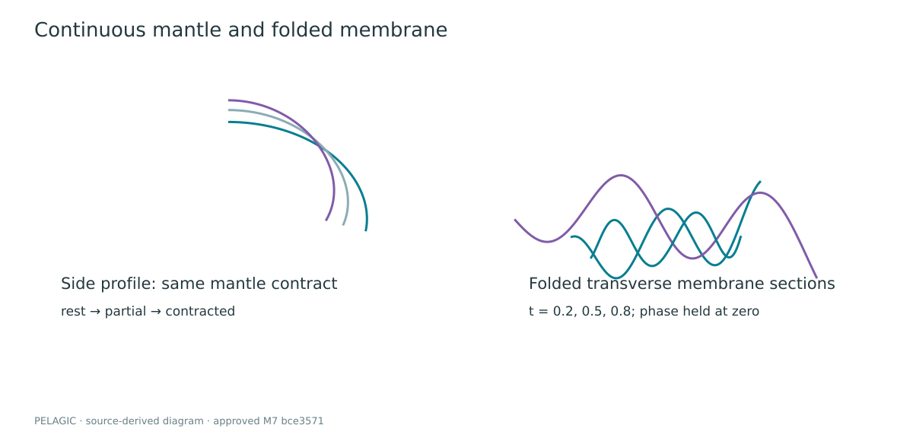

Here the surface outputs and $R,H,y_r$ use animal-local world units. Latitude, contraction, lobe phase and local current controls are dimensionless/art-scaled inputs; azimuth is radians. In the membrane equation $b$ is the sideways offset and $f$ the fold offset in the transported section frame; its $t$ is normalized arm length, not seconds.

**Source:** [mantle.js](https://github.com/Denoax/pelagic-jellyfish-webgl/blob/bce3571b0300ecfe5dc6e5dd45f28a9cda57006e/src/scene/anatomy/mantle.js#L4-L54).

## 2. Bell deformation, rowing cycle, and locomotion

The normalized swim phase wraps continuously. Contraction occupies the first
0.20 of the cycle, refill continues to 0.68, and the remaining interval is a
coast. Equation (3), **CODE-EQUIVALENT**, defines contraction magnitude:

$$
p(q)=\begin{cases}
S(q/0.20),&q<0.20,\\
1-[S((q-0.20)/0.48)]^{1.42},&0.20\le q<0.68,\\
0,&q\ge0.68.
\end{cases}
$$

Define a window $W(q;a,b)=\sin^2[\pi(q-a)/(b-a)]$ strictly inside $(a,b)$
and zero elsewhere. Equation (4), **CODE-EQUIVALENT**, gives primary thrust
$T_1$, secondary thrust $T_2$, and margin roll $m_r$:

$$
\begin{aligned}
T_1&=W(q;0.025,0.215),\quad T_2=W(q;0.57,0.82),\\
m_r&=0.78T_1-0.52W(q;0.22,0.66).
\end{aligned}
$$

The same state reaches geometry and locomotion. It produces a temporal
relationship, not a claim of measured pressure. Activation adds an integrated
response through the existing tissue state rather than creating a replacement
animal. Figure 2 plots the exact signals; the retained S1 master shows several cycles without converting timing into a still-image claim.

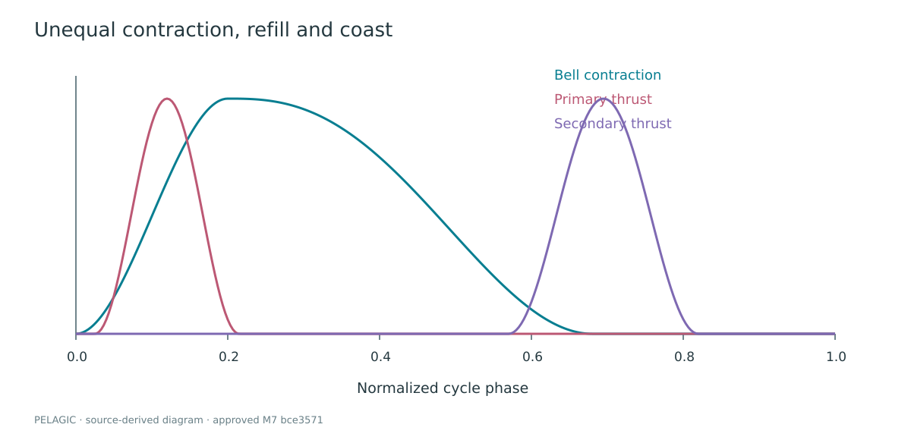

Each main-route animal has a desired location derived from an authored path
plus slow current-like variation. Its position is integrated from velocity;
it is not simply placed on that desired point each frame. The direction blends
toward the route with a contraction-dependent gain. In equation (5),
**CODE-EQUIVALENT** for the velocity core, $\hat d$ is the updated swimming
direction, $e=X_{desired}-X$, $k=\min(0.42,0.075+0.045\|e\|)$,
$a=(0.72+0.28\,scale)\,motionScale$, and $c$ is the two-dimensional current:

$$
\begin{aligned}
V^*&=V+h[(2.35T_1+0.58T_2)a\hat d+ke
          +0.095\,motionScale(c_x,0,c_y)],\\
V^+&=\operatorname{cap}_{v_{max}}\{V^*e^{-h(0.24+0.22\,refill-0.08\,coast)}\},\\
X^+&=X+hV^+.
\end{aligned}
$$

The cap is $v_{max}=0.92+0.42\,drift$. A separate soft composition correction
engages when route error exceeds 4.2 world units; excluding it would overstate
the purity of propulsion-driven travel. Orientation follows velocity with a
pulse-dependent quaternion blend. No calibrated body drag or added-mass model
is implied by the exponential factor.

For pairs of visible main-route animals, equation (6), **CODE-EQUIVALENT**, adds
opposite desired-position corrections when $d<d_{safe}$:

$$
C_{ij}=0.44(1-d/d_{safe})\frac{X_{desired,i}-X_{desired,j}}{d},
\qquad d_{safe}=1.05+0.55(scale_i+scale_j).
$$

Distance is clamped below at 0.001. This steers desired routes apart; it does
not resolve collisions between all membranes or represent a general schooling
model. The distant route source has its own established motion history; the
population adapter shares rendering quality, not a newly unified route solver.

**Algorithm 1 — animal update (structural pseudocode).**

```text
evaluate authored desired route and bounded drift
accumulate pairwise desired-route separation
sample contraction/refill/coast state
turn swimming direction toward desired route
integrate pulse thrust, weak tether and current into velocity
apply drag and speed cap; integrate position
apply exceptional soft composition guard if far outside route
orient bell-first axis toward velocity; preserve physical scale
publish pose and pulse for tissue and environmental observers
```

In equations (3)–(6), $T_1,T_2,refill,coast,drift,motionScale$ are dimensionless authored controls; $scale$ is animal scale. $X,V,e,C_{ij}$ are world position, velocity, route error and route correction, respectively; $h$ is seconds. The distance $d$ in pair separation is between desired positions. Neither that correction nor the soft route tether is a measured hydrodynamic force.

**Source:** [jellyMotion.js](https://github.com/Denoax/pelagic-jellyfish-webgl/blob/bce3571b0300ecfe5dc6e5dd45f28a9cda57006e/src/scene/jellyMotion.js#L10-L58) · [JellySchoolDirector.js](https://github.com/Denoax/pelagic-jellyfish-webgl/blob/bce3571b0300ecfe5dc6e5dd45f28a9cda57006e/src/scene/JellySchoolDirector.js#L209-L275).

## 3. Soft-body appendage dynamics

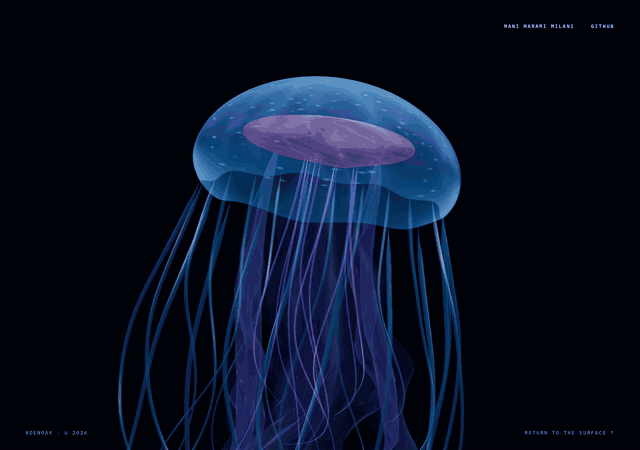

*S2 excerpt, seven seconds at original speed. The change is remembered motion, not a freshly posed ribbon each frame.*

The appendage history is meaningful only if it survives body movement. Before
local simulation, current and previous points are rotated by the change from
the previous body frame and translated by the same inverse body displacement.
Applying a different transport to previous state would inject spurious velocity.
Large discontinuous body displacements are guarded instead of replayed as a
violent chain impulse.

Equation (7) is **CODE-EQUIVALENT** for prediction. With $\sigma$ the bounded
frame scale and $d_0=0.955$ for arms or $0.968$ for tentacles,

$$
\widetilde x_i=x_i+d_0^{\sigma}(x_i-x_i^-)+g_i+c_i+e_i+r_i.
$$

The named increments are not a single physically measured acceleration:
$g_i$ is downward bias proportional to $\sigma^2$; $c_i$ is current displacement
proportional to longitudinal $t_i^2\sigma^2$; $e_i$ is bounded traveling flow;
$r_i$ is a localized pointer repulsion. The approved path uses $h=1/60$, giving
$\sigma=1$ during fixed simulation steps. Replacing these mixed increments by
an unexplained $h^2F$ would misstate the implementation.

Roots are reattached during projection. For segment vector $\delta=x_i-x_{i-1}$,
$\ell=\max(10^{-4},\|\delta\|)$ and rest length $r$, equation (8),
**CODE-EQUIVALENT**, is

$$
\epsilon=(\ell-r)/\ell,\qquad
x_{i-1}\leftarrow x_{i-1}+0.46\epsilon\delta,\quad
x_i\leftarrow x_i-0.54\epsilon\delta.
$$

The first free point instead receives the full correction because its parent
is fixed. Arms use five iterations, tentacles four. Three oral-spine separation
passes inspect neighboring longitudinal samples and apply the same bounded
correction to both Verlet histories. This reduces some oblique crossings
without adding artificial propulsion; it is not sheet-sheet collision.

Visible tubes use frames transported along the chains. Folded arm surfaces use
the simulated centerline, not independent animation transforms. Normal refresh
and deformation scheduling depend on significance; detail transitions resample
the same state. S2 shows turning and lag. Figure 3 distinguishes state from
reconstructed surface so a smooth mesh is not mistaken for a denser solver.

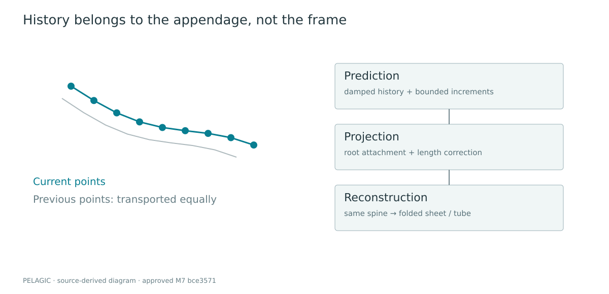

**Algorithm 2 — appendage step.**

```text
transport both position histories into the current animal frame
accumulate bounded time; take fixed tissue steps
for each active chain:
    attach root to approved anatomy
    predict free points from damped history and authored increments
    repeat length projection; reattach root
separate nearby oral spines, correcting both histories equally
resample existing chains at the visible detail level
reconstruct folded membranes and tapered tubes; refresh needed normals
```

All chain positions, rest lengths and named prediction increments are in the transported animal-local frame; damping $d_0$ and frame scale $\sigma$ are dimensionless. Here $r_i$ denotes the pointer increment, whereas the scalar $r$ in the projection is rest length. The notation is local to these two expressions.

**Source:** [LivingAppendages.js](https://github.com/Denoax/pelagic-jellyfish-webgl/blob/bce3571b0300ecfe5dc6e5dd45f28a9cda57006e/src/scene/LivingAppendages.js#L888-L948) · [mantle.js](https://github.com/Denoax/pelagic-jellyfish-webgl/blob/bce3571b0300ecfe5dc6e5dd45f28a9cda57006e/src/scene/anatomy/mantle.js#L35-L54).

## 4. Tissue optics and bioluminescence

The bell uses `MeshPhysicalNodeMaterial`, but its translucent identity is an
explicit approximation. The material sets transmission to zero: it does not
refract the ocean framebuffer. Anatomical thickness, facing and absorption
control alpha, pigmentation and roughness. This distinction matters because a
living-looking bell is not evidence of physical subsurface transport.

For clamped UV latitude $v$, let $K$ be the canal mask and
$f=\max(0.24,|n_v\cdot v_{eye}|)$. Equation (9), **CODE-EQUIVALENT** for the
bell path, is

$$
\begin{aligned}
d_t&=0.30(1-v)^{1.4}+0.04+0.20K\max(0,\sin\pi v),\\
A&=1-e^{-1.7d_t/f},\\
\alpha&=\operatorname{clamp}_{[0.025,0.62]}
 [(0.40A+0.08)\,opacity/0.58].
\end{aligned}
$$

The membrane branch uses a different thickness/edge profile. UV clamps protect
fractional powers against tiny interpolation overshoots. This is an important
example of a defect that could resemble geometry segmentation while originating
in material evaluation.

A seeded 512×256 data texture stores soft mottling, canal structure and sparse
luminous cells in separate channels. It includes 112 seeded cell marks and
matching seam texels, with mipmapping for distance. Emission has a hierarchy:
soft tissue, brighter rim, pink/violet internal accents and restrained speckles.
A broad analytic environment lobe provides a moving highlight as normals turn.
Bloom is not used to construct the animal; the inherited bloom chain is off.

The colors are art direction, not species spectroscopy. Double-sided alpha
surfaces can still sort imperfectly when they overlap. Tissue thickness here
is a shading profile, not the distance between a watertight inner and outer
shell. These limits remain visible in close inspection and are not hidden by
calling the material physically accurate.

Here $n_v$ and $v_{eye}$ are normalized view-space normal and eye direction. $d_t$ is dimensionless artistic optical thickness; $A$ is an absorption weight, $\alpha$ the alpha coefficient, and $opacity$ a material control. The exponential is Beer–Lambert-inspired, not a calibrated spectral extinction law.

**Source:** [JellyTissue.js](https://github.com/Denoax/pelagic-jellyfish-webgl/blob/bce3571b0300ecfe5dc6e5dd45f28a9cda57006e/src/scene/materials/JellyTissue.js#L17-L39).

## 5. Connected ocean current and wake field

The current system is inexpensive enough to sample for multiple CPU particle
systems. Let $t'=0.075t$. Equation (10), **CODE-EQUIVALENT**, defines ambient flow:

$$
\begin{aligned}
U_x&=0.055+0.085\sin(0.21y+t')+0.045\cos(0.17z-t'),\\
U_y&=0.025+0.055\sin(0.19z+0.7t')+0.035\cos(0.18x+t'),\\
U_z&=0.07\sin(0.20x-0.8t')+0.04\cos(0.23y+t').
\end{aligned}
$$

Each component is independent of its own coordinate, so this ambient expression
has zero divergence analytically. The complete field does not inherit that
guarantee: localized envelopes and the final velocity cap alter it.

For wake age $a$, lifetime $L$, source axis $\hat b$, offset $r=X-X_e$, initial
radius $R_0$ and strength $k$, set $R=R_0(1+0.08a)$ and $d^2=\|r\|^2/R^2$.
Equation (11), **CODE-EQUIVALENT**, applies inside $d^2<4$:

$$
E=S(1-d^2/4)^2S(a/0.3)S((L-a)/3)k,
\qquad \Delta U=0.31E(\hat b\times r)/R-0.23E\hat b.
$$

There are 32 wake slots and eight activation slots. Wake emission observes an
actual rising pulse threshold and bounded animal speed; it does not attach a
permanent cloud to the body. Events drift downstream, expand modestly and die.
Repeated activation is rate-limited per source, and a single delayed neighbor
response is non-recursive. The adapter observes approved animal state rather
than retuning its physics.

Marine snow uses three world-space layers: 64 near, 320 mid and 400 distant
particles on desktop, with distinct size, opacity, extent and near-distance
envelopes. Particle motion samples the common field plus a small settling bias.
Recycling occurs beyond a zero-opacity boundary and fades back in. A separate
bounded fleck pool follows the same field. S3 shows the local activation
response and decay; sparse highlights must remain subordinate to the animals.

Ambient $(x,y,z)$ and wake $X,X_e,r,R,R_0$ are world coordinates/lengths; $t,a,L$ are seconds, $\hat b$ is a unit world axis, and $k,E$ are bounded authored weights. The field supplies artist-scaled world-unit velocity to its observers, not a conserved momentum density.

**Source:** [CurrentField.js](https://github.com/Denoax/pelagic-jellyfish-webgl/blob/bce3571b0300ecfe5dc6e5dd45f28a9cda57006e/src/scene/ocean/CurrentField.js#L17-L79) · [ConnectedOcean.js](https://github.com/Denoax/pelagic-jellyfish-webgl/blob/bce3571b0300ecfe5dc6e5dd45f28a9cda57006e/src/scene/ocean/ConnectedOcean.js) · [OceanSnow.js](https://github.com/Denoax/pelagic-jellyfish-webgl/blob/bce3571b0300ecfe5dc6e5dd45f28a9cda57006e/src/scene/ocean/OceanSnow.js).

## 6. Population and screen-space LOD

Detail follows CSS-pixel bell diameter, not animal identity or drawing-buffer
DPR. For radius $R$, positive view depth $z$, viewport height $H$, camera zoom
$Z$ and vertical field of view $f$, equation (12), **CODE-EQUIVALENT**, is

$$
D=\min\left(8H,\frac{RHZ}{\max(R/4,z)\tan(f\pi/360)}\right),\qquad
d^+=d+\operatorname{sgn}(k-d)\min(|k-d|,\min(h,0.05)/1.2).
$$

Invalid inputs return zero coverage; the second expression advances continuous
detail toward integer target tier $k$, with no hidden-tab debt. Table 1 records
the hysteresis. Conservative bounds include appendages when the bell is clipped.

**Table 1. Selected source constants, not measured biological parameters.**

| Quantity | Value | Meaning |
| --- | --- | --- |
| Near promotion / retention | 110 / 90 CSS px | avoids repeated threshold toggling |
| Medium promotion / retention | 32 / 24 CSS px | same hysteresis principle |
| Interaction coverage | 24 CSS px | plus visibility and presence >0.15 |
| Adjacent detail travel | 1.2 s | reversible geometric transition |
| Tissue / current / idle field step | 1/60 s | distinct subsystem accumulators |
| Journey step | 1/240 s | bounded input follower |
| Wake / activation lifetime | 5.8 / 6.4 s | finite disturbance ownership |
| Optical heroes / ambient bubbles | 5 / 384 | not 389 full refraction evaluations |
| Idle field long dimension | 256 samples | each dimension at least 64 |

Lower levels resample the same mantle and persistent oral spines. Resources
and tube indices are prepared in advance. During a transition, neighboring
surface samples morph geometrically; this is not two complete transparent
animals alpha-crossfading. Selected tentacles taper in by weight, with dormant
histories seeded from a live neighboring strand. Near uses the approved
implementation. Offscreen surface reconstruction is skipped while state needed
for return is preserved.

Figure 4 connects the threshold policy to recorded population assignments at three journey positions.

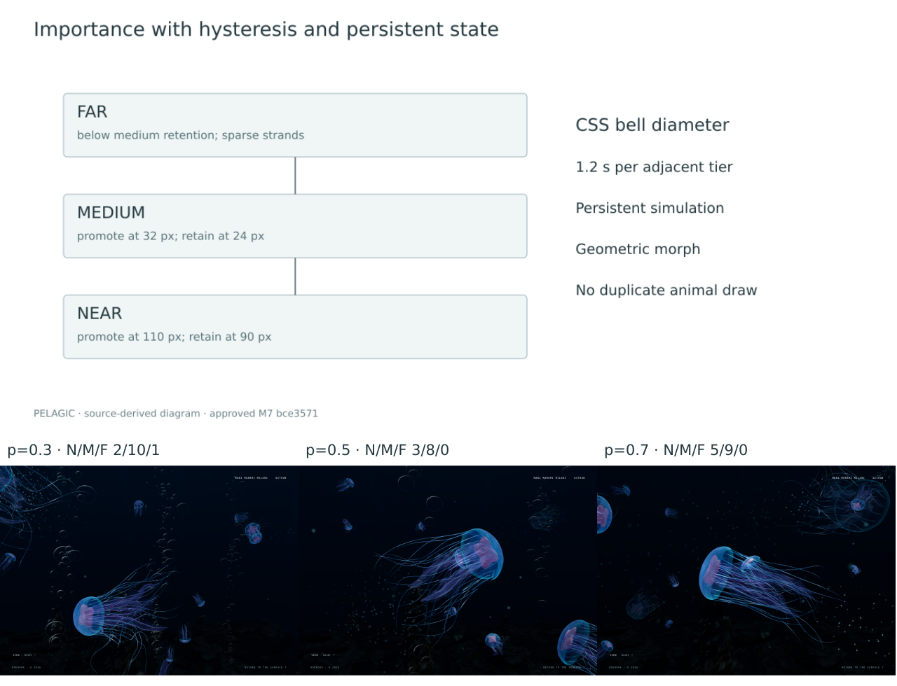

**Algorithm 3 — importance detail.**

```text
read existing main and distant route poses
test conservative animal bounds against camera frustum
compute CSS bell diameter; choose hysteretic target tier
advance continuous detail without pause debt
reuse persistent spines; sample adjacent prepared surface levels
morph geometry and strand widths, not two full animal renderings
assign finite light/fleck resources by visible importance
retain normal activation eligibility and approved near presentation
```

$R$ in the projection includes animal world scale; $z$ is positive view depth. $H,D$ are CSS pixels, $Z$ is dimensionless zoom and $f$ is degrees. $d,k$ are detail coordinates (far 0, medium 1, near 2); the transition time uses seconds. Fixed per-ID quality allocation would leave a large distant-route animal crude merely because of its ID. The adopted importance adapter avoids that failure without replacing either route source.

**Source:** [Importance.js](https://github.com/Denoax/pelagic-jellyfish-webgl/blob/bce3571b0300ecfe5dc6e5dd45f28a9cda57006e/src/scene/population/Importance.js#L4-L30) · [PopulationDetail.js](https://github.com/Denoax/pelagic-jellyfish-webgl/blob/bce3571b0300ecfe5dc6e5dd45f28a9cda57006e/src/scene/population/PopulationDetail.js) · [PopulationAnimal.js](https://github.com/Denoax/pelagic-jellyfish-webgl/blob/bce3571b0300ecfe5dc6e5dd45f28a9cda57006e/src/scene/population/PopulationAnimal.js).

## 7. Camera as a one-parameter journey

The camera is input-driven. Wheel line/page units normalize to CSS-pixel intent;
touch and keyboard inputs reach the same bounded follower. Opposite intent
cancels queued travel without teleporting the camera. No production autoplay
advances the journey when the visitor stops.

With progress error $e=s_{target}-s$, gain $g$, speed bound $v_m=0.14$,
acceleration bound $a_m=1.4$ and $h=1/240$, equation (13),
**CODE-EQUIVALENT**, is

$$
\begin{aligned}
v_d&=\operatorname{sgn}(e)\min[v_m\tanh(g|e|),\sqrt{2a_m|e|}],\\
v^+&=v+\operatorname{clamp}(v_d-v,-a_mh,a_mh),\\
s^+&=s+hv^+.
\end{aligned}
$$

The target stays at most 0.075 ahead/behind progress and within $[0,1]$.
Balanced gain is 72; cinematic/responsive use 52/92. Tiny residual motion snaps
to exact rest only within the allowed braking step. A legacy `ProgressSpring`
class remains in source but does not define current production travel.

Each view bakes 1,201 poses. For a scalar coordinate over one authored segment,
let $p$ be the starting value, $\Delta$ its difference, and $m,n$ the endpoint
tangents multiplied by segment span. Equation (14), **CODE-EQUIVALENT**, is

$$
P(t)=p+mt+(10\Delta-6m-4n)t^3
 +(-15\Delta+8m+7n)t^4+(6\Delta-3m-3n)t^5.
$$

Interior tangents use a monotone harmonic construction; endpoint tangents are
zero. Authoring angles unwrap before conversion to hemisphere-continuous
quaternions. Runtime sampling linearly interpolates position and spherically
interpolates quaternion. Thus the authoring polynomial is smooth, while the
finite sampled playback is an approximation to it—not an analytic continuous
quaternion spline.

Documentary, Drift, Intimate and Deep expose different authored tracks. Explore
temporarily gives the visitor observer control without rebuilding the ocean.
Idle holds the observer and journey while animals continue moving. S6 shows
view changes and Explore; this method does not reinterpret those controls as
simulation steering or a new camera design.

In equation (13), $s,e$ are dimensionless progress, $v$ progress/second, and $a_m$ progress/second². The baked polynomial uses segment-local $t\in[0,1]$, not elapsed seconds; $p,\Delta,m,n$ carry the units of the scalar being authored (world position or unwrapped angle). Playback samples $P(s)$ and $Q(s)$; it does not aim continuously at a moving animal.

**Source:** [JourneyController.js](https://github.com/Denoax/pelagic-jellyfish-webgl/blob/bce3571b0300ecfe5dc6e5dd45f28a9cda57006e/src/scene/camera/JourneyController.js#L35-L58) · [CameraTrack.js](https://github.com/Denoax/pelagic-jellyfish-webgl/blob/bce3571b0300ecfe5dc6e5dd45f28a9cda57006e/src/scene/camera/CameraTrack.js#L31-L47).

## 8. Live refraction and bubble passage

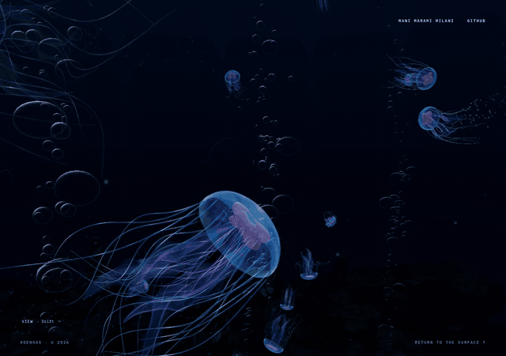

*S5 excerpt: watch the image inside a passing hero bubble, not only its boundary. Cheap ambient films do not each run the analytic lookup.*

For lens-local origin $o$, direction $d$ and ellipsoid radii vector $r$, define
$O=o/r$, $D=d/r$. Equation (15), **CODE-EQUIVALENT**, is

$$
\begin{aligned}
A&=D\cdot D,\quad B=O\cdot D,\quad C=O\cdot O-1,\\
t_e&=\frac{-B-\sqrt{\max(B^2-AC,10^{-6})}}{A},\\
n&=\operatorname{normalize}[(o+t_ed)/r^2].
\end{aligned}
$$

The shader transforms the normal by the appropriate normal matrix and refracts
in metric view space. A second analytic intersection finds the exit; a second
refraction computes the outgoing direction. This is different from deforming
only a visible lens mesh while leaving the source image unchanged.

Equation (16), **CODE-EQUIVALENT** for the projection core, uses exit point
$E_v$, outgoing view ray $D_o$, scene view-depth $z_s$, and camera projection
$P$:

$$
\begin{aligned}
z_i&=\max(z_s,E_{v,z}-6),\\
\ell&=\max\left(0,\frac{z_i-E_{v,z}}{\min(D_{o,z},-0.05)}\right),\\
q&=P(E_v+\ell D_o,1),\\
uv_r&=(q_x/(2q_w)+1/2,\;1/2-q_y/(2q_w)).
\end{aligned}
$$

The actual code guards the homogeneous denominator, grazing rays, source
borders and depth tests. Bubble lookup displacement is capped to
$\sqrt{2}\,0.008$ in UV length before further masks. The virtual image plane
six units behind the exit is explicitly approximate, especially for transparent
animals that do not write depth. A depth texture is not translucent depth, and
its attachment is not proof that the selected backend resolves it correctly.
The pinned WebGL multisample limitation is described under Limitations below.

Five refractive heroes accompany 384 cheap ambient films. Seeded lifetimes,
stream packets, aspect-changing shape and modest drift make a bounded passage,
not a permanent screen of lenses. Only heroes perform the analytic optical
lookup. Authored index ratios are softened rather than using a literal water/air
ratio that would require unavailable reflected scene rays at grazing angles.
Figure 5 and S5 expose the image bending and its limitations in motion.


For equations (15)–(16), $o,d,r$ belong to lens-local ray coordinates, $A,B,C$ are quadratic coefficients and $t_e$ is the entry ray parameter. $E_v,D_o,z_s$ are metric view-space quantities; negative view Z points forward. $q$ is homogeneous clip position here, not pulse phase. $uv_r$ is dimensionless top-origin screen UV. The authored relative-index ratio enters the two refraction calls in the linked source.

**World bubbles and idle liquid are different domains.** Bubbles use world-space analytic interfaces projected into the current ocean image. The clock is a screen-space implicit field. Both sample the clean live ocean, but neither reconstructs complete light transport.

**Source:** [LiveOceanLens.js](https://github.com/Denoax/pelagic-jellyfish-webgl/blob/bce3571b0300ecfe5dc6e5dd45f28a9cda57006e/src/scene/glass/LiveOceanLens.js#L171-L259) · [BubblePopulation.js](https://github.com/Denoax/pelagic-jellyfish-webgl/blob/bce3571b0300ecfe5dc6e5dd45f28a9cda57006e/src/scene/glass/BubblePopulation.js).

## 9. Abyssal hydrothermal sanctuary

The deep scene uses a dark basalt basin, connected shelves, a recessed channel,
one principal sulfide structure, secondary spires and sparse vent-associated
life. These are procedural and instanced artistic forms, not a surveyed site.
Processed Rock 07 scan luminance [Poly Haven Rock 07](#ref-polyhaven) contributes mineral variation.
The active geology material is `MeshBasicNodeMaterial` with an authored
surface-gradient lighting response; calling it a calibrated PBR BRDF would be
incorrect. Scanned detail and physically motivated placement do not change that.

The plume maintains fixed-capacity position, velocity, age, lifetime and size
arrays. It is pre-established at construction rather than emitted as a first-
visit burst. Nearby mineral packets share spatially related eddies. In equation
(17), **CODE-EQUIVALENT** for selected updates, sampled current $U$ is filtered
into $U_f$, then a target plume velocity $V_d$ is followed:

$$
\begin{aligned}
U_f^+&=U_f+[\operatorname{clamp}(U,-0.65,0.65)-U_f](1-e^{-h/0.85}),\\
V^+&=V+(V_d-V)(1-e^{-kh}),\quad X^+=X+hV^+.
\end{aligned}
$$

$k=2.1$ for smoke and 1.2 otherwise. Smoke's vertical target includes
$1.6e^{-0.18a}+0.045$ plus filtered vertical current. Lateral entrainment grows
with height. These are **ART-DIRECTION HEURISTICS** when interpreted as plume
physics: no temperature, pressure or buoyancy conservation is solved.

Localized thermal domains reuse the optical output. Their world-space pattern
and bounded projection produce shimmer without a second scene render. A single
pooled animal-derived lighting contribution changes owner through zero rather
than sliding an unrelated bright point across the floor. Channel-dependent
distance attenuation blends toward directional water radiance. This is not
volumetric multiple scattering or measured ocean image formation.

Figure 6 shows the resulting sanctuary within the approved ocean rather than an isolated geology renderer.

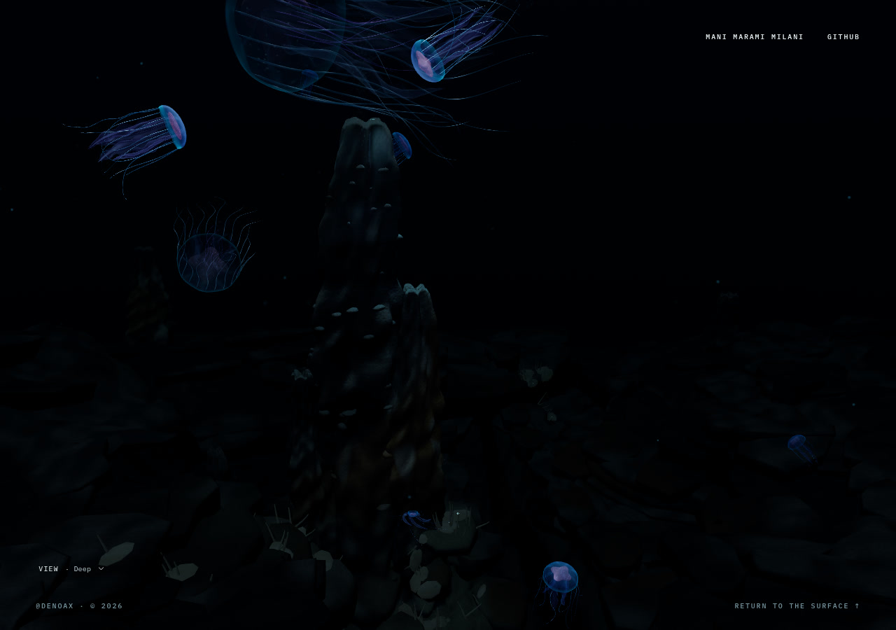

The plume uses world-space $X,V,U,U_f,V_d$; $h$ and particle age $a$ are seconds, while the numerical follow gains are artist-selected inverse-time scales. The thermal shimmer samples the shared live image, rather than making the particle field a fluid or temperature solver.

**Source:** [VentDynamics.js](https://github.com/Denoax/pelagic-jellyfish-webgl/blob/bce3571b0300ecfe5dc6e5dd45f28a9cda57006e/src/scene/sanctuary/VentDynamics.js#L46-L69) · [Sanctuary.js](https://github.com/Denoax/pelagic-jellyfish-webgl/blob/bce3571b0300ecfe5dc6e5dd45f28a9cda57006e/src/scene/sanctuary/Sanctuary.js) · [materials.js](https://github.com/Denoax/pelagic-jellyfish-webgl/blob/bce3571b0300ecfe5dc6e5dd45f28a9cda57006e/src/scene/sanctuary/materials.js).

## 10. Ocean-to-glass liquid system

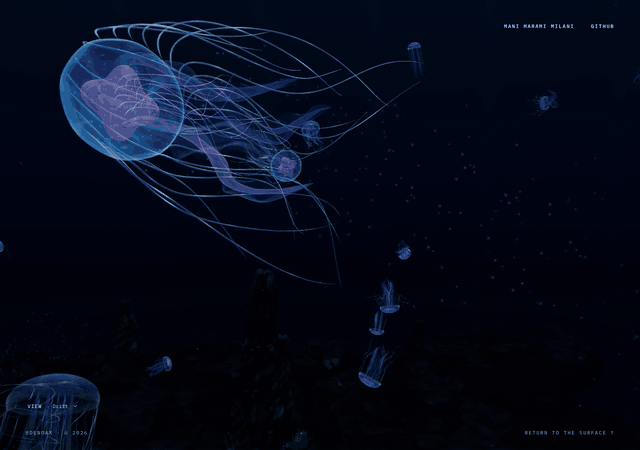

*S9 contact/merge at normal full-frame scale; a compressed preview of the existing master, not a new simulation or a zoomed diagnostic.*

Idle is a mode of the shared compositor, not another WebGL canvas. The semantic
`IdleScreen` contains no renderer. A 30-second inactivity policy requests entry;
readiness and reduced-motion conditions govern whether it appears. Pointer
motion deforms the active film without dismissing it. Click/tap or the defined
keyboard actions initiate dismissal and consume the event before it becomes an
animal click. The ocean continues beneath a held camera pose.

The clock uses two independent canvas textures. Clone-sharing a texture source
would not supply independent old/new masks in this Three.js version. Digits
occupy fixed cells while retaining the font's proportional shapes. Landscape
uses HH:MM; portrait stacks hours and minutes. Eight contact sites are found
from the project's own low-resolution clock mask, not from ocean readback.

Equation (18) is a **CONTINUOUS ABSTRACTION** of the scalar topology:

$$
F(u)=a\,S_{0.12,0.95}\left(
G(u-\Delta)+\sum_j D_j(u-\Delta)+\sum_j N_j(u-\Delta)+\sum_j R_j(u-\Delta)
\right).
$$

$a$ is entry/exit amount; $G$ is the mapped, locally grown/eroded glyph;
$D_j,N_j,R_j$ are droplet, neck and reservoir/bulge contributions. The actual
function includes conditionals for changed cells, colon growth, front arrival,
old/new stroke mapping and exit. It is not accurately represented by simply
crossfading two text images. Gaussian-like additive masses create connected
boundaries, but their sum is not a material-volume conservation law.

The field is evaluated at the sample and four offsets. In equation (19),
**CODE-EQUIVALENT**, $e=(1.7/W,1.7/H)$ and

$$
\begin{aligned}
g&=(F(u+(e_x,0))-F(u-(e_x,0)),\;
F(u+(0,e_y))-F(u-(0,e_y))),\\
n&=\operatorname{normalize}(-16g_x,-16g_y,1),\\
\delta u&=0.035\,n_{xy}(H/W,1)F(u)\,S(a)\,S_{0,0.06}(border).
\end{aligned}
$$

The difference is intentionally not divided by $2e$. Its scale and the factor
16 form an artistic normal construction. The resulting lookup samples the
current clean ocean color at clamped $u+\delta u$. Small normal-driven light
and luminance adaptation support the material; they do not substitute for live
image displacement. S8–S12 show formation, contact, interaction, minute change
and dismissal at normal presentation size.

Figure 7 samples contact and formation from S9; its complete motion remains the stronger temporal evidence.

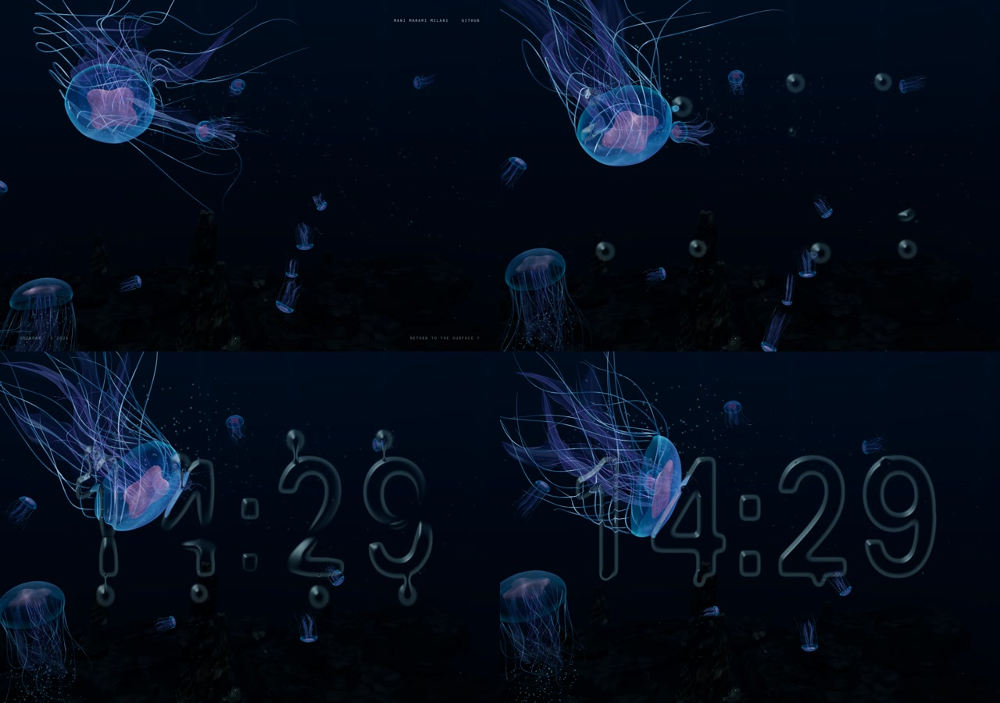

The paired field stores velocity in RG and displacement in BA, signed around
zero in RGBA16F. Its long dimension is 256, with a minimum of 64 samples on
either axis. It is small state, not a downsampled fake ocean. Current ocean color
stays in the separate full-resolution optical target.

For screen coordinate $u$, first read previous velocity $V_0$, backtrace
$p=u-0.42hV_0$, and sample state $(V,D)$ plus its four-neighbor average
$(\bar V,\bar D)$. Equation (20), **CODE-EQUIVALENT**, gives the core step:

$$
\begin{aligned}
V'&=\operatorname{clamp}_{[-0.58,0.58]}
\{[0.88V+0.12\bar V+h(36(\bar D-D)-5.5D)]e^{-2.8h}
+3.2h\,V_pBI\},\\
D'&=\operatorname{clamp}_{[-0.17,0.17]}(D+hV').
\end{aligned}
$$

$V_p$ is bounded pointer velocity, $B$ a Gaussian segment brush, $I$ fresh-input
presence. A queued bounded event impulse is added to $V'$ after its clamp and
before displacement integration; an edge envelope multiplies the final state.
That order is material: the first clamp alone is not an absolute bound after
the event term. The method is a spring/advection construction, not incompressible
Navier–Stokes, and no pressure projection is performed.

Entry contact follows the facing mask surface, not an interior stroke anchor.
The existing M7.2 choreography gives the approaching surfaces a visible gap,
creates a narrow connection, then transfers and settles. Let $b=S(age/0.65)$
and $T=S((t-0.29)/0.58)$ after the per-site contact time. Equation (21),
**CODE-EQUIVALENT** for entry radius, is

$$
r=(0.034+0.003(i\bmod3))\sqrt{(1-T)b}.
$$

The source's scalar `mass=1-T` is a choreography bookkeeping quantity, not a
physical integral of the implicit field. Stroke growth also draws from an
explicit authored reservoir. Dismissal creates a throat that narrows, breaks
and recoils before the remaining field disappears. Events trigger modest
field impulses once per site and reset on mode changes. Figure 8 shows exit
at normal size; enlarged diagnostics alone would overstate its readability.

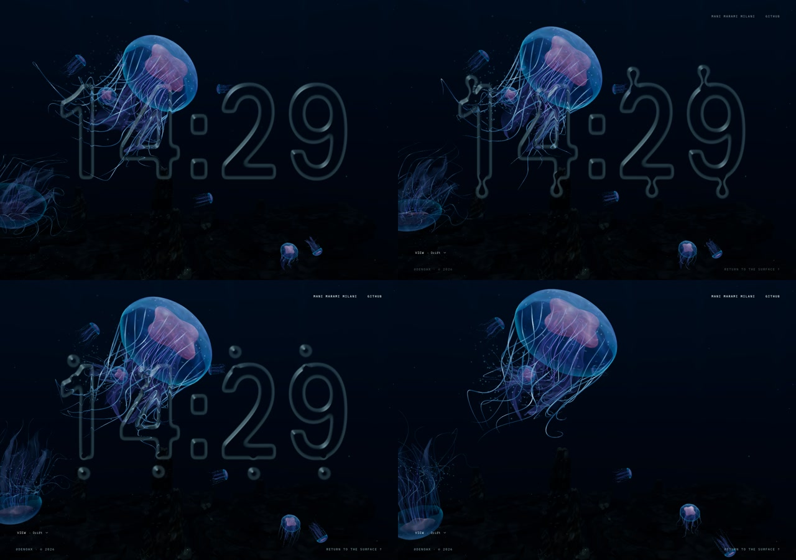

**Algorithm 5 — liquid frame.**

```text
read idle intent; reset only choreography/input bookkeeping on state change
refresh masks only for layout or minute changes
advance bounded controller time and compute local contact/drop/neck state
enqueue each contact or break impulse once
advance persistent field through ping-pong targets
evaluate mapped glyph + implicit masses at displaced coordinates
derive artistic thickness normal; sample current clean ocean image
blend optical presentation without feeding output color back into state
```

For equations (18)–(21), $u,\Delta,D$ are screen-UV coordinates/displacements with aspect correction where stated; $W,H$ are drawing-buffer pixels. $F,G,D_j,N_j,R_j,a,b,T,B,I$ are dimensionless fields or envelopes. $V,V_0,V_p$ are screen-space velocity controls, $h$ is seconds, and $i$ is the contact-site index. The entry-drop $t$ is local time after that site’s contact; its radius is in viewport-height units. These are optical/artistic units, not material mass or volume.

**Source:** [OceanIdleGlass.js](https://github.com/Denoax/pelagic-jellyfish-webgl/blob/bce3571b0300ecfe5dc6e5dd45f28a9cda57006e/src/scene/glass/OceanIdleGlass.js#L114-L179) · [IdleDisplacement.js](https://github.com/Denoax/pelagic-jellyfish-webgl/blob/bce3571b0300ecfe5dc6e5dd45f28a9cda57006e/src/scene/glass/IdleDisplacement.js#L22-L38) · [LiquidChoreography.js](https://github.com/Denoax/pelagic-jellyfish-webgl/blob/bce3571b0300ecfe5dc6e5dd45f28a9cda57006e/src/scene/glass/LiquidChoreography.js#L40-L77).

## Numerical robustness

Malformed synthetic spatial event → non-finite pointer/current state → invalid transforms and dynamic geometry → tissue disappearance. The corrected boundary rejects non-finite spatial coordinates before they enter scene state. It does not sanitize final geometry, reset the ocean, or change tissue color. Natural idle lifecycle was not the identified root cause. This is the M6.6.1 robustness case, not a claim that every future context-loss failure has been solved.

Subsystems deliberately reject or cap suspension debt. The idle controller
clears its accumulator when hidden. Its per-call duration is at most 0.05 s;
the tissue path also has finite-duration guards. These are stability policies,
not exact real-time continuation through a background pause.

Equation (22), **CODE-EQUIVALENT** for the idle accumulator with $h=1/60$, is

$$
A'=\min(A+\min(dt,0.05),3h),\quad
N=\min(3,\lfloor(A'+10^{-10})/h\rfloor),\quad A^+=A'-Nh.
$$

Hidden/invalid-input branches clear debt before this expression. The renderer
is serialized to avoid concurrent frame work. Idle shader linking may continue
while ordinary frames render, but the optical output is not exposed until its
first valid draw. Resize changes target dimensions and invalidates field state
as required; teardown waits for in-flight ownership before disposing resources.

**Algorithm 6 — bounded lifecycle.**

```text
if hidden or invalid input: clear relevant debt/input latch; do not catch up
otherwise cap admitted duration and accumulate at most the allowed steps
run fixed steps, retaining only a fractional remainder
serialize scene/output work and restore renderer state on exceptions
publish readiness only after successful preparation
on teardown: stop listeners, settle in-flight ownership, dispose once
```

Here $A$ is accumulated seconds, $dt$ the admitted frame duration, $N$ the integer number of fixed steps and $h$ their duration. Fixed steps are per-subsystem policies: the whole application is not one globally bitwise-deterministic solve.

**Source:** [IdleLiquidState.js](https://github.com/Denoax/pelagic-jellyfish-webgl/blob/bce3571b0300ecfe5dc6e5dd45f28a9cda57006e/src/scene/glass/IdleLiquidState.js#L21-L31) · [HeroScene.jsx](https://github.com/Denoax/pelagic-jellyfish-webgl/blob/bce3571b0300ecfe5dc6e5dd45f28a9cda57006e/src/scene/HeroScene.jsx).

## Rendering architecture

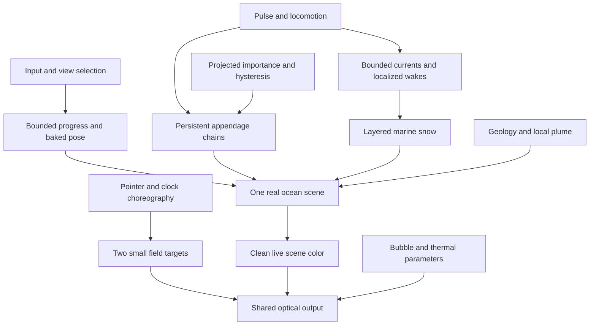

React owns readiness, idle intent and sparse semantic controls. High-frequency
work belongs to imperative scene objects and persistent buffers. The scene uses
`WebGPURenderer` from `three/webgpu`, with an explicitly verified WebGL2 backend
for this publication. A package dependency on React Three Fiber does not make
this an R3F renderer: no Fiber scene ownership is used on the active path.

The frame reads input and updates bounded journey progress. The school director
advances animal poses; the environment advances its persistent populations;
the detail adapter evaluates screen importance. Connected-ocean state observes
the animals and updates particulate. Tissue geometry and presentation then
update, followed by the existing scene render. When optical effects are active,
that render targets a clean color image and a shared output pass composes the
effects. Idle adds small field-simulation passes, not another ocean.

**Table 2. Active responsibilities at the publication runtime.**

| Responsibility | Owner | Persistent state |
| --- | --- | --- |
| Browser/scene lifecycle | `HeroScene`, `useIdleScreen` | renderer, scene, idle intent, readiness |
| Main route poses | `JellySchoolDirector` | position, velocity, heading, pulse |
| Tissue | `LivingAppendages`, `PopulationAnimal` | chains, geometry, material uniforms |
| Detail assignment | `PopulationDetail` | detail state, pooled light/fleck ownership |
| Connected water | `CurrentField`, `ConnectedOcean`, `OceanSnow` | event pools and particle positions |
| Camera | `JourneyController`, `TrackPlayer`, `ViewController` | scalar progress, baked poses, Explore state |
| Optical output | `LiveOceanLens` | clean scene target and output material |
| Sanctuary | `Sanctuary`, `VentDynamics` | geology resources, plume, pooled illumination |
| Idle | `OceanIdleGlass`, `IdleDisplacement` | two masks, two field targets, bounded choreography |

One ocean image supplies all active optical effects. `LiveOceanLens` owns a
full drawing-buffer RGBA16F target, a depth attachment, and the output material.
The scene is rendered into that target without the lens in its input. Thermal
shimmer and bubble slots sample that clean source; idle may then replace local
output with its own clean-source lookup. There is no recursive color feedback.

This ordering has a cost and a limitation. The output adds a screen-sized pass
when optical content is active; idle also advances its small persistent field.
However, overlapping optical effects do not solve nested ray transport. Each
effect sees the same unmodified ocean source. The blend can preserve an
attractive image without representing light that physically traversed every
intervening surface.

The target uses renderer sample count and linear color. Tone/output state is
restored around preparation and rendering, including failure paths. A tiny
scratch target is used during idle preparation and then disposed. Ready state
is published after a valid first optical draw, not merely after allocating a
material. Figure 9 diagrams source versus output ownership.

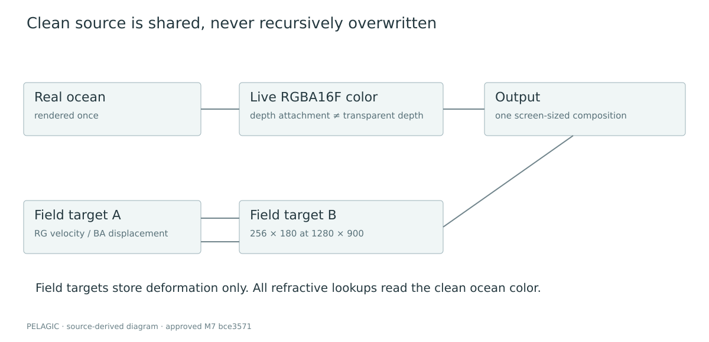

**Algorithm 4 — optical frame.**

```text
advance bounded idle field, if needed
prepare active thermal/bubble domains
if no optical domain and no visible idle: render ocean directly
otherwise:
    resize clean target to actual drawing buffer
    render the real ocean once into clean target
    sample clean image for thermal and bounded bubble slots
    if idle visible: evaluate liquid field and clean-image displacement
    render output once; restore renderer state even after errors
```

The locked software stack is React 19.2.0, Three.js 0.175.0 and Vite 6.4.2.
The build uses the existing static client/Sites packaging path; publication
does not modify its worker or deployment configuration. Scientific diagrams,
plots, metadata and portable browser tools are publication additions only.
The source manifest checks byte parity of runtime files against the approved
commit rather than inferring parity from a successful build.

The repository contains historical modules and assets that are no longer
active. Import paths decide implementation truth. In particular, the old idle
renderer and old camera cannot be cited as current simply because their files
remain. The provenance audit separates active scanned albedo, archived models,
generated graphics-recovery artwork, original publication captures and external
reference-only material.

**Source:** [HeroScene.jsx](https://github.com/Denoax/pelagic-jellyfish-webgl/blob/bce3571b0300ecfe5dc6e5dd45f28a9cda57006e/src/scene/HeroScene.jsx) · [LiveOceanLens.js](https://github.com/Denoax/pelagic-jellyfish-webgl/blob/bce3571b0300ecfe5dc6e5dd45f28a9cda57006e/src/scene/glass/LiveOceanLens.js) · [OceanIdleGlass.js](https://github.com/Denoax/pelagic-jellyfish-webgl/blob/bce3571b0300ecfe5dc6e5dd45f28a9cda57006e/src/scene/glass/OceanIdleGlass.js).

## Engineering ablations / failed approaches

These are development records, not controlled comparisons against other research systems. A historical before/after can change several mechanisms; it cannot establish an isolated speedup. The frozen optics diagnostic is separated from that history.

| Attempt | Observed failure or boundary | Replacement / conclusion |
| --- | --- | --- |
| Over-directed M5 camera | Independent position, point-of-interest and safety corrections produced rejected janky travel | M5.2 bounded scalar progress and baked position/quaternion; no invented jerk-reduction percentage |
| Giant dark analytic lens | Real bending worked, but the dark disc failed art review | Brief refractive hero-bubble passage with cheaper ambient films; analytic optics retained |
| Bright/smooth sanctuary | Broad color and early slabs read as flat, bright or repetitive | Connected meso geology, dark mineral response and restrained highlights |
| Repeated shelf primitive | Similar ledges remained obvious across close/medium views | Deterministic shelf-silhouette variation and shared batching, not additional rock count |
| Separate idle canvas | It did not contain the current ocean color needed for refraction | Shared M7 scene target/output, with only small field-state ping-pong |
| Idle-return geometry diagnosis | Malformed synthetic pointer coordinates were the earlier invalid state | Finite spatial-input boundary checks, not a final-geometry patch |
| Asset2 / optional GTAO, review-only | Initial depth-fetch mismatch; corrected prototype returned identity AO and unhelpful depth | Not approved, not the README runtime, not a demonstrated AO improvement |

A connected-particulate visible/hidden ablation was not run for this
publication; S3 is an activation time course, not that controlled comparison.
The frozen optical pair has SSIM about 0.969, a descriptive image difference
only: it is neither a visual-quality score nor evidence of physically correct
refraction. The comparison uses the existing review interface, not edited
runtime source.

The later Asset2 experiment retained a material-space approximation rather than useful GTAO. Its measurements are not substituted for the approved-runtime results. The earlier implementation records are preserved as evidence, not examples to recreate for this README.

## Performance

The reused publication measurements run separately from screenshots, video capture,
encoding, builds and tests. The recorded quantity is the interval between
completed asynchronous ocean-frame callbacks. It is not a GPU timestamp or a
measurement of shader duration. The harness records its matching method and
rejects empty samples. Browser scheduling, compositor cadence, CPU work and
driver submission all contribute.

The minimum scenario set is opening, midwater, bubble passage, sanctuary,
Explore, settled idle and active idle manipulation. Each record includes
runtime SHA, browser and backend, hardware, viewport, drawing buffer, DPR,
quality/bloom state, warm-up, duration and raw intervals. A deterministic random
seed makes initial conditions more comparable; real-time interactive trajectories
still depend on scheduling. Existing development hooks select review states;
they do not authorize changed runtime algorithms.

The results table is generated from retained data, not copied from a
milestone report. Median, p95, maximum and counts above 50 ms are reported
together. Adverse intervals remain in the data. A quiet repeated frame does not
prove that an active transition is equally cheap. Conversely, a capture-induced
stall is not silently used as evidence of ordinary runtime cost.

Table 3 and Figure 10 are generated from the fresh benchmark record. They use
the exact approved runtime and preserve all raw adverse samples. Measurements
are frame intervals, not GPU timings. No comparative performance claim against
other projects is made.

**Table 3. Fresh approved-runtime frame intervals (milliseconds).**

| Scenario | Median | p95 | Maximum | >50 ms | Frames |
| --- | ---: | ---: | ---: | ---: | ---: |
| opening | 16.70 | 18.60 | 28.80 | 0 | 1800 |
| midwater | 16.70 | 17.80 | 27.20 | 0 | 1800 |
| bubble passage | 16.70 | 18.70 | 65.30 | 1 | 1798 |
| sanctuary | 16.70 | 18.00 | 25.90 | 0 | 1800 |
| Explore | 16.70 | 18.50 | 31.80 | 0 | 1800 |
| settled M7 | 16.70 | 17.90 | 26.00 | 0 | 1800 |
| M7 manipulation | 16.70 | 18.20 | 30.00 | 0 | 1803 |

Actual NVIDIA WebGL2; 1280×900 viewport and drawing buffer; DPR 1; bloom off. Eleven-second initial warm-up plus scene/idle warm-up; 30-second measurement per case. Existing development hooks select the approved runtime states. These are render-completion intervals, not GPU timings. Single-run observations, not confidence intervals. Bubble passage includes its natural decay. No capture or video encoding during timing.

The measured browser is Brave/Chromium 152.0.7977.76, with ANGLE OpenGL ES
3.2 on an NVIDIA RTX 4070. The Linux host uses an Intel Core i5-14600K and
62.5 GiB RAM. Its local llama service remained running consistently; this run
does not isolate service contention. Existing development fixtures hold DPR
at 1 without adaptive downshift. Median and p95 use sorted samples at
floor(0.5n) and floor(0.95n), respectively. The bubble case retained one
65.3 ms interval; its cause is not established. The natural bubble window may
end within the 30-second observation. Draw-call snapshots were not sampled in
that timing run; separate diagnostic population records must not be relabeled
as simultaneous benchmark draw counts. Raw arrays and environment records are
retained in [the raw benchmark](paper/results/benchmark.json).

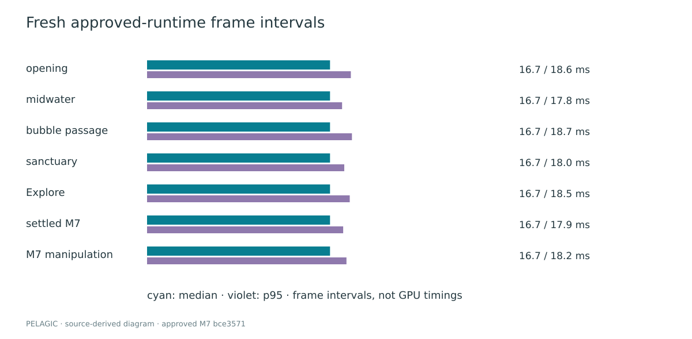

## Validation

The source, capture and test records below belong to the approved publication runtime. This README conversion reruns the necessary build/tests/parity and byte guard; it reuses the earlier recordings and capture-free measurements. Those are different validation events.

A clean dependency installation succeeded. The first pre-build suite passed
129 of 130 tests; the remaining test required generated packaging output.
Building first satisfied that prerequisite, after which all 130 existing tests
passed. The approved-motion check covered 720 frames and 24 exact checkpoints;
the legacy default-animal parity check covered 240 frames and eight checkpoints.
These narrow checks establish their stated comparisons, not biological
correctness or universal visual acceptance.

| Check | Evidence and scope |
| --- | --- |
| Full tests | 130 passing after the production build; no general npm test script is invented |
| Approved motion parity | 720 frames / 24 exact checkpoints |
| Default animal parity | 240 frames / eight geometry checkpoints and material response |
| Runtime identity | 116 protected files compared byte-for-byte with approved source |
| Native motion review | All 12 retained MP4s played to completion; no browser errors in the recorded gallery check |
| Lifecycle footage | S8 entry, S9 contact, S10 pointer/recovery, S11 minute change, S12 pinch/exit |
| Ownership | One main renderer/context and one ocean render in the active source; extra field/output draws are explicitly counted separately |
| Responsive evidence | Desktop/narrow/portrait browser inspection, not physical-device validation |

No new 20-cycle or allocation-stability campaign was run for this documentation conversion. Earlier M7 reports contain lifecycle/resource tests on their named commits; they are not relabeled as fresh tests of another runtime. The current source retains bounded accumulators, persistent target ownership and serialized teardown. Those source contracts and the retained clips support narrower claims than a universal leak-free or crash-free guarantee.

**Table 4. Compatibility scope of this publication, not a general support promise.**

Table 4 separates the actual backend from emulation and untested environments.

| Environment | Scope |
| --- | --- |
| NVIDIA RTX 4070, Brave/Chromium, WebGL2 | actual graphics path used for primary captures and fresh results |
| Narrow and 390×844 portrait viewports | browser emulation; not physical-mobile validation |
| Hardware WebGPU full ocean | NOT TESTED in this publication; legacy full-ocean issue remains separate |
| SwiftShader/software WebGPU | NOT TESTED in this publication unless an explicitly separate record is supplied |
| Safari, Firefox, iOS/Android hardware | NOT TESTED |

Four small inline GIFs make the methods visible without a separate reader site. Ten reused figures include generated diagrams, actual browser captures and a raw-data plot. The [capture catalog](paper/media/catalog.json) preserves renderer, viewport, drawing buffer, DPR, seed, phase and source timing; [README media provenance](docs/readme/media.json) records the exact excerpt and encoding. Original videos are approximately 30 observed browser frames/s, encoded at 30 fps with possible repetitions. The smaller GIFs are 8 fps publication previews, not a runtime frame-rate claim. Masters remain outside normal Git and no unissued remote media URL is invented.

## Reproducibility

The executable baseline is **bce3571b0300ecfe5dc6e5dd45f28a9cda57006e**. These commands select that immutable runtime, not an unspecified main branch. The documentation branch is local until authorized; the public demo may still show a different review release.

```sh
git clone https://github.com/Denoax/pelagic-jellyfish-webgl.git
cd pelagic-jellyfish-webgl
git switch --detach bce3571b0300ecfe5dc6e5dd45f28a9cda57006e
npm ci
VITE_OCEAN_RELEASE=milestone-2 npm run build
node --test tests/*.test.mjs
node scripts/check-approved-motion.mjs
node scripts/check-default-animal.mjs
npm run dev
```

The clone/switch sequence requires the named commit to be available from the remote. This local review does not claim it has been published there. In the existing full publication checkout, skip clone/switch and use its byte-identical runtime. Do not substitute a different remote commit if the requested object is absent. Historical parity scripts require their original Git objects; a history-free runtime snapshot can build but cannot manufacture those comparisons.

Build before tests: the Sites packaging test reads generated output. The historical release flag selects the approved production path; its name does not mean the implementation ends at M2. Vite prints the local development address. `npm run preview` serves the built artwork; no paper route or PDF builder is needed to understand or run the system.

| Inspection | Query / control | Scope |
| --- | --- | --- |
| Explicit fallback | `?renderer=webgl` | Select WebGL2; verify the actual backend rather than trusting the renderer class name |
| Keep ocean awake | `?renderer=webgl&idle=300` | Existing long idle-delay fixture |
| Approved specimen | `?renderer=webgl&specimen=1&animal=candidate&idle=300` | DEV-only specimen, same approved animal; the historical candidate label is not Asset2 |
| Camera modes | View → Documentary / Drift / Intimate / Deep / Explore | Existing world and accepted observer controls |
| Normal liquid clock | Leave input inactive for 30 seconds | Reduced motion/readiness policy applies; pointer deforms, click/keyboard dismisses |

Node 24.20.0 and the committed lockfile were used. Three.js is pinned to 0.175.0. Publication helper dependencies are separate from the application; no runtime package upgrade is needed. In the publication checkout, `node scripts/publication/source-manifest.mjs` verifies approved-file hashes.

The retained benchmark and motion tools accept an explicit local address and external evidence directory. They record scene state and timing separately; deterministic seeding does not make wall-clock browser scheduling bitwise repeatable. Never run recording/encoding concurrently with timing and report the result as capture-free. [REPRODUCIBILITY.md](REPRODUCIBILITY.md) retains optional tool details and archival paper-build instructions; this README already contains the complete method and runtime commands.

## Limitations

Pelagic is not calibrated to a species, a measured ocean volume, or physical
tissue properties. Its bell and folds are procedural art direction. Constraint
iterations and clearance heuristics can reduce, but not eliminate, intersections.
The appendages do not solve continuum elasticity or complete self-collision.
Route separation is not a validated collective-behavior model.

Current, wake and plume fields are bounded approximations. Their shared timing
and spatial dependence improve coherence, but there is no fluid–structure
coupling, pressure solve, mass conservation, thermal transport or prediction
of real vent behavior. Distance-dependent water appearance is not a validated
participating-media reconstruction. Geological textures contribute surface
detail without converting authored lighting into a measured BRDF.

Image-space optics have finite information. They cannot recover offscreen or
occluded radiance. Transparent tissue lacks its own resolved depth layer.
Virtual planes, displacement caps, grazing fades and softened indices are
deliberate compromises. Multiple optical effects share a clean source rather
than recursively transporting light. The pinned WebGL depth-resolution issue
further limits occlusion confidence; attachment presence must not be advertised
as correct depth behavior.

The liquid clock is a two-dimensional scalar presentation with authored contact
timing and small persistent deformation. Its necks and reservoirs do not prove
conserved volume. Resize may reset local field state. Hidden-tab time is
discarded, not physically simulated. Preparation can still impose one-time
driver work; steady-state frame intervals do not erase that cost.

The hardware matrix is narrow. Results on one NVIDIA desktop and emulated
viewports do not establish mobile performance, Safari compatibility, or a fixed
frame budget on all machines. Visual approval is Mani's artistic judgment,
not a controlled user study. No peer-review or priority claim accompanies this
independent technical preprint.

The inherited clock can also appear stretched after a portrait resize; the retained inspection records show that limitation rather than retouching it. No runtime visual fix is part of this README conversion.

## Technical stack

| Component | Exact publication implementation |
| --- | --- |
| Application/lifecycle | React 19.2.0, imperative scene ownership |
| Graphics | Three.js 0.175.0; WebGPURenderer with node/TSL materials |
| Validated backend | NVIDIA ANGLE WebGL2; class name is not backend proof |
| Build | Vite 6.4.2, existing Sites/static packaging |
| Tool runtime | Node 24.20.0 with committed lockfile |
| Evidence tooling | Browser CDP capture, FFmpeg derivatives, capture-free completion probe |
| Original-source policy | MIT; third-party notices retained |

## Repository map

| Path | Responsibility |
| --- | --- |
| README.md | Complete technical publication |
| src/scene/HeroScene.jsx | Renderer and active scene ownership |
| src/scene/anatomy/, LivingAppendages.js | Procedural surfaces and persistent tissue |
| src/scene/ocean/ | Shared current, events and particulate |
| src/scene/population/ | Screen-importance detail adapter |
| src/scene/camera/ | Input-driven journey and observer tracks |
| src/scene/glass/ | Shared optical output and live-ocean liquid |
| src/scene/sanctuary/ | Approved deep geology and vent presentation |
| docs/readme/ | Small derived GIFs, provenance and README validation |
| paper/figures/, media/, results/ | Reused source-linked figures, capture metadata and raw measurements |
| paper/source-map.md | Equation-to-immutable-source index |
| paper/manuscript.md and supplement-source.md | Preserved prior prose cache/history, not a required reader destination |
| scripts/publication/ | Reusable capture, timing and publication tools |
| tests/ | Existing deterministic and packaging tests |

## References

<a name="ref-blinn1982"></a>

Blinn, James F. 1982. “A Generalization of Algebraic Surface Drawing.”
*ACM Transactions on Graphics* 1 (3): 235–56.
<https://doi.org/10.1145/357306.357310>.

<a name="ref-fluidglass"></a>

chiuhans111. n.d. *FluidGlass*.
<https://github.com/chiuhans111/fluidglass>.

<a name="ref-costello2021"></a>

Costello, John H., Sean P. Colin, John O. Dabiri, Brad J. Gemmell,
Kelsey N. Lucas, and Kelly R. Sutherland. 2021. “The Hydrodynamics of
Jellyfish Swimming.” *Annual Review of Marine Science* 13: 375–96.
<https://doi.org/10.1146/annurev-marine-031120-091442>.

<a name="ref-gemmell2013"></a>

Gemmell, Brad J., John H. Costello, Sean P. Colin, et al. 2013. “Passive
Energy Recapture in Jellyfish Contributes to Propulsive Advantage over
Other Metazoans.” *Proceedings of the National Academy of Sciences* 110
(44): 17904–9. <https://doi.org/10.1073/pnas.1306983110>.

<a name="ref-muller2007"></a>

Müller, Matthias, Bruno Heidelberger, Marcus Hennix, and John Ratcliff.
2007. “Position Based Dynamics.” *Journal of Visual Communication and
Image Representation* 18 (2): 109–18.
<https://doi.org/10.1016/j.jvcir.2007.01.005>.

<a name="ref-aurelia"></a>

Niehus, Niklas. n.d. *Aurelia*. <https://github.com/holtsetio/aurelia>.

<a name="ref-polyhaven"></a>

Poly Haven. n.d. *Rock 07*. <https://polyhaven.com/a/rock_07>.

<a name="ref-three175"></a>

Three.js contributors. 2025. *Three.js r175
Source and Rendering Implementation*.
<https://github.com/mrdoob/three.js/tree/r175>.

<a name="ref-wyman2005"></a>

Wyman, Chris. 2005. “An Approximate Image-Space Approach for Interactive
Refraction.” *ACM Transactions on Graphics* 24 (3): 1050–53.
<https://doi.org/10.1145/1073204.1073310>.

## Citation

Mani Marami Milani is the author. This is an independent technical manuscript in local review, not a conference acceptance or peer-reviewed publication. No DOI, affiliation or release date is invented. The runtime commit identifies the executable experiment separately from this README-only publication commit.

```bibtex
@unpublished{maramimilani_pelagic,
  author = {Marami Milani, Mani},
  title = {{Pelagic}: A Real-Time Mathematical Rendering System for Procedural Jellyfish, Stateful Appendages, Underwater Optics, and Interactive Liquid Glass},
  note = {Independent technical preprint, local-review edition; runtime bce3571b0300ecfe5dc6e5dd45f28a9cda57006e},
  url = {https://github.com/Denoax/pelagic-jellyfish-webgl}
}
```

[CITATION.cff](CITATION.cff) supports repository-aware citation tools; [CITATION.bib](CITATION.bib) contains the same bibliographic identity.

## Licensing and asset provenance

Mani Marami Milani directed and reviewed the artwork. Codex/OpenAI models
assisted with implementation, source auditing, documentation, test tooling and
publication preparation. This disclosure is not an independent verification of
every generated statement; the source map, measured data and human review gate
remain necessary. Existing generated artwork is used for graphics recovery or
reduced-motion fallback, not substituted for successful runtime motion evidence.

Original code is MIT licensed; original publication text, diagrams and
project-generated screenshots/media are CC BY 4.0. Third-party code, fonts,
textures and archived models retain their own terms. This policy does not
relicense external research material. Scientific figures from other authors
are linked or cited, not copied into the publication's original figure set.

See [LICENSE.md](LICENSE.md), the complete [MIT](LICENSES/MIT.txt) and [CC BY 4.0](LICENSES/CC-BY-4.0.txt) texts, [ASSET_PROVENANCE.md](ASSET_PROVENANCE.md), and [CONTRIBUTING.md](CONTRIBUTING.md). This documentation does not relicense third-party fonts, Aurelia code, scans or reference material. Main/Pages publication was explicitly authorized after README review; no GitHub release, DOI or archival submission is implied.
