# Pelagic

> A silent, interactive descent through a living WebGL jellyfish ocean.

[](https://github.com/Denoax/pelagic-jellyfish-webgl/actions/workflows/ci.yml)
[](https://denoax.github.io/pelagic-jellyfish-webgl/)

**[Enter the live ocean →](https://denoax.github.io/pelagic-jellyfish-webgl/)**

An interactive WebGL ocean, a living jellyfish swarm, and an original liquid-glass clock built as a text-free digital art study.

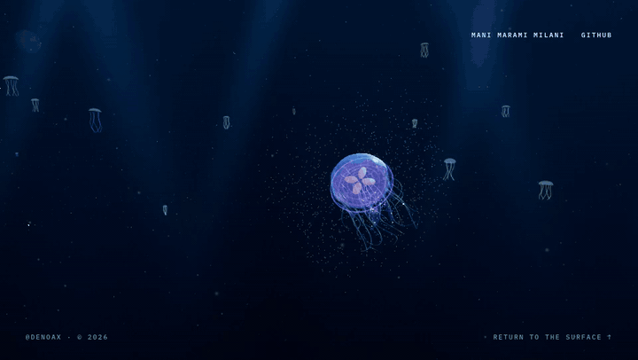

The experience is deliberately not a conventional portfolio page. Scrolling acts as a silent camera timeline: it changes the featured animal, orbit, depth, light and swarm composition without putting headings or paragraphs over the artwork. Only Mani Marami Milani and GitHub remain at the top-right, `@DENOAX · © 2026` remains at the bottom-left, and Return to the Surface remains at the bottom-right.

## The journey

| Surface encounter | Mid-water handoff | Deep departure |
| --- | --- | --- |
| 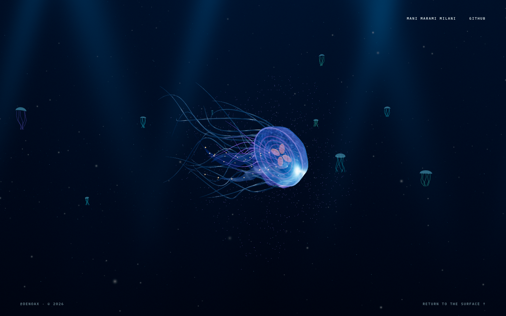 | 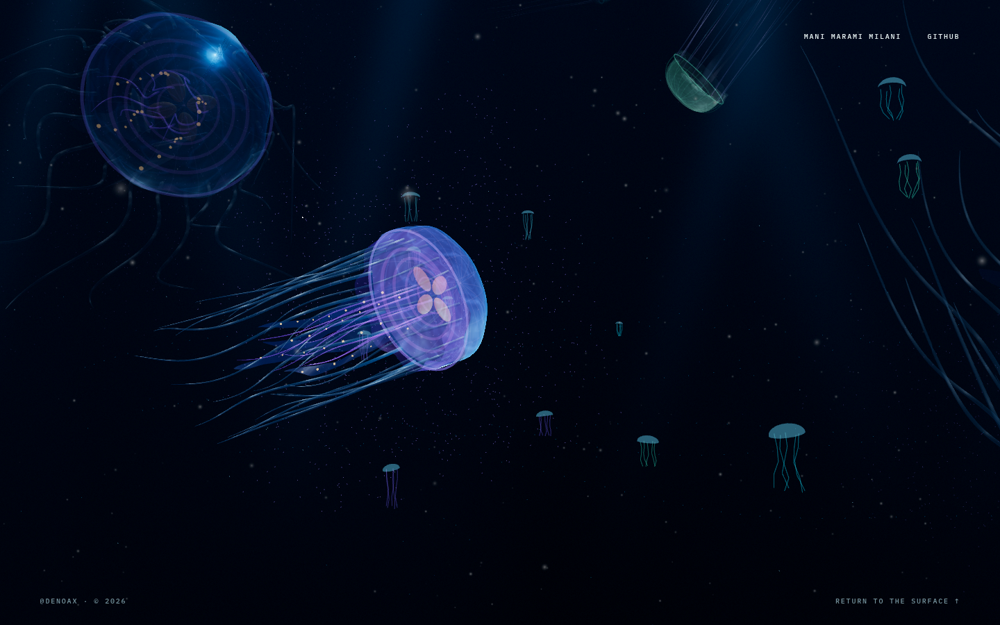 | 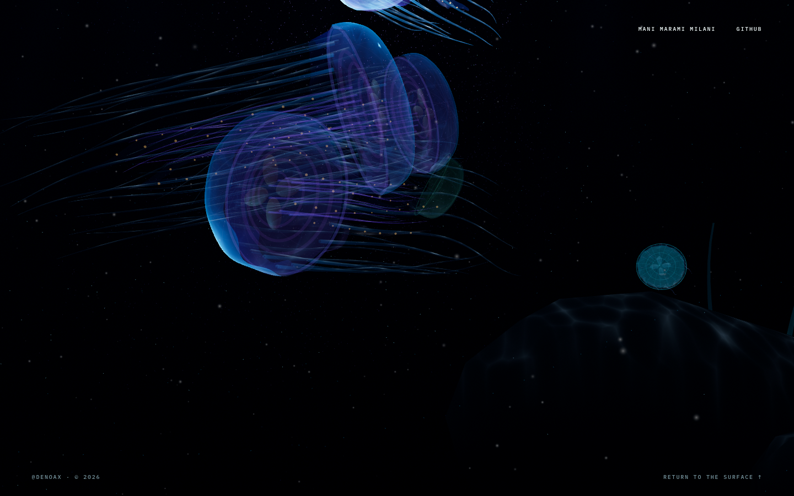 |

The persistent labels are real links; every other visible page label was removed. Empty semantic chapters remain in the document only as scroll-length and camera-timing tracks, so the scene can still travel through an authored beginning, encounters and departure.

## Water and glass refinement


The newest rendering pass adds stateful elastic glass, a prepared idle transition, shared underwater visibility, layered geology and visible graphics recovery. [See the implementation, current captures and measured test results](docs/implementation/2026-09-05-rendering-pass.md). The original GIFs and evolution gallery below document earlier stages; they are not new performance evidence.

## What is built in

- A persistent Three.js ocean with depth fog, marine snow, current veils, god rays and a procedural seabed.
- Eight independent foreground jellyfish plus a distant school, each with deforming tissue and simulated appendage lag.
- Bell-coupled locomotion: contraction produces thrust, refill produces drag, and momentum carries the coast.
- Stable-scale departures: animals swim beyond the frame and settle into depth haze instead of shrinking away.
- A cinematic scroll camera with continuous orbit, subject handoffs and separate position/target damping.
- Raycast interaction that sends bioluminescent recoil through an individual animal and its nearby school.
- A full-screen `HH:MM` liquid-glass idle clock with GPU texture morphing and an intentionally slow pointer wake.
- Responsive desktop and portrait compositions, reduced-motion handling, WebGL 2 fallback, and static-host packaging.

## How it was built

### 1. A persistent 3D ocean

`HeroScene.jsx` owns the persistent Three.js scene. It reads the actual backend after initialization, including automatic WebGPU-to-WebGL fallback. Both backends use the direct render path; the inherited MRT bloom chain is disabled. Pixel ratio starts at a maximum of `1.25` on desktop and `1` on mobile, and can step down after sustained slow frames. Graphics denial/loss shows recovery artwork and a compatibility retry instead of a silent black canvas.

The seabed and animals share directional water radiance and distance-dependent, channel-specific attenuation. A nonuniform terrain grid concentrates detail around the camera path. Triplanar scanned albedo, multi-scale sediment noise, terrain-integrated contact shading and localized hot crust replace the old bright plane and circular shadow stickers. See the [implementation and verification record](docs/implementation/2026-09-05-rendering-pass.md).

The environment is built from:

- several depth bands of marine snow;
- animated current veils and god-ray lighting;
- a hero jellyfish plus independent background organisms;
- dark physical lighting and selective tissue/crust emission;
- scroll-controlled depth, exposure, and camera framing.

### 2. Jellyfish that swim instead of sliding

Each organism uses a timed rowing cycle rather than moving along a path at constant speed:

1. The bell contracts quickly.
2. The contraction produces the main thrust impulse.
3. The bell refills more slowly while drag increases.
4. A smaller secondary impulse approximates the stopping vortex.
5. The animal coasts before the next pulse.

`JellySchoolDirector.js` uses that cycle to add momentum along an authored route. The route only steers the animal; it does not directly teleport it. Nearby organisms also receive separation forces so a cluster does not collapse into one mesh.

`LivingAppendages.js` reconstructs each visible animal as layered geometry: a deforming mantle, internal crown, organs, oral-arm ribbons, and constrained tentacle chains. The appendages retain their previous positions, so they lag behind acceleration and turning instead of rotating rigidly with the bell.

Lifecycle visibility never changes an animal's physical scale. Jellyfish leave by continuing their pulse-driven route beyond the camera frame; completed actors remain as faint, full-sized silhouettes in depth haze instead of shrinking into miniature objects or popping out of existence.

### 3. A camera that explores the swarm

`PelagicCameraRig.js` separates three ideas that are often incorrectly combined:

- camera position;
- point of interest;
- featured animal.

This lets the camera travel around and through the water while different jellyfish enter, become the subject, and leave. Position, target, field of view, and the very small amount of camera bank are damped independently. Mobile uses a shorter, wider orbit and no authored bank.

### 4. Physical interaction

Pointer movement becomes a decaying current vector. It influences nearby tissue and the water field without steering the camera. A raycast identifies individual jellyfish; clicking one sends a bioluminescent wave through that animal, applies a localized recoil to its soft body, and triggers a weaker delayed response in nearby members of the school.

### 5. The liquid clock

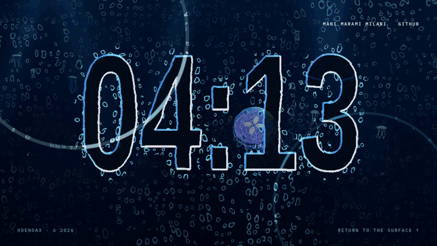

`IdleGlassScene.jsx` is a transparent Three.js renderer prepared before idle entry and retained between visits. The live ocean remains underneath. The fade waits for the first rendered enhancement frame; dormant glass does not continuously draw.

The original glass pipeline:

1. Canvas 2D caches softened clock masks, updating only when needed.
2. Small paired render targets retain velocity and displacement between frames.
3. Cursor-segment impulses pull the field; advection, neighbor coupling and spring restoration carry and settle the wake.
4. Smooth droplet level sets cover the viewport and share the clock's displacement.
5. Thickness gradients drive rounded highlights, rim light and transparency.
6. Signed half-float storage preserves precision near rest. A packed 16-bit RGBA8 displacement path supports devices without float render targets.

Desktop draws `HH:MM` as one composition. Portrait screens use a separate texture and stack hours and minutes vertically.

Ambient movement stays slow. Direct manipulation is continuous, with a bounded field that remembers a sweep and then returns to rest. This is an original elastic-flow model, not a full Navier–Stokes solver. The transparent overlay does not yet refract the ocean framebuffer itself.

### 6. Smooth minute changes

Two clock textures are kept in memory. When the minute changes, the next time is drawn into the hidden texture and a spatially staggered transition takes `2.8s`. Textures swap roles and are reused. Hidden clocks refresh ahead of entry so a stale-minute upload is not normally coupled to the visible fade.

### 7. Idle and accessibility behavior

`useIdleScreen.js` listens for pointer, keyboard, wheel, touch, focus, scroll, and visibility activity. It does not activate while a form control is being edited or while the document is hidden. The animation is completely disabled when `prefers-reduced-motion` is enabled. The overlay never traps focus, plays sound, or destroys the live ocean beneath it.

The clock appears automatically after 30 seconds without input. Add `?idle=1` while developing to reveal it after one second. Click, tap, press Enter, Space, or Escape to return to the ocean.

| Desktop clock | Portrait clock |
| --- | --- |
| 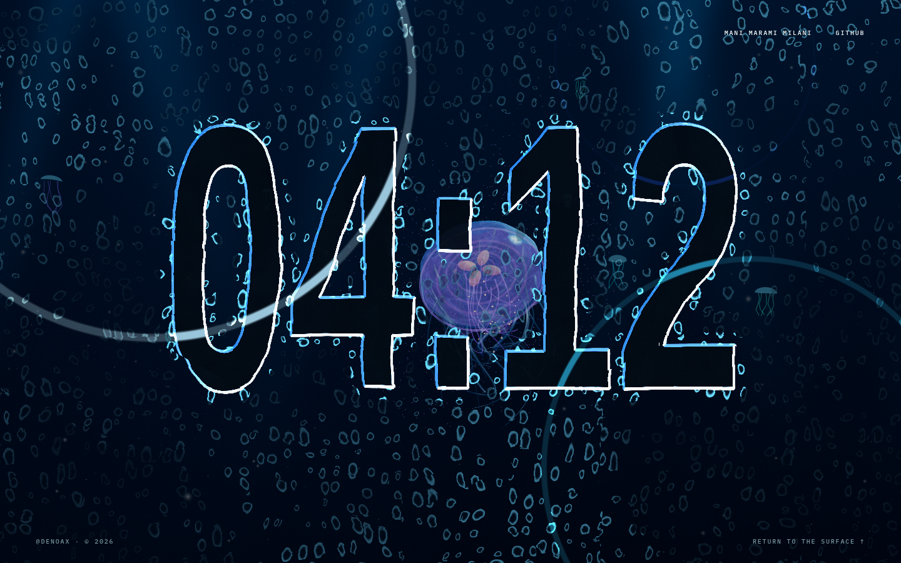 | 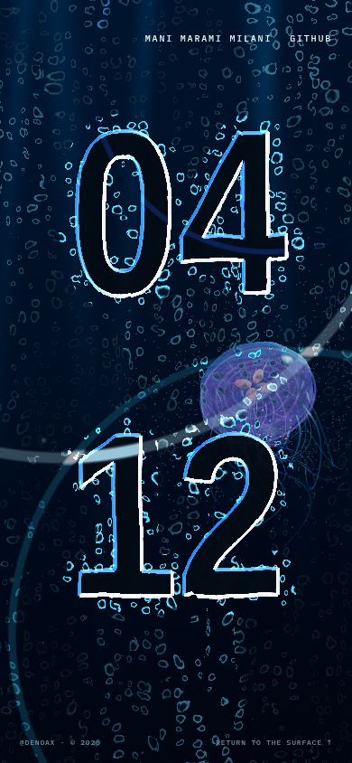 |

## Evolution

This was not the first version. The strongest visual and technical decisions came from repeatedly replacing approaches that failed in motion.

| Stage | Capture | What changed next |
| --- | --- | --- |
| Selected concept | 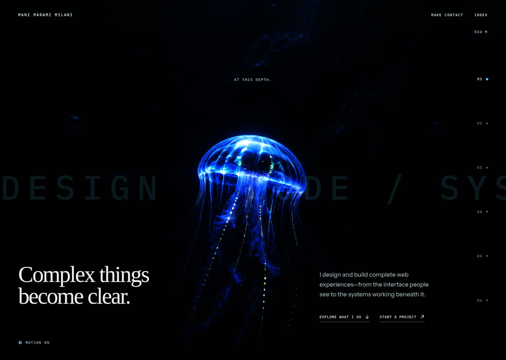 | Prove the mood with real geometry instead of shipping the reference image. |
| First live geometry | 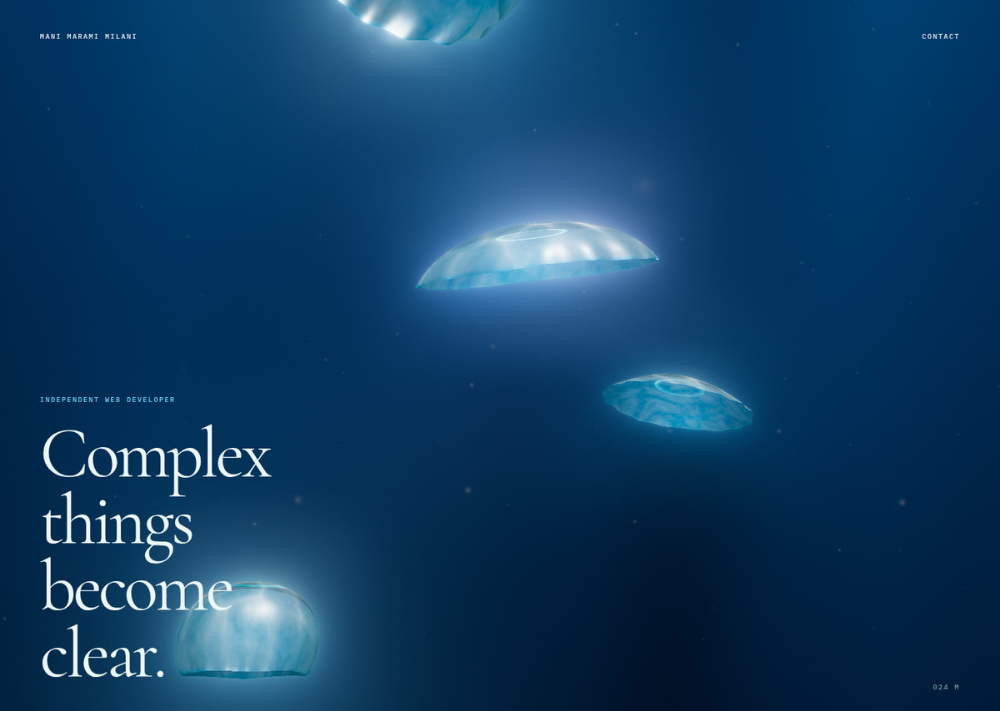 | Replace disconnected glass domes with coherent tissue, appendages, and biological movement. |
| Living swarm | 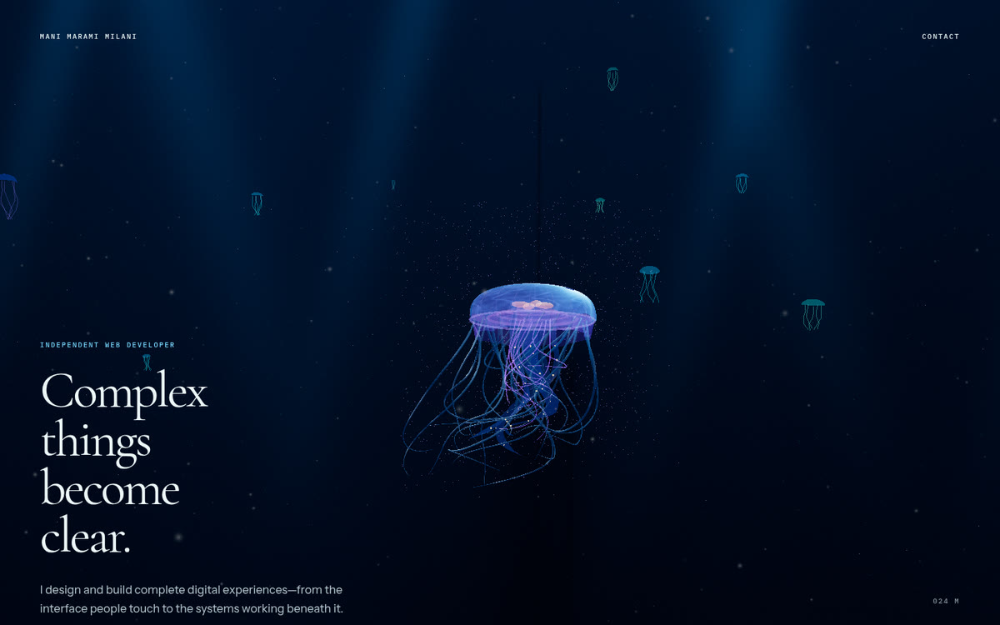 | Add independent actors, pulse-driven travel, camera handoffs, and click interaction. |
| First idle experiment | 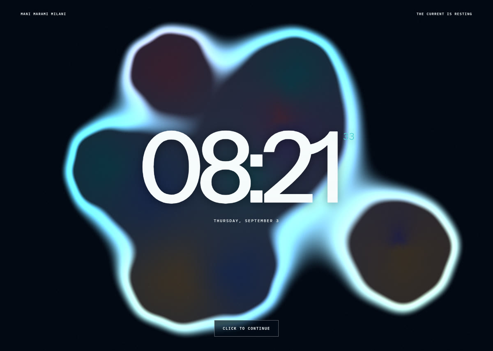 | Remove the soft CSS-like blobs and rebuild the clock as a transparent GPU liquid field. |
| Current result |  | Expand the droplets edge-to-edge, reduce the clock to hours and minutes, slow the wake, and leave only the minimal identity/navigation chrome. |

## Architecture

```text
React application
├── invisible scroll choreography + minimal persistent chrome
├── idle-state and motion-preference controller
├── persistent ocean renderer
│   ├── Aurelia scene foundation
│   ├── LivingAppendages soft-body presentation
│   ├── JellySchoolDirector pulse-driven swarm
│   ├── PelagicCameraRig authored camera journey
│   └── PelagicEnvironment particles and current
└── transparent idle renderer
    ├── dual CanvasTexture clock masks
    ├── original GLSL liquid/droplet shader
    └── persistent spring/advection field + packed compatibility path
```

The high-frequency animation path stays outside React state. React handles readiness and visibility; the clock masks, field, vectors, materials and buffers are reused in place. Reduced motion uses the project poster without starting either graphics renderer.

## Stack

- React 19
- Three.js 0.175
- React Three Fiber
- Three.js WebGPU renderer with WebGL 2 fallback
- TSL for the inherited scene pipeline
- Original GLSL for the liquid clock
- Vite 6
- Fontsource packages for locally bundled fonts

## Run locally

```sh
git clone https://github.com/Denoax/pelagic-jellyfish-webgl.git
cd pelagic-jellyfish-webgl
npm install
npm run dev
```

Open the local URL printed by Vite. To jump directly to the visual clock:

```text
http://localhost:5173/?idle=1
```

Production verification:

```sh
npm run build
npm run test:sites
```

The generated static client is written to `dist/client`. The included worker provides a portable single-page fallback for static hosting.

## Controls

| Input | Result |
| --- | --- |
| Scroll | Travel through the ocean and hand the camera between members of the swarm |
| Move the pointer | Disturb nearby tissue and the water current without steering the camera |
| Click a jellyfish | Trigger a localized bioluminescent pulse and recoil |
| Remain idle for 30 seconds | Reveal the liquid-glass clock over the still-living ocean |
| Click, tap, Enter, Space, or Escape | Return from the clock to the ocean |
| GitHub | Open [Denoax](https://github.com/Denoax) in a new tab |

## Project map

```text
src/
├── core/                 idle and motion-preference hooks
├── scene/                ocean, organisms, camera, environment, liquid clock
├── ui/                   minimal DOM and idle overlay shell
├── vendor/aurelia/       modified MIT-licensed scene foundation
└── App.jsx               silent scroll tracks and persistent art chrome
docs/media/               curated evolution screenshots, GIFs and MP4s
licenses/                 bundled third-party license notices
ASSET_PROVENANCE.md       asset sources, modifications, and license notes
```

## Credits and licensing

The scene foundation in `src/vendor/aurelia/` is adapted from [Aurelia](https://github.com/holtsetio/aurelia) by Niklas Niehus / Holtsetio under the MIT License. Its notice is retained in `licenses/Aurelia-MIT.txt`.

[FluidGlass](https://github.com/chiuhans111/fluidglass) was studied as an interaction reference. Its repository did not include a license when reviewed, so no FluidGlass source, shader, layout, image, or asset is included here. The clock renderer is an independent implementation using this project's own shader, composition, ocean, and interaction model.

Font and asset details are recorded in [ASSET_PROVENANCE.md](ASSET_PROVENANCE.md). No project-wide license is implied; add one deliberately before accepting outside code contributions or reuse.
