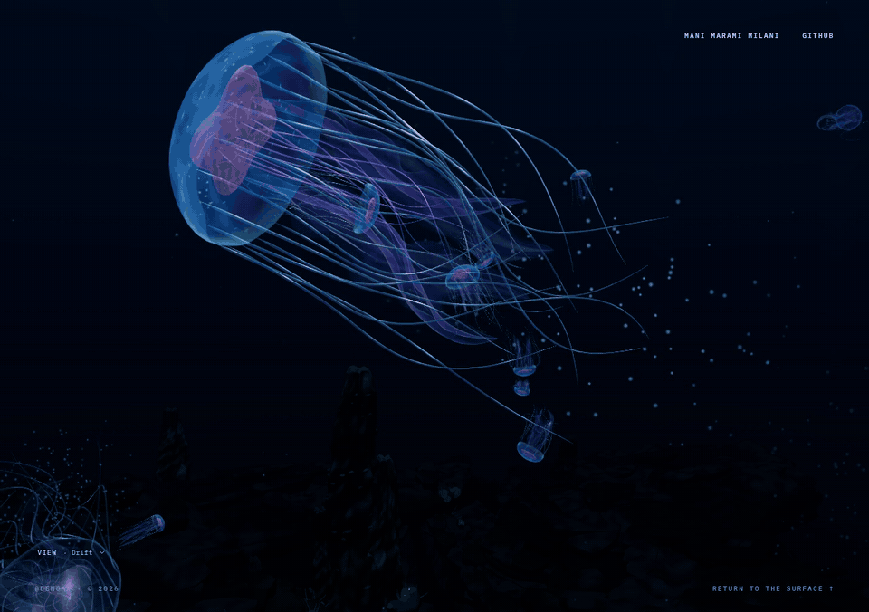
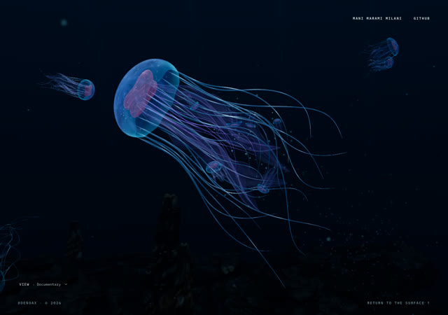
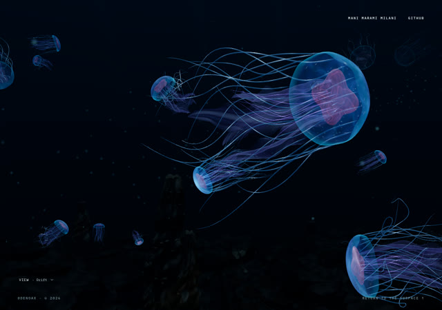
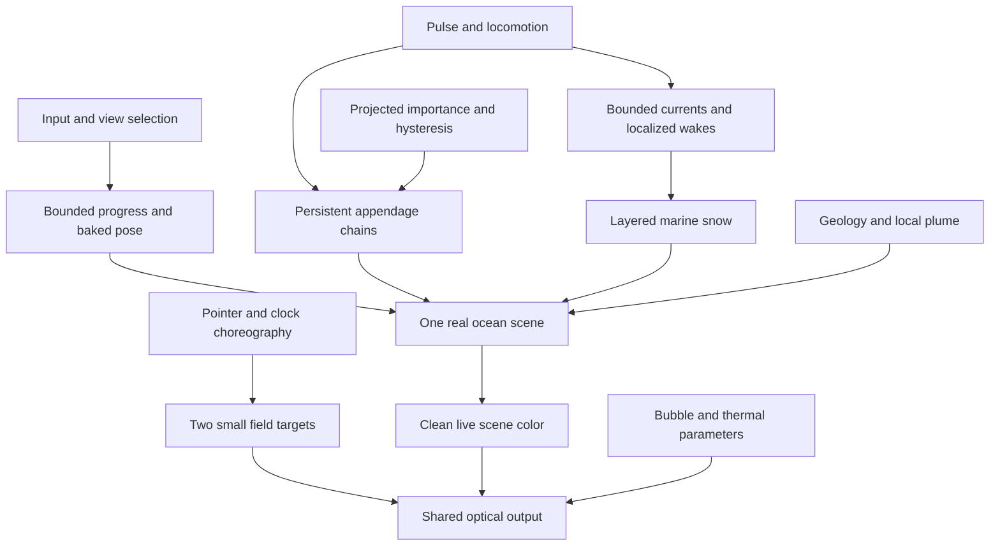
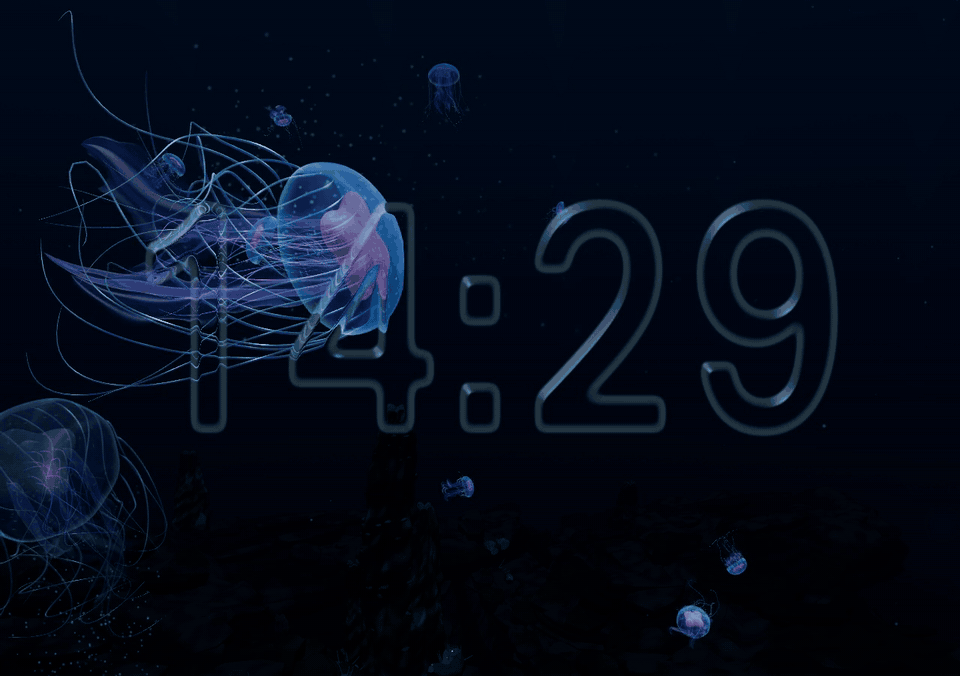

# Pelagic

> A real-time mathematical rendering study of procedural jellyfish, stateful appendages, underwater optics and live liquid glass.

**Mani Marami Milani · Independent technical preprint · Local review edition**

[Live ocean](https://denoax.github.io/pelagic-jellyfish-webgl/) · [Paper](paper/pelagic.md) · [PDF](paper/pelagic.pdf) · [Project page](public/paper/index.html) · [Reproduce](REPRODUCIBILITY.md) · [Cite](CITATION.bib) · [Local release package](paper/RELEASE_PACKAGE.md)



The public ocean link is an existing visitor experience, not a guarantee that Pages matches this artifact. This publication describes approved runtime **`bce3571b0300ecfe5dc6e5dd45f28a9cda57006e`**. Documentation lives on a separate local branch. No new release or deployment is implied. Later Asset2 experiments are excluded from primary figures and results because they were not explicitly approved.

## Abstract

Real-time organism scenes become difficult to maintain when anatomy, motion, environmental effects, camera control and interface optics evolve as unrelated demonstrations. Pelagic is a browser-based rendering study that connects these systems while preserving an art-directed jellyfish identity. Its implementation combines a procedural mantle and folded oral membranes, pulse-coupled locomotion, persistent constrained appendages, bounded world-space currents, projected-size population detail, and an input-driven six-degree-of-freedom camera journey. A shared optical compositor samples one live ocean image for refractive bubbles, localized thermal shimmer and an interactive liquid clock. The clock combines authored implicit-surface choreography with a low-resolution persistent spring/advection field. The paper describes the actual Three.js 0.175.0 implementation, distinguishes code-equivalent equations from abstractions and artistic heuristics, and links the methods to reproducible source locations. The accompanying artifact includes browser motion evidence, deterministic tests, historical rejected approaches and fresh frame-interval measurements of the approved runtime. The work is a systems and visual-engineering study, not a fluid–structure interaction model, calibrated biological simulation or claim of algorithmic priority. Image-space optics cannot recover unseen radiance; liquid topology is not mass-conserving; performance and compatibility evidence remain specific to the tested hardware and backend.

## Contributions

These are contributions of the implementation and documentation, not claims that the component techniques were invented here.

1. **A continuous procedural animal.** Bell, rim, folded oral membranes and reconstructed tentacles preserve a coordinated identity through contraction, recovery, turning and changing scale. Geometry contracts remain distinct from the controller moving the animal.
2. **Persistent appendage history.** Stateful chains carry inertia through body transforms instead of resetting to a fresh wobble each frame. Their constrained points feed both sheets and tubes. Detail transitions reuse that state.
3. **A connected, bounded environment.** Marine snow, localized pulse wakes, activation and neighbor response share world-space current information. Pools and finite lifetimes make the response temporary rather than a permanent halo.
4. **Population detail with hysteresis.** Projected bell diameter chooses near, medium and far representations. Persistent resources and adjacent-tier morphing separate visual importance from resource lifetime, avoiding repeated geometry creation at thresholds.
5. **One clean live ocean for multiple optical effects.** Bubbles, thermal shimmer and liquid-clock output sample the same source image. The compositor neither recursively reads its own output nor maintains a duplicate ocean.
6. **A documented ocean-to-glass transition.** Authored implicit contact, merging and pinch choreography combines with a small persistent displacement field. Browser motion, code-mapped mathematics and explicit optical limits make the method inspectable.

## Journey

| Surface encounter | Pelagic water | Abyssal sanctuary |
| --- | --- | --- |
|  |  |  |

These are browser frames, not generated concept paintings. “Surface,” “pelagic” and “abyss” describe an authored journey, not measured ecological strata. Camera range, fog and geological visibility are artistic choices. Distant geology can remain visible in the approved surface composition.

Four authored observer modes and Explore share one persistent world. Scrolling changes a bounded scalar along a baked pose track, rather than translating an unrelated camera independently in several places. View changes do not create a second school. A subject can leave the frame, become less important and later return while organism and environmental state continue. That continuity matters more than arranging a single flattering still.

The sanctuary changes visual scale without changing the renderer. Procedural masses, mineral variation, sparse benthic life and localized discharge form a dark geological endpoint. Its active material uses an authored unlit/node response with mapped detail; it is not a calibrated rock BRDF. The publication records that distinction rather than describing every attractive mineral highlight as physically based shading.

## Selected mathematics

The paper contains 22 numbered equation groups. Each is classified and linked to pinned source in [the equation/source map](paper/source-map.md); [notation](paper/notation.md) defines the spaces and major symbols. These compact explanations are not an alternative implementation.

### Persistent appendage prediction

$$
\mathbf{x}^{*}=\mathbf{x}+d(\mathbf{x}-\mathbf{x}_{\mathrm{old}})+\Delta\mathbf{x}_{\mathrm{forcing}}.
$$

Positions are chain points in transported simulation space; the previous point supplies history. Damping and bounded increments come from the active solver. Root attachment and iterative segment-length corrections follow prediction. This is an explanatory abstraction of `LivingAppendages`, not a claim that the complete implementation is a single textbook Verlet equation. Both histories move when coordinates change, avoiding accidental velocity from a body transform. Pause recovery bounds admitted time rather than running an unlimited catch-up solve. Paper Section 9 distinguishes prediction, constraints and reconstruction.

### Projected visual importance

$$
D_{\mathrm{px}}=\frac{2rH}{2z\tan(\theta_y/2)}.
$$

Here $r$ is world-space bell radius, $H$ is CSS viewport height, $z$ is positive camera-space depth and $\theta_y$ is vertical field of view. The diameter is combined with visibility and hysteresis rather than treated as a universal perceptual metric. Medium promotion/retention use 32/24 CSS pixels; near promotion/retention use 110/90. An adjacent-tier morph lasts 1.2 seconds. Changing drawing-buffer DPR therefore does not silently alter the anatomical tier. Section 12 explains resource reuse and offscreen work as well as the thresholds.

### Smooth liquid occupancy

$$
F(\mathbf{u},t)=\sum_i a_i(t)\exp\!\left[-\frac{\|\mathbf{u}-\mathbf{c}_i(t)\|^2}{2\sigma_i(t)^2}\right].
$$

This abstraction describes Gaussian contributions in aspect-corrected screen coordinates. The implementation also has authored contact/throat terms and transition envelopes; it is not simply this sum thresholded once. The field supplies a coherent optical boundary as centers, amplitudes and widths change. Its topology merges or separates without rebuilding a triangulated fluid surface. Amplitudes and widths are art-directed, not volume-conserving. Sections 17–18 explain how this boundary interacts with persistent pointer displacement and the actual ocean image.

## System architecture



The active renderer is Three.js `WebGPURenderer` using its real **WebGL2 fallback** in the publication measurements. A class name is not proof that hardware WebGPU ran. Node/TSL materials belong to that renderer family, and Three.js stays pinned at 0.175.0. React owns application lifecycle; imperative Three.js owns the ocean. React Three Fiber appearing in the dependency list does not mean the active scene uses it.

When optical effects need scene color, the compositor uses a clean RGBA16F target with a depth attachment and an output pass. Idle adds two small RGBA16F field targets, 256×180 at the measured viewport. They store velocity and displacement, not duplicate ocean images. Auxiliary field/output draws are additional work but not extra complete ocean scene renders. A direct path remains available when optical composition is inactive.

Transparent tissue complicates depth: its color is layered into the source image, while it generally does not write opaque depth. A bounded virtual background plane supplies information the image lacks. The pinned fallback also has a documented multisample depth-resolve limitation. “Live refraction” therefore means current scene color genuinely bends, not that the system reconstructs transparent-layer depth, unseen radiance or nested physical refractions.

## Motion results


**S9 — contact and merge.** This excerpt shows the normal-size browser sequence. The master and timestamps retain approach, contact, neck formation and settlement. It demonstrates authored implicit topology, not a recording of conserved fluid volume.



**S12 — pinch dismissal.** The boundary must separate in time while the image beneath remains live. A preview aids browsing; the full-resolution source is the technical evidence. Neither an isolated bright edge nor a favorable screenshot establishes that the interaction succeeds through motion.

The [motion catalog](paper/MOTION_GALLERY.md) covers twelve tasks: pulse; appendage lag; activation; population detail during travel; bubble passage; observer modes; sanctuary plume; idle entry; merging; pointer deformation; minute change; and pinch exit. Metadata records runtime SHA, browser/backend, viewport, drawing buffer, DPR, camera, seed, simulation time and observed source rate. Files are encoded at 30 fps from approximately 30 observed browser frames per second. Encoding may repeat frames and is not a benchmark.

MP4 masters and timestamps stay outside ordinary Git history. Small previews, posters and metadata are tracked; the local review server joins these with staged motion. Remote media URLs will not be guessed before an actual release exists. No generated substitute imagery, browser chrome or private desktop capture is used as runtime evidence. Source-derived diagrams are labeled separately so a plotted profile cannot be mistaken for a rendered specimen.

## Fresh publication performance

The capture-free run uses approved M7, not the later Asset2 experiment. Seven scenes are observed for 30 seconds each after initial and scene-specific warm-up. Existing development fixtures select repeatable states and hold DPR at 1 without adaptive downshift. This is a single-run characterization, not a randomized cross-device study or a comparison against another renderer.

| Scenario | Median (ms) | p95 (ms) | Maximum (ms) | Intervals >50 ms |
| --- | ---: | ---: | ---: | ---: |
| Opening | 16.70 | 18.60 | 28.80 | 0 |
| Midwater | 16.70 | 17.80 | 27.20 | 0 |
| Bubble passage | 16.70 | 18.70 | 65.30 | 1 |
| Sanctuary | 16.70 | 18.00 | 25.90 | 0 |
| Explore | 16.70 | 18.50 | 31.80 | 0 |
| Settled M7 | 16.70 | 17.90 | 26.00 | 0 |
| M7 manipulation | 16.70 | 18.20 | 30.00 | 0 |

These are **render-completion intervals, not GPU timings**. Medians near refresh cadence do not reveal spare GPU capacity. One 65.3 ms bubble-passage interval is retained; the run does not identify its cause. Removing that stall or claiming guaranteed 60 fps from the median would misrepresent the evidence.

The browser is Brave/Chromium 152.0.7977.76 using ANGLE on an NVIDIA RTX 4070. Viewport and drawing buffer are both 1280×900, DPR is 1, and production bloom is off. The host has an Intel Core i5-14600K and approximately 64 GB RAM. Full environment and intervals are in [the raw record](paper/results/benchmark.json); [the report](paper/results/README.md) explains contention and measurement scope. No recording or encoding ran during timing. Resolution was not lowered to improve the numbers.

## Read the paper

- [GitHub-native paper](paper/pelagic.md) and [PDF](paper/pelagic.pdf): full implementation description, equations, algorithms, figures, results and limitations.
- [Supplement](paper/supplement.md) and [supplement PDF](paper/supplement.pdf): motion tasks, numerical qualifications, negative results and optical boundaries.
- [Source map](paper/source-map.md), [notation](paper/notation.md), [claim ledger](paper/audit/CLAIM_LEDGER.md) and [reference ledger](paper/audit/REFERENCE_LEDGER.md): the bridge between prose and implementation.
- [Baseline decision](paper/PUBLICATION_BASELINE.md): why approved M7, rather than the latest review-only checkout, defines this artifact.

The PDF and Markdown derive from one canonical manuscript. The paper is an independent technical preprint, with no DOI, arXiv identifier, acceptance, institutional affiliation or peer-review claim. Biological swimming papers motivate unequal contraction/recovery rhythm; they do not validate these parameters as measurements of a real species. Implementation citations are not interchangeable with evidence from biological experiments.

## Reproduce

Use a clean publication checkout or the prepared package. Publication commits contain documentation and tools; the runtime manifest pins the approved source separately.

```sh
npm ci
VITE_OCEAN_RELEASE=milestone-2 npm run build
node --test tests/*.test.mjs
node scripts/check-approved-motion.mjs
node scripts/check-default-animal.mjs
npm run dev -- --host 127.0.0.1
```

Open the address printed by Vite. The release flag selects the existing approved path; its historical name does not mean this code stops at Milestone 2. Build before the full tests: a packaging test reads generated output. A missing build artifact is a failed precondition, not a passed test.

The [reproducibility guide](REPRODUCIBILITY.md) documents capture, timing, browser selection, required system tools, paper building and local package review. Scripts accept output directories instead of embedding a home directory. Capture presets seed initialization, but wall-clock scheduling and driver behavior still prevent bitwise image reproducibility. Metadata records actual observed states so deviations can be investigated rather than hidden.

Deterministic parity tests compare approved motion and the default animal against existing baselines. They establish specific numerical contracts, not universal visual correctness. Browser sequences complement them by exposing transparent overlaps, moving silhouettes, refraction and recovery. A convincing result requires both kinds of evidence; a passing unit test cannot establish that a contact neck is legible or an animal moves attractively.

## Limitations

- This is an artistic organism system, not fluid–structure simulation. Thrust, bounded currents and wakes are heuristics, not estimates of pressure, ocean circulation or energy efficiency.
- The implicit clock does not conserve mass. Contact and separation are authored transitions aided by persistent deformation, not a general surface-tension solver.
- Image-space optics lack offscreen color and independent transparent-layer depths. The depth-resolve limitation remains documented, not silently repaired in a publication change.
- Gelatinous tissue uses an optical/material approximation, not physical framebuffer transmission merely because it looks translucent.
- Fixed steps exist in several subsystems, but the application is not one globally deterministic solve. Pause recovery bounds time admission rather than simulating every missed second.
- Single-machine intervals cannot establish hardware WebGPU support, mobile performance, universal compatibility or GPU execution time. Physical mobile, Safari, Firefox and hardware WebGPU are not validated by this publication run.
- Sanctuary materials and scale are art-directed. Archived scanned assets in the repository are not automatically active in the current geology.
- Author review and example captures are not a perceptual user study. No quantitative superiority over other artwork or research systems is claimed.

These limits are part of the result. They identify where a reusable visual system ends and a general simulation or rendering problem begins. Future work should be judged against those boundaries, not called solved because one attractive frame can be produced. Historical rejected approaches in the supplement explain engineering choices without turning anecdotal development observations into controlled comparative experiments.

## Citation

Use [CITATION.cff](CITATION.cff) for repository-aware tools or [CITATION.bib](CITATION.bib) for BibTeX. The author is **Mani Marami Milani**. Cite this as an unreleased/local-review technical manuscript until publication is authorized. The citation omits an invented DOI and release date. Record the runtime SHA separately when reporting reproduced results: the identity of an executable experiment is not necessarily the identity of its later documentation commit.

## Provenance and licensing

Original source code is **MIT**. Original paper, documentation, diagrams, screenshots and project-generated media are **CC BY 4.0**, to the extent the author can license them. Third-party components retain their licenses; this split does not relicense them. Read [LICENSE.md](LICENSE.md), [ASSET_PROVENANCE.md](ASSET_PROVENANCE.md) and the retained Aurelia notice before redistributing substantial source or assets.

Codex/OpenAI assistance covered implementation, research synthesis, writing, source audit and tooling under the author's direction. Runtime captures here were rendered by the project, not generated substitutes. Earlier generated fallback artwork is identified separately in provenance and is not scientific motion evidence. FluidGlass informed visual goals, but its unlicensed implementation is not copied. Scientific citations provide context, not an assertion that Pelagic reproduces those experiments.

[CONTRIBUTING.md](CONTRIBUTING.md) describes changes that preserve evidence quality. This branch prepares a local publication package only: no release, Pages update, remote metadata edit or archival submission has been performed.
