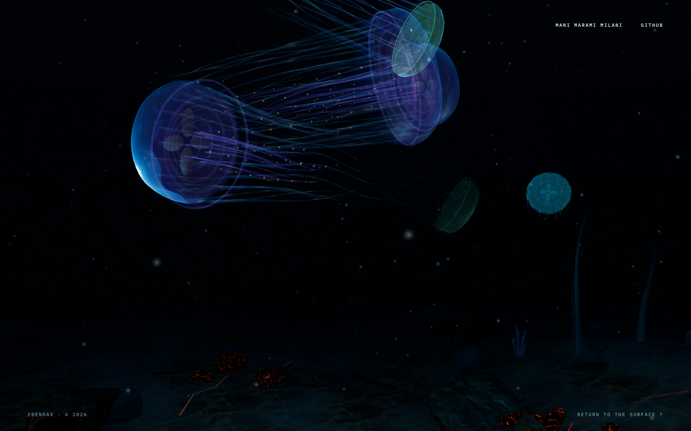
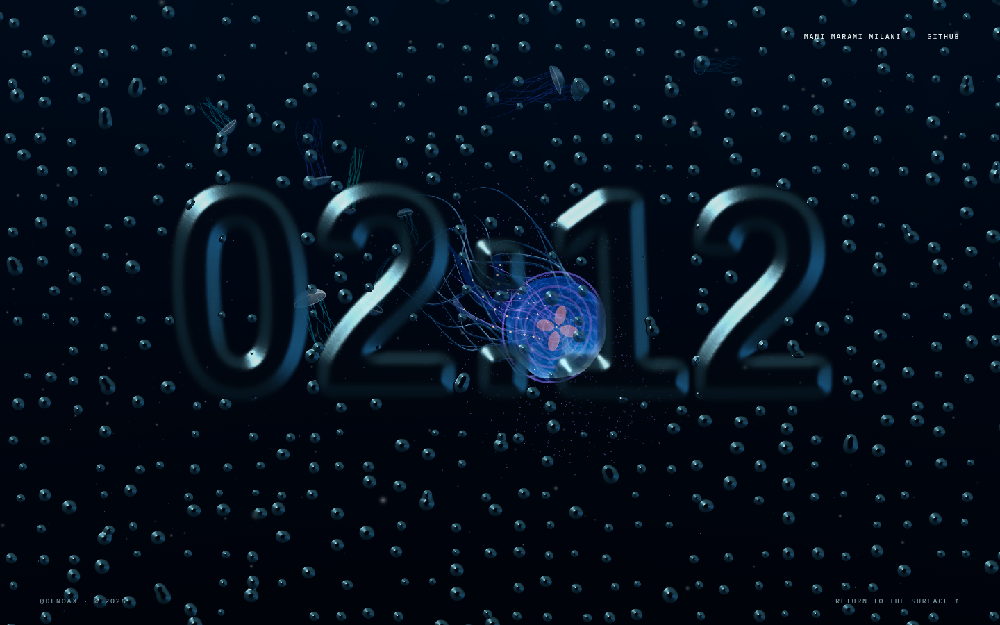
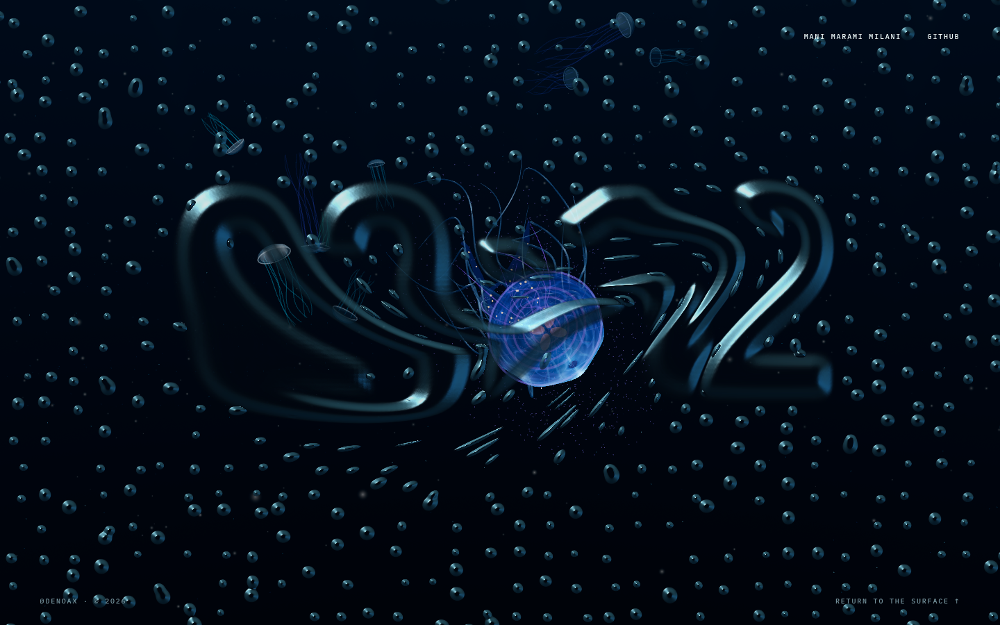
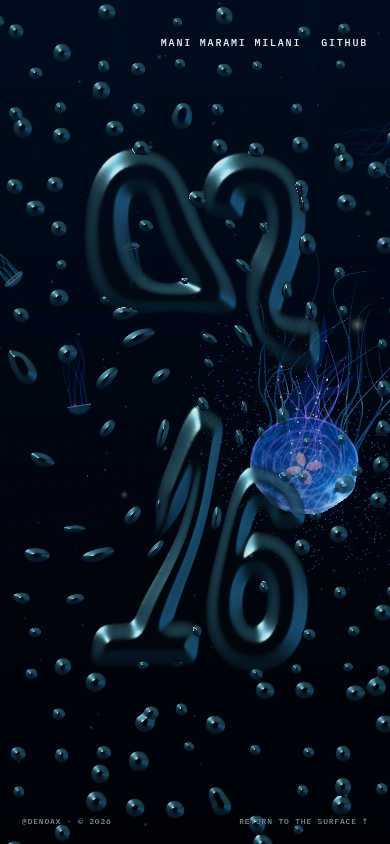
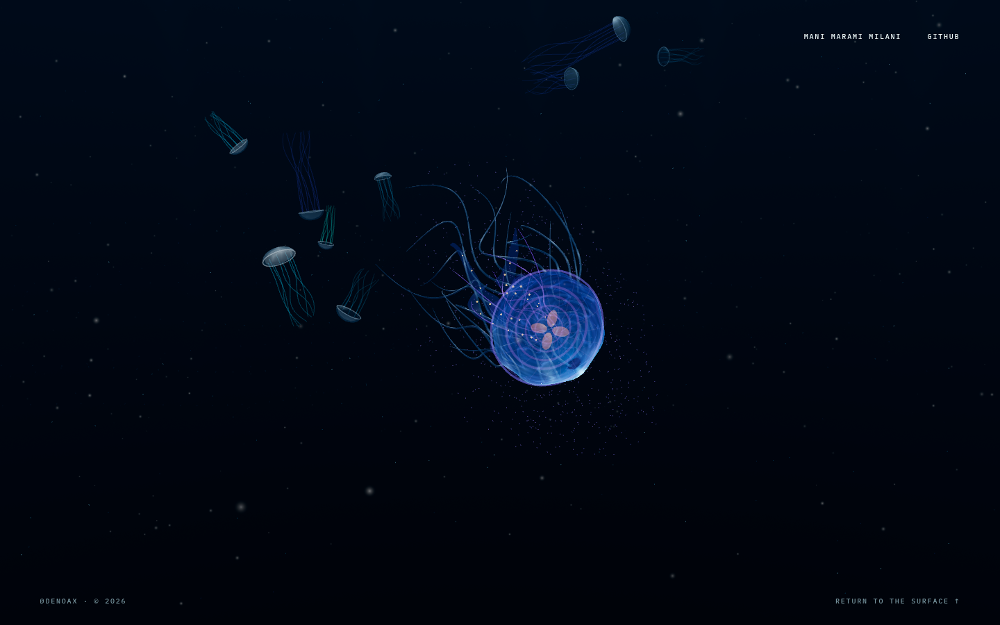
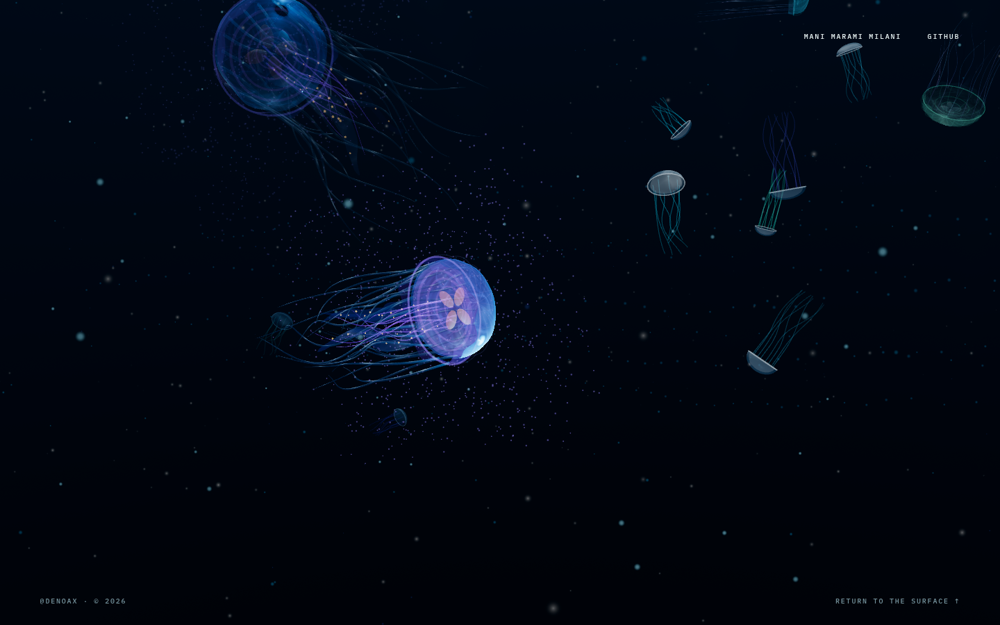
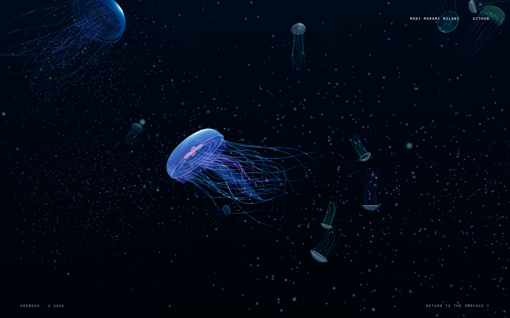

# Pelagic — water and liquid-glass implementation

Implemented locally after the [rendering audit](../research/2026-09-05-ocean-rendering-audit.md). This record does not claim a GitHub Pages deployment or approval for the Three.js showcase.

## Artwork



The expanded, nonuniform terrain mesh concentrates samples in the visible basin. A reused Poly Haven scan is triplanar-mapped and mixed with sediment and mineral variation. Contact shade is embedded into the terrain material instead of floating circular meshes. Small basalt lobes contain localized emissive crust seams. Shared directional radiance and distance attenuation let the far floor disappear into the water while retaining foreground detail. The near-clear interval is an art-directed visibility control, not a claim of a physically calibrated ocean.

An intermediate fog pass was rejected because it hid too much detail. Shader inspection found that an inline TSL `Output` reference applied the fog twice; storing its result before reassignment fixed that. Signed inputs to terrain `pow` were also made safe. Spatially identical vertices now receive identical rock displacement, avoiding cracks introduced by per-index randomness.

| Resting glass | After a cursor sweep |
| --- | --- |
|  |  |

The clock uses cached softened masks, a 2.8-second minute morph, smooth droplet level sets and thickness-gradient shading. A fixed-step, bounded spring/advection field retains velocity and displacement in two small render targets. Cursor segments inject movement continuously rather than leaving isolated point stamps. Drift is very slow; direct manipulation remains responsive.

Signed half-float storage is centered on zero. An initial encoded-around-0.5 version left a small sticky offset and was replaced after numerical testing. When float render targets are unavailable, two 16-bit displacement components are packed into RGBA8 and use a simpler damped/advection model. This path also passed the rest/recovery checks.



## Reliability and lifecycle

- Read the initialized backend, not the original browser preference. The former failed-adapter case now reports WebGL 2 and renders visible ocean pixels.
- Use the direct renderer path on both backends. The inherited MRT/bloom pipeline is not selected in production.
- Handle initialization failure, context/device loss and repeated frame failures. Keep navigation working and show the existing project poster with a compatibility retry instead of silent blackness.
- Reduced motion does not initialize either graphics renderer.
- Prewarm the transparent idle renderer before entry, compile its shaders and submit a frame before revealing it. Retain resources across idle visits; stop continuous drawing while dormant and hidden. Keep the canvas alive through its 2.6-second exit.
- Refresh a stale clock while dormant rather than normally uploading it at the start of the next fade.
- Do not initialize the hidden legacy Aurelia animals and GPU spring buffers behind the visible `LivingAppendages` animals.
- Defer idle preparation during pointer/scroll activity. Load and prewarm the scanned geology before revealing the first live frame so its first parse/compile does not land in the descent.
- Cap initial ocean DPR and reduce it after sustained slow frame delivery. This is a conservative resolution governor, not proof of low-end-device performance.

| Failed adapter: now visible | Graphics denied: useful recovery |
| --- | --- |
|  |  |

## Verification

Browser tests used isolated Brave/CDP sessions on Linux, ANGLE/OpenGL, RTX 4070. Portrait and ultrawide captures test layout and composition on that GPU; they are not measurements from physical phones.

| Check | Observed result |
| --- | --- |
| Production build | Passed; existing large-chunk warnings remain. |
| Sites packaging tests | 4/4 passed. |
| Automatic adapter-denial fallback | Ready, actual WebGL 2, visible ocean, no console errors. |
| Graphics denied at initialization | Recovery poster, accessible message and compatibility link. Expected initialization error logged. |
| Context loss after startup | Error state and recovery artwork; rendering stops rather than continuing to claim readiness. |
| Reduced motion | Still artwork, zero graphics contexts. |
| Half-float gel | Rest displacement 0; sweep peak 0.212 UV units; visible wake retained; below 0.000024 after settling, then zero. |
| RGBA8 packed gel | Rest 0; sweep peak 0.076; wake 0.014; settled 0. |
| Minute change / Escape / repeat entry | Clock advances and finishes its morph; Escape dismisses; repeat entry reuses the same two contexts. |
| Layouts | 1440×900, 1920×1080, 390×844 and 2560×1080 captures inspected; no horizontal overflow in recorded layout tests. |
| Continuous scroll | Final local test: 16.67 ms average callback interval, 16.7 ms p95 / 16.8 ms max, no recorded long frames. An earlier pass had 149.9 ms / 83.3 ms hitches from preparation and geology loading; these prompted the final scheduling/prewarm changes. |
| Native WebGPU attempt | This environment selected WebGL 2; native WebGPU is **not** claimed validated. |

The final **no-screenshot** 1920×1080 profile recorded a maximum animation-frame interval of **16.8 ms** from 250 ms before idle activation through 3.3 seconds after activation, with **no long tasks in that interval**. This replaces the audit's 125 ms idle-entry task. Ocean, idle and exit windows were also approximately 16.7 ms per animation callback. These are browser callback timings, not GPU completion/presentation timestamps or a promise of 60 FPS on other hardware.

Startup remains a known limitation: the final run recorded 221 ms and 953 ms initial tasks and a 252 ms offscreen glass-preparation task. Moving that preparation away from the visible fade fixes the measured entrance, not every startup stall.

Evidence: [desktop timing data](profile-desktop.json), [continuous-scroll timing data](scroll-desktop.json), [half-float field samples](gel-half-float.json), [packed-field samples](gel-packed.json). Reproduction script: `scripts/verify-rendering.mjs`. It deliberately injects failures; screenshots must still be inspected because a ready flag alone does not prove good pixels.

```sh
node scripts/verify-rendering.mjs fallback 'http://127.0.0.1:4173/?idle=300' /tmp/pelagic-fallback
node scripts/verify-rendering.mjs blocked 'http://127.0.0.1:4173/?idle=300' /tmp/pelagic-blocked
node scripts/verify-rendering.mjs loss 'http://127.0.0.1:4173/?idle=300' /tmp/pelagic-loss
node scripts/verify-rendering.mjs gel 'http://127.0.0.1:4173/?idle=4' /tmp/pelagic-gel
node scripts/verify-rendering.mjs gel-byte 'http://127.0.0.1:4173/?idle=4' /tmp/pelagic-packed
node scripts/verify-rendering.mjs profile 'http://127.0.0.1:4173/?idle=12' /tmp/pelagic-profile 1920 1080
```

## Honest remaining boundaries

### Particle polish follow-up

Replaced square hero flecks, marine snow and current-veil points with instanced camera-facing discs. A radial opacity shader softens their edges; individually phased GPU drift, small size variation and restrained shimmer keep them alive without adding simulation buffers or draw calls. Shared underwater fog uses each particle's center. Build and Sites tests passed; a three-frame Brave/WebGL 2 capture at 1440×900 was visually inspected with no console errors. Native WebGPU was not independently tested.



The subsequent free-drift pass detaches the animal flecks into world-space pools. Each fleck has its own smoothed wandering velocity and 15–28-second lifetime; only births sample the jellyfish transform. Older particles linger as it leaves, then fade out individually. Birth/death alpha and positions use reused typed buffers; shader seeds remain stable as positions change. Three regression tests verify transform independence, independent travel/expiry, and invisible replacement births. A four-frame Brave/WebGL 2 sequence was inspected with no console errors; build and Sites tests passed.



The idle layer still uses a separate prepared renderer and does not sample/refract the real ocean framebuffer. The gel is an original elastic/advection model, not full Navier–Stokes or copied FluidGlass code. A shared-renderer optical composite is a subsequent architectural step. Real Safari/iOS, Firefox, Android and integrated-GPU performance need physical-device validation. The compatibility retry is user-controlled; hardware-disabled graphics cannot be repaired by a website.

No third-party shader code was copied and no new third-party asset downloaded. See [asset provenance](../../ASSET_PROVENANCE.md). The research sources informed shared underwater visibility, multi-scale terrain, stateful displacement and renderer lifecycle; screenshots of reference projects were not used as production assets.
