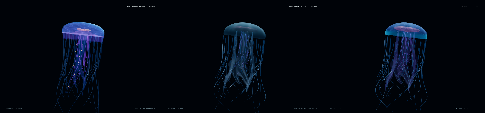

# Milestone 1 — approved model, restored bioluminescent color

## Status: READY FOR VISUAL REVIEW

The approved form and motion remain intact. The material pass restores a more luminous blue/cyan bell, pink internal anatomy and restrained violet/cellular detail. This is ready for Mani's color review, not permission to publish or advance milestones.

## Scope

Mani explicitly approved the geometry and animation at **`c4eaa355a4f0ccdf7ec4b24a73653a9799ca7c56`**. This continuation is a **material/color pass only**. The old production jellyfish is the direct art-direction reference, not a reason to reopen its geometry.

Repository `/home/mani/dev/jellyfish-studio/site`, origin `https://github.com/Denoax/pelagic-jellyfish-webgl.git`, branch `milestone-1-jellyfish-specimen`. Final rendering source: **`49c9fda601cb052a75478dbe808c4a98df5368bf`**. Subsequent review/media commits do not change that animal. The original production baseline is still `1b5b83e776de1ccad1038a75a98830ac4fc41184`.

## What changed — and what did not

The old source's appealing character came from its blue-violet emissive tissue texture, cyan edge/sheen, warmer luminous organs, violet filaments and small arm accents. The approved new material had removed much of that separation along with the old construction shells.

This pass restores that **color hierarchy on the approved surfaces**:

- **Bell:** more translucent optical response, less diffuse/matte roughness, blue-violet emission modulated by soft organic mottling and sparse canals. The existing viewing-angle/thickness response still governs the tissue.
- **Edge:** a brighter cyan accent on the existing rolled mantle, strongest at grazing angles. No restored torus, extra shell or silhouette change.
- **Internal anatomy:** pink/rose-lavender emission with the repository's existing tissue texture; brighter than the surrounding thin bell, without uniformly whitening the whole animal.
- **Membranes/filaments:** quieter violet emission and sparse rose-colored cells. Membrane opacity and edge coverage are softer, reducing the hard visual patches at crossings.
- **Organic detail:** original seeded 512 × 256 mipmapped data masks for mottling, canals and small luminous cells. The cells remain attached to the existing UVs; no extra geometry, particle system or independent animation is added. Periodic seams and filtered minification are tested.

The bell, rolled rim, gastric body, oral arms, tentacles, normals, vertex colors, proportions, deformation, swimming, activation timing/recoil and camera are unchanged. **No geometry or simulation function was edited.** The existing point light, ocean lighting, fog, environmental particles, water, seabed and idle glass are also unchanged.

The normal production renderer already has bloom disabled. This pass preserves that path: the new luminosity comes from localized material response, **not a newly enabled bloom/halo pass**. The old extra shells/rings and pearl geometry stay hidden. The surface has volume and color without bloom. Scene-image refraction and physically calibrated subsurface transport are still not implemented.

### Secondary overlap issue

Only the membrane material changed: lower optical coverage and softer sheet edges make overlapping folds less opaque and less abruptly outlined. **Physical crossings can still occur.** No collision, spacing, geometry or animation changes were made to chase this secondary issue. This is a modest visual mitigation, not a claim of an intersection-free model.

## Matched three-way comparison

All three sets are fresh browser captures at **1280 × 900 viewport/drawing buffer, DPR 1, the same fixed quality and normal bloom-off path**, seeded fixture and held time **t=9**. The camera offsets, animal transform scale and pulse checkpoint are equivalent. Differences in the old model's actual shape are intentional, not a change in screenshot magnification.

Left to right: old production → approved model before color → color-refined model. This plate simply places the three actual browser frames side by side; it does not retouch them.



| View | Old production animal | Approved new model before color | New model after color |
| --- | --- | --- | --- |
| Oblique / medium | [old](evidence/color-old/oblique-medium.png) | [approved](evidence/color-approved/oblique-medium.png) | [after](evidence/color-final/oblique-medium.png) |
| Side / near | [old](evidence/color-old/side-near.png) | [approved](evidence/color-approved/side-near.png) | [after](evidence/color-final/side-near.png) |
| Underside / near | [old](evidence/color-old/underside-near.png) | [approved](evidence/color-approved/underside-near.png) | [after](evidence/color-final/underside-near.png) |
| Top / near | [old](evidence/color-old/top-near.png) | [approved](evidence/color-approved/top-near.png) | [after](evidence/color-final/top-near.png) |
| Oblique / far | [old](evidence/color-old/oblique-far.png) | [approved](evidence/color-approved/oblique-far.png) | [after](evidence/color-final/oblique-far.png) |

Each folder's `matched.json` records renderer, source and captured `state`; its `info.specimen.time` is only the earlier warm-up sample. Final contraction **t=10.06** and recovery **t=11.4** are in [color-final-contract](evidence/color-final-contract) and [color-final-recover](evidence/color-final-recover). Their approved-geometry/material-before counterparts remain in [refinement-final-contract](evidence/refinement-final-contract) and [refinement-final-recover](evidence/refinement-final-recover).

## New motion evidence

- [Specimen recording](evidence/color-final-motion/motion.mp4): repeated pulses, near side, actual click activation, a complete close underside cycle, near/medium/far changes and a controlled turn. Encoded **54.36 seconds, 1254 × 900**.
- [Same animal in the existing ocean](evidence/color-final-ocean/motion.mp4): opening, existing first approach at approximately 7% scroll, activation, turn and recovery. Encoded **36.60 seconds, 1280 × 900**. Only existing foreground slot 0 is substituted.

Both are actual browser screencasts, encoded from captured frame timestamps. They are not generated imagery or still-image animations. Use the PNG sets for exact phase/pixel comparisons; CDP compositor output can have a different encoded width from the recorded drawing buffer. Capture overhead is excluded from the performance runs.

## Local review

The existing server is running at **127.0.0.1:5178**:

- [Color-refined specimen](http://127.0.0.1:5178/?specimen=1&renderer=webgl&idle=300).
- [Color-refined ocean preview](http://127.0.0.1:5178/?oceanPreview=1&renderer=webgl&idle=300).
- [Original production specimen](http://127.0.0.1:5178/?specimen=1&animal=baseline&renderer=webgl&idle=300).
- [Unchanged default artwork](http://127.0.0.1:5178/).

Specimen keys remain 1–4 for angles, N/M/F for distance, Space for pause/resume, A or an actual click for activation. Append `&hold=9`, `&hold=10.06` or `&hold=11.4` for repeatable inspection. The approved-before material is preserved by its commit and captures, not a second new runtime material engine.

Reproduce from the repository:

```sh
npm run dev -- --host 127.0.0.1 --port 5178 --strictPort
node --test tests/*.test.mjs
node scripts/check-approved-motion.mjs
node scripts/check-default-animal.mjs
VITE_BASE_PATH=/pelagic-jellyfish-webgl/ npm run build
```

Browser jobs must run one at a time because the existing Brave/CDP wrapper uses port 9279. Example timing run, separately from captures:

```sh
node scripts/specimen-evidence.mjs 'http://127.0.0.1:5178/?specimen=1&renderer=webgl&idle=300' color-repeat-perf perf 30
```

Use `oceanPreview=1` instead of `specimen=1` for ocean timing, `matched` with `&hold=9` for screenshots, or `anatomy-tour 54` for the specimen motion tour.

## Validation

- **18/18 tests passed:** all 16 prior tests plus deterministic/periodic sparse luminous masks and owned-texture disposal/filtering coverage. There is no generic `npm test` script; the actual command is shown above.
- **Approved model/motion guard passed:** `check-approved-motion.mjs` compares 720 frames and 24 checkpoints against the approved constructor. Mesh buffers are byte-for-byte equal; oral/tentacle/filament particle positions and Verlet histories, activation state and body transform are exactly equal through turns, activation and a rejected background-time jump. It compares geometry/motion, deliberately not material values.
- **Default-artwork parity passed:** original production geometry/material behavior remains equal at eight checkpoints across 240 frames.
- **Production build passed:** GitHub Pages base path and Sites packaging retained. Existing large-chunk and npm global `tmp` warnings remain. The production bundle contains neither `SpecimenPreview` nor `__SPECIMEN__`.
- **Scope check:** the `LivingAppendages.js` diff changes only material settings in its `improved` branch. `anatomy/mantle.js`, `jellyMotion.js`, `JellySchoolDirector.js`, `SpecimenPreview.js`, `HeroScene.jsx` and environment sources have no changes in this pass.
- **Actual interaction/lifecycle:** both final motion recordings show a successful click on actor 0 and activation returning to zero, with no console errors. The [new lifecycle check](evidence/color-final-lifecycle/lifecycle.json) shows idle `true → false`, click activation `0 → 1`, actual tab visibility `hidden`, and only **0.1203 seconds** of simulation advancement across the approximately 1.8-second background interval plus brief resumed observation.
- **Visual self-review:** inspected the three-way plate, close side/underside/top, contraction, recovery and far frames, plus frame sequences through pulses, activation, turn and the existing ocean approach. The clean rim and approved form remain intact; the body is now distinctly more colorful and luminous. The pink internal body stays readable through the blue bell, while the finer violet appendages remain subordinate. Final approval remains Mani's decision.

## Performance and compatibility

Measurements use the same method on both sides: **six-second warm-up, thirty-second uncaptured run**, fixed quality, 1280 × 900 viewport and drawing buffer, DPR 1, bloom off. The approved-before runs were completed before editing material source; the after runs use the committed final source. No screenshot capture, video encoding or build runs concurrently with timing.

Test host: Intel Core i5-14600K, approximately 62 GiB RAM, NVIDIA RTX 4070 12 GiB / driver 610.57.04; Brave Flatpak 1.94.119, Chromium 152.0.7977.76. WebGL backend: ANGLE / NVIDIA RTX 4070 OpenGL ES 3.2. These are **frame intervals, not GPU timings**. A 60 Hz scheduling ceiling does not demonstrate spare GPU headroom.

| Scene / material | rAF median / p95 (ms) | Render-completion median / p95 (ms) | Maximum render interval (ms) | Intervals >50 ms |
| --- | ---: | ---: | ---: | ---: |
| Specimen / approved-before | 16.7 / 16.8 | 16.7 / 17.3 | 20.0 | 0 |
| Specimen / color-after | 16.7 / 16.7 | 16.6 / 18.6 | 23.2 | 0 |
| Ocean / approved-before | 16.7 / 16.8 | 16.7 / 17.8 | 22.5 | 0 |
| Ocean / color-after | 16.7 / 16.7 | 16.6 / 18.9 | 22.8 | 0 |

The specimen's render-completion p95 increased **1.3 ms** and maximum **3.2 ms**. The ocean's p95 increased **1.1 ms** and maximum **0.3 ms**. Median cadence remains essentially unchanged. The added tail cost is reported, not hidden by reducing resolution or quality. These single paired runs include normal working-PC scheduling noise and do not isolate shader GPU duration. Each contains 1,800 render intervals (final ocean 1,801), zero console errors and unchanged DPR 1.

Raw timing evidence: [approved specimen](evidence/color-perf-approved-specimen/performance.json), [final specimen](evidence/color-perf-final-specimen/performance.json), [approved ocean](evidence/color-perf-approved-ocean/performance.json), [final ocean](evidence/color-perf-final-ocean/performance.json).

Rendering cost added: one mask sample in each bell/membrane material, two small RGBA8 mipmapped textures (approximately **1.33 MiB** including mip levels), and one-time deterministic mask generation. No new meshes, simulation steps, lights, render targets or draw calls. The built scene chunk increased from approximately 731.02 to 732.71 kB uncompressed (209.49 to 210.19 kB gzip); no dependency was added.

Actual renderer checks:

- **WebGL 2 / NVIDIA RTX 4070:** matched views, final specimen/ocean recordings and lifecycle checks passed with zero browser errors.
- **WebGPU / Google SwiftShader software adapter:** the isolated final specimen reached the held t=9 checkpoint and rendered all five matched views with zero browser errors. [Actual adapter/checkpoint](evidence/color-final-webgpu/matched.json). This was the real WebGPU API, but **not hardware WebGPU validation**.
- Hardware WebGPU, physical mobile devices, Safari/Firefox, integrated-GPU laptops and thermal endurance: **NOT TESTED**.
- The known legacy full-ocean WebGPU transmission-format issue remains separate and was not reworked or claimed fixed. No renderer version/family change was made.

## Source and safety

Changed runtime sources: `src/scene/materials/JellyTissue.js`, new `src/scene/materials/BioluminescenceMap.js`, and material assignments only in `src/scene/LivingAppendages.js`. Supporting additions: `tests/jelly-tissue.test.mjs`, `scripts/check-approved-motion.mjs`, scoped material instructions and this evidence/report.

The pre-existing root `AGENTS.md` edit and untracked research are preserved and not committed. Three.js remains **0.175.0**. All runtime changes remain development opt-in; default/public artwork is unchanged. No merge, push, deployment or workflow trigger occurred. **Milestone 2 was not started.**
