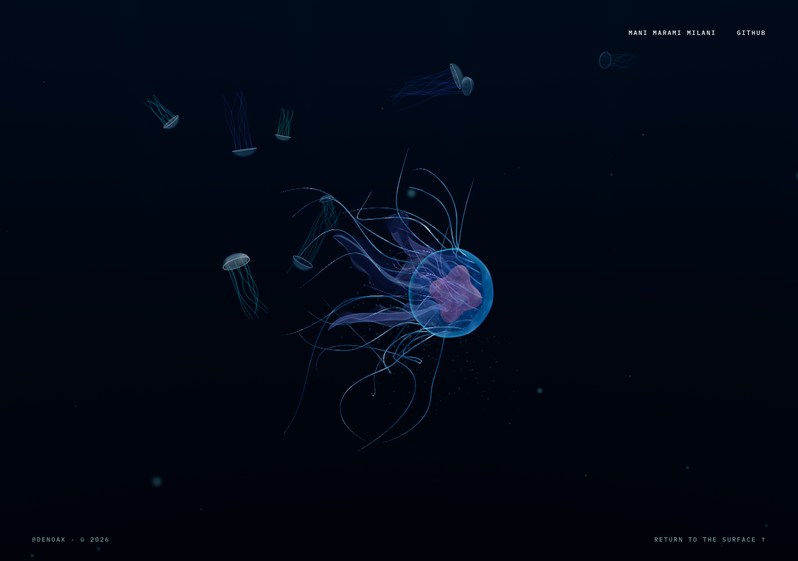
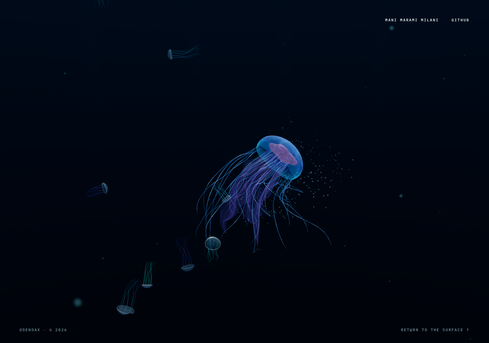
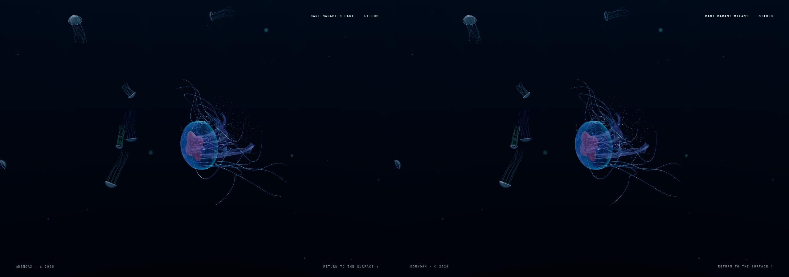
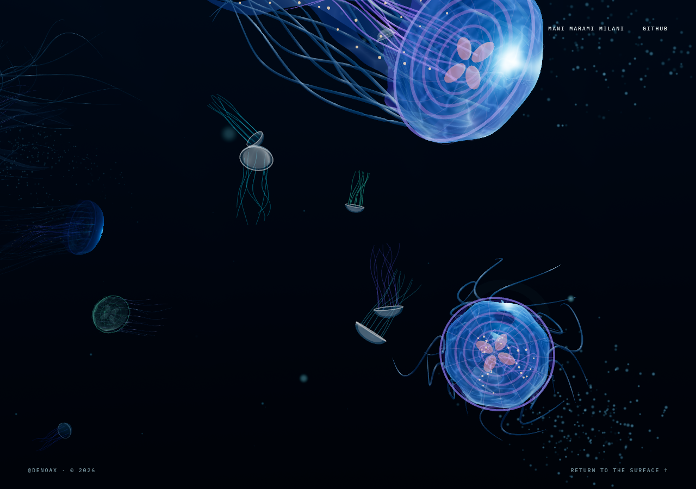
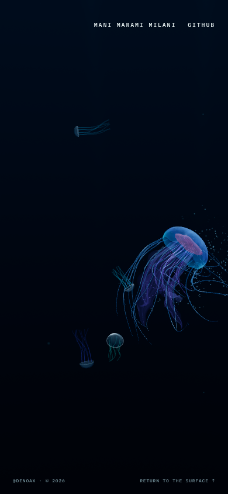
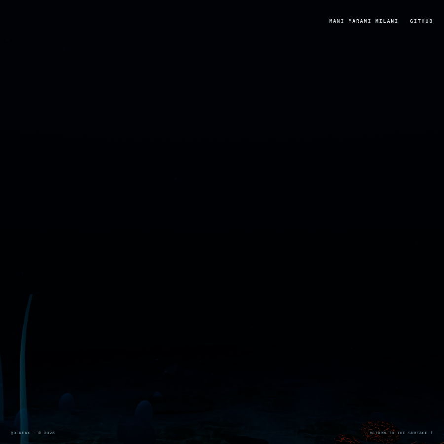

# Milestone 2 — fresh live audit and local refinement

Status: **READY FOR VISUAL REVIEW.** This is a local review candidate, not
user approval or permission to publish/proceed to another milestone.

This is a refinement of the already published M2, not another implementation
or an animal redesign. The capture-first audit found one worthwhile adjustment:
ordinary propulsion wakes needed more contrast against the persistent flecks.
The existing click event was already local, readable and temporary. Its size,
timing, propagation and underlying currents were deliberately left intact.

## Identity, scope and safety

| Item | Verified value |
| --- | --- |
| Repository | Denoax/pelagic-jellyfish-webgl |
| Local root | /home/mani/dev/jellyfish-studio/site |
| Live / starting M2 review SHA | `a0501c21f8c782887bf6a5e1257e955ada41b678` |
| Approved M1 animal SHA | `515fa71d90f423ac97747cb7a60d1d84d446d13b` |
| Local refinement branch | `milestone-2-live-visual-refinement` |
| Candidate runtime SHA | `cd3d79c2f5ae8f0bc9eb88936123bd26ac219e49` |
| Live Pages build | [successful run 34133364127](https://github.com/Denoax/pelagic-jellyfish-webgl/actions/runs/34133364127) |
| Live entry / scene / field chunks | `index-Bt9kzCir.js` / `HeroScene-Qtsnr9MU.js` / `ConnectedOcean-Bb6fDGEh.js` |
| Local candidate chunks | `index-AOfZcGYf.js` / `HeroScene-B9KPf24C.js` / `ConnectedOcean-CbT_Dcnj.js` |

The first action on the artwork was fresh recording of the actual public URL,
without preview switches, before runtime changes. GitHub main, the review
branch and Pages run matched a0501c2. A fresh pre-edit build with the Pages
environment reproduced the live chunk identities. The browser confirmed
`oceanRelease=milestone-2`, actual WebGL 2, and absent specimen controls.

Read both requested September 7 research documents and all M1/M2 implementation
reports. Their original DEV-only/default-unchanged statements are historical;
the later publication report describes the actually shipped build. The latest
user instruction overrides publishing preferences: **no push, merge, deployment
or workflow trigger in this pass**. The prior review branch, dirty root
AGENTS.md and untracked research are preserved. Two detached temporary
worktrees retain exact a0501c2 and 515fa71 comparisons; no reset/clean/stash.

## Fresh audit, in experience order

### 1. Arrival and ordinary pulses — healthy animal, previously weak wake



The approved cyan/pink animal remains the clear subject. The three marine-snow
depth layers are substantially quieter than M1's violet glitter. Near soft
discs have stronger parallax; mid/far material is smaller and dimmer. Motion
does not show the entire cloud rigidly following the camera. Open water is
sparse, but restoring the original extra particle layers would be a regression.

The ordinary pulse wake was too close to the standing fleck brightness. There
were valid wake records, but in the fresh sequence the propulsion consequence
was easy to miss. This is the reason for the small refinement, not a claim
that the field or pulse trigger was missing.

### 2. Click and recovery — preserve the successful event



The tissue responds first, then nearby blue flecks reveal a local patch of
water. The patch persists after the body turns/moves and subsides. No hard
expanding sphere, fullscreen flash or added bloom is visible in these samples.
Live desktop clicks succeeded 5/5, including four rapid repeats; the recorded
repeat-settled state has zero environmental activations and pending echoes.
Changing event radius, lifetime or propagation speed was not justified.

### 3. Ordinary wake refinement — supporting visibility, unchanged movement



Same seeded ocean camera, animal, t=11.5, 1280×900 drawing buffer/DPR 1 and
bloom-off rendering. This is a modest contrast adjustment, not a new spectacle.
Existing water behind the animal becomes more legible; ordinary flecks outside
the wake recede. Read the motion too: a still cannot establish propulsion.

### 4. Nearby response — conditional, not staged



The published aggregation yielded two genuine clicks on naturally adjacent
actors 2/4. The first potential neighbor moved out of range and was skipped;
the second produced one weak echo. It settled to zero environmental events and
pending echoes. No actor was moved and no camera offset was injected to force
this result. The opening normally has no eligible partner. These later actors
still use older materials, so this is not evidence of population-wide M1 quality.

### 5. Narrow and portrait — working, with inherited framing limits



900×900 and 390×844 were exercised in the real browser. The same restrained
response is visible, without becoming screen-filling glitter. Portrait can
place the organism and responding water at the right edge; that reduces
readability. Distant caps still look simpler than the approved animal. Neither
issue warrants changing the camera or population in this milestone.

### 6. Deep journey — existing composition remains the weak point



The native-scroll journey was sampled at 28%, 52%, 88%, 100%, then surface.
Late close passes expose large older appendages crossing the screen. The
endpoint can be mostly empty/dark with low floor contrast. These are camera,
legacy-animal and seabed limitations, not fixed or concealed by more particles.

### 7. Calm, overlap and lifecycle — validation recorded below

The longer narrow tour includes 20 seconds without input before its first
click, deliberately spaced clicks, a click during an earlier event's fade,
and settled journey views. The separate endurance/lifecycle checks verify
rapid-input cleanup, real tab visibility change and idle return. No glass work
is part of this pass.

Accessibility scope: the minimal corner links remain separated in these
viewports. Canvas activation still lacks a verified keyboard equivalent, and
tiny visible footer text does not establish adequate touch targets. No complete
screen-reader, contrast or WCAG audit is claimed. Portrait uses desktop mouse
input under viewport/mobile emulation, not a physical touchscreen.

## Exactly what changed

Only two runtime files, one visibility expression in each:

- `src/scene/FreeParticleDrift.js`: calm fleck pedestal **0.23 → 0.16**; the
  existing bounded local wake's visibility coefficient **0.18 → 1.4**. This
  weights a decaying, spatially varying envelope, not a global 7.8× brightness
  multiplier. Click coefficient remains 1.9. Wake and click use **maximum,
  not addition**, so their overlap cannot brighten beyond the stronger response.
- `src/scene/ocean/OceanSnow.js`: existing snow wake visibility **0.2 → 0.9**;
  unchanged ambient pedestal, depth settings and 2.2 click coefficient. Same
  maximum rule avoids additive overlap. No color/size/count changes.

No current-field, wake-event, activation or controller architecture changes.
The analytic ambient velocity, local vortices, positions, advection, pulse
threshold, 5.8-second wake, 6.4-second click lifetime, 0.8-second environmental
cooldown, capacities 32/8 and conditional strength-0.11 echo remain unchanged.
Desktop counts remain **784 ambient + 1,200 existing local flecks**.

M1 source is byte-for-byte unchanged: anatomy, LivingAppendages, tissue maps,
materials, swim state, school director and camera. One-way animal-to-water
coupling is intentional; approved tentacle dynamics are not secretly retuned.
No new geometry, render pass, dependency, renderer, simulation or assets.
Three.js stays **0.175.0**. Global bloom remains off.

Two focused tests assert local visibility, non-additive overlap, exact return
to calm and unchanged particle advection. Browser tooling gains responsive
captures, a longer journey, held pulse checkpoints and read-only measurement
of the actual shipped asynchronous render-loop completion.

## Before/after evidence

All footage is actual Brave/CDP screencast output with recorded frame timestamps,
not generated imagery or animated stills. Captures add workload and are not
performance tests. Self-review inspected full-size images and temporal frame
sequences; no in-app realtime video-playback tool is available here.

| Inspection | Before | After |
| --- | --- | --- |
| Actual live opening, no query switches | [12-second recording](evidence/live-opening/motion.mp4) | See production candidate below |
| Calm → click → water → settle → close pass/repeats | [published M2](evidence/live-interaction/motion.mp4) | [local production candidate](evidence/candidate-production/motion.mp4) |
| Approved M1 ocean, freshly captured from 515fa71 | [M1 motion](evidence/approved-m1-motion/motion.mp4) | Compare with the same tour above |
| Narrow calm / spaced clicks / full journey | [live 900×900](evidence/live-narrow/motion.mp4) | [candidate 900×900](evidence/candidate-narrow-verified/motion.mp4) |
| Portrait interaction and close pass | [live 390×844](evidence/live-portrait/motion.mp4) | [candidate 390×844](evidence/candidate-portrait/motion.mp4) |
| Naturally adjacent animals | [live encounter](evidence/live-neighbors/motion.mp4) | [candidate encounter](evidence/candidate-neighbors/motion.mp4) |
| Ordinary pulse checkpoints | [shipped source](evidence/shipped-pulses/matched.json) | [candidate](evidence/candidate-pulses/matched.json) |
| Calm t=9 | [before](evidence/shipped-activation/time-9.png) | [after](evidence/candidate-activation/time-9.png) |
| Tissue response t=9.8 | [before](evidence/shipped-activation/time-9.8.png) | [after](evidence/candidate-activation/time-9.8.png) |
| Propagation t=11 | [before](evidence/shipped-activation/time-11.png) | [after](evidence/candidate-activation/time-11.png) |
| Lingering patch t=13 | [before](evidence/shipped-activation/time-13.png) | [after](evidence/candidate-activation/time-13.png) |
| Settled t=17 | [before](evidence/shipped-activation/time-17.png) | [after](evidence/candidate-activation/time-17.png) |

Held before captures come from a separate exact a0501c2 checkout, using its
existing DEV ocean fixture; they are not falsely labeled live-server time
controls. Six ordinary and five activated checkpoints have exactly equal
recorded camera, school, phase, direct activation and field state. Matched
PNGs use the same 1280×900/DPR1 fixed quality. Wall-clock tour clips are comparable
actions, not perfectly frame-synchronized simulations.

Early driver metadata's `sourceRevision` means the driver's current checkout,
not necessarily the URL being captured. Correct target mapping: public URL and
5182 = a0501c2; 5183 = 515fa71; 5178/5181 = candidate source recorded above.
Later runs explicitly record this distinction. Prior reports/media were read
for context, not reused as fresh audit proof. Ignored raw JPEGs/draft/reference
captures remain local; deliverable MP4/PNG/JSON is retained.

## Tests, recovery and performance

Baseline: all **28/28** existing tests and the actual Pages-profile production
build pass. Final candidate: **31/31**, both existing exact-parity scripts, and the
Pages-profile production build pass. No generic npm test script exists.
Existing large-chunk and npm global tmp configuration warnings remain.

Completed render interval measurement observes the actual ocean async rAF
callback resolving after `await app.update()`. It skips hidden/busy early-return
callbacks. This also works on the public minified release without injecting
specimen controls or modifying the deployed code. Cross-check against the M1
fixture's original `rendered()` timer gave equal median/p95/max in the first
instrument validation. A separate rAF cadence trace remains in each JSON.
**Neither measurement is GPU execution time.**

The final probe also counts actual renders when the environmental fixed-step
clock does not advance that display frame. A focused tooling test covers held
simulation renders, busy returns and hidden callbacks; it does not change the
runtime or substitute for the browser runs.

Hardware: Intel i5-14600K, 62 GiB RAM, NVIDIA RTX 4070 / 12,282 MiB VRAM,
driver 610.57.04. Brave 1.94.119 / Chromium 152.0.7977.76, real ANGLE NVIDIA
WebGL2/OpenGL ES 3.2; not SwiftShader. Every final measurement uses 1280×900
viewport **and drawing buffer**, DPR 1, the same desktop animal/detail settings,
antialiasing on and bloom off. Six seconds warm-up, 30 seconds measurement,
idle delayed identically with `idle=300`, no screenshot/video capture or build
work during measurement. M1 uses its original DEV ocean comparison facility;
live M2 is the actual HTTPS production page, candidate is the local production
build with no specimen controls. The M1 fixture locks quality, while live and
candidate retain their production adaptation; buffer/DPR are checked before
and after to reject any downscaled comparison. The headless compositor's
approximately 60 Hz cap is not a maximum-throughput or physical-display test.

Final alternating sequence: M1 A → live A → candidate A → M1 B → live B →
candidate B. Each run has 1,800 completed-render intervals, no browser errors,
and unchanged DPR/buffer. [Raw arrays and checked summary](evidence/summary.json).

| Run | Median | p95 | Maximum | >50 ms | Controller CPU median / p95 / max |
| --- | ---: | ---: | ---: | ---: | ---: |
| [Approved M1 A](evidence/perf-approved-final-a/performance.json) | 16.7 ms | 18.7 ms | 26.8 ms | 0 | n/a |
| [Actual live M2 A](evidence/perf-live-final-a/performance.json) | 16.6 ms | 20.1 ms | 34.8 ms | 0 | 0.2 / 0.4 / 1.5 ms |
| [Candidate A](evidence/perf-candidate-final-a/performance.json) | 16.7 ms | 22.3 ms | 34.1 ms | 0 | 0.2 / 0.5 / 1.6 ms |
| [Approved M1 B](evidence/perf-approved-final-b/performance.json) | 16.7 ms | 20.4 ms | 36.3 ms | 0 | n/a |
| [Actual live M2 B](evidence/perf-live-final-b/performance.json) | 16.7 ms | 19.5 ms | 29.8 ms | 0 | 0.3 / 0.4 / 1.1 ms |
| [Candidate B](evidence/perf-candidate-final-b/performance.json) | 16.6 ms | 17.9 ms | 22.1 ms | 0 | 0.2 / 0.3 / 0.5 ms |

Median remains essentially unchanged. Candidate-minus-live p95 is **+2.2 ms
in A, −1.6 ms in B**; candidate-minus-M1 is +3.6 / −2.5 ms. This shared desktop
shows substantial run-to-run variance, including M1. These samples support
acceptable pacing on this machine, **not** a proven speedup, zero-cost claim
or statistically isolated regression estimate. In particular, do not hide
candidate A's higher tail behind the better B result. No quality was reduced.
The controller timer includes field/snow/echo work but excludes local-fleck
consumer loops, renderer submission and GPU work; it is not total feature cost.
No extra draw calls, buffers or particle counts were introduced by refinement.

### Recovery, repeated input and observation

[Three-minute observation](evidence/candidate-long-final/observation.json):
180.25 seconds, visible at every checkpoint, simulation advances 178.13 seconds
between the first and last two-second samples. Twelve rapid direct hits produce
only two accepted environmental events through the existing cooldown; observed
peaks are 5 wakes / 2 activations / 0 pending echoes. The run follows the native
28%, 52%, 88%, surface journey and ends with **0 activations / 0 pending echoes**.
One ongoing swimming wake remains as intended. No eligible natural pair at the
two sampled opportunities in this run; the separate social clips demonstrate
the conditional echo. No browser errors.

[Idle/background check](evidence/candidate-lifecycle/lifecycle.json): idle
enters, Escape returns to ocean, then a real click succeeds (0 → 1). A separate
tab makes the page genuinely hidden for 1.8 seconds. The simulation advances
only 0.117 seconds across control/return frames, not a violent catch-up. No
browser errors. The existing idle visuals and transitions were not redesigned.

Excluded verification attempts remain labeled, not silently counted as passes:
`candidate-long` stopped advancing at simulation t=3.6 despite no console
errors; it lacked recorded visibility. The exact cause is **unconfirmed**.
The evidence driver now explicitly brings the page to front, records visibility
and rejects non-advancing long observations. The 18-second recovery probe and
complete 180-second rerun passed without runtime changes. Separately, an M1
readiness attempt failed because its temporary Vite server had stopped; it was
restarted. Neither failed attempt is a valid performance or recovery result.
Early `perf-live-a` / `perf-approved-a` use a superseded measurement probe;
the latter also overlapped video post-processing. Both are instrument-development
records, **excluded** from the final comparison.
Two narrow capture attempts (`candidate-narrow`, `candidate-narrow-final`)
recorded the padded headless container at 900×646 despite a 900×900 CSS/drawing
buffer. They are not accepted matched footage. The capture tool now explicitly
restores the visible compositor size after screenshots; the replacement is
`candidate-narrow-verified`. This is browser tooling, not a website resize fix.

## Run the local candidate

Already served at <http://127.0.0.1:5181/pelagic-jellyfish-webgl/>.
This uses the shipping profile without specimen/debug controls. Add `?idle=300`
only for uninterrupted inspection; normal idle behavior remains 30 seconds.

```sh
cd /home/mani/dev/jellyfish-studio/site
export PATH=/home/mani/.local/share/fnm/node-versions/v24.20.0/installation/bin:$PATH
node --test tests/*.test.mjs
node scripts/check-approved-motion.mjs
node scripts/check-default-animal.mjs
VITE_BASE_PATH=/pelagic-jellyfish-webgl/ VITE_OCEAN_RELEASE=milestone-2 npm run build
VITE_BASE_PATH=/pelagic-jellyfish-webgl/ npm run preview -- --host 127.0.0.1 --port 5181 --strictPort
```

## Reference discipline and remaining limits

Fresh [David Li Particle Flow](https://david.li/flow/) footage demonstrates
legible motion through clustered suspended matter. Its dense red plume, 66k+
counts, UI and solver are not appropriate to copy into this quiet artwork.
[Bruno Imbrizi's author-written particle article](https://tympanus.net/codrops/2019/01/17/interactive-particles-with-three-js/)
supports eased spatial memory over an instantaneous displacement. The current
repository already has that memory; this pass improves its visibility instead
of importing another engine. No reference assets/source were copied.

The wake improvement is intentionally modest and most legible at full size.
Soft billboards and additive transparency are still approximations; no depth-
aware particle/tissue intersection or volumetric scattering was introduced.
Neighbor response remains rare in the opening. Old distant/secondary animals,
portrait framing, extreme close crops and the dark endpoint need later work.

Real WebGL2 on this NVIDIA desktop is exercised. Physical mobile, Safari,
Firefox, integrated GPUs, touch hardware, thermal/battery endurance, GPU timings,
context loss and full accessibility: **NOT TESTED**. The existing full-ocean
WebGPU transmission-format issue remains documented separately in M1; no fresh
WebGPU correctness claim or renderer-family change here.

**No live Pages change, push, merge, deployment or later milestone.**
