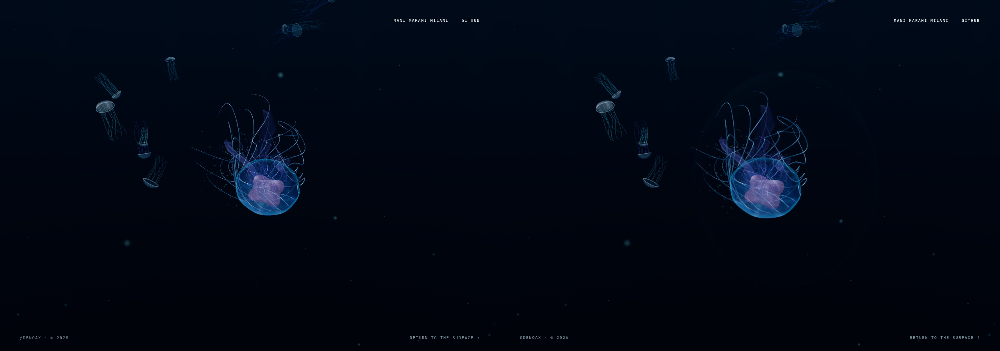

# Milestone 3 — one live ocean lens

Status: **READY FOR VISUAL REVIEW**. This is a local optical proof, not a
replacement idle screen, publication, or approval to begin another milestone.

## Open the proof

Already running: <http://127.0.0.1:5178/?liveLens=1&renderer=webgl&idle=300>.

- Watch the normal ocean. The development lens appears after the opening camera
  settles; it then stays in world space, not attached to the animal or cursor.
- **Shift + left-drag** inside the lens stretches it. Release for recovery.
- **L** places it in the current view for inspecting another part of the existing
  journey. This moves the test lens, not the camera or jellyfish.
- Ordinary clicks still activate the animal and M2 water response. Native scroll
  still follows the approved journey. `idle=300` only delays the existing idle
  screen for inspection; omit it to retain the ordinary 30-second delay.

Exact server command, if restarting the already-running server:

```sh
cd /home/mani/dev/jellyfish-studio/site
export PATH=/home/mani/.local/share/fnm/node-versions/v24.20.0/installation/bin:$PATH
npm run dev -- --host 127.0.0.1 --port 5178 --strictPort
```

Exact approved M2 comparison worktree runs at
<http://127.0.0.1:5184/?connectedOcean=1&oceanPreview=1&renderer=webgl&idle=300>.
No test controls can be selected by query strings in the production build.

## Identity and research anchor

| Item | Verified identity |
| --- | --- |
| Repository/root | Denoax/pelagic-jellyfish-webgl; `/home/mani/dev/jellyfish-studio/site` |
| Authoritative approved M2 baseline | `1342d82118d8632cd429e21418832f5c908446a7` |
| Branch | `milestone-3-live-glass-proof`, created directly from that SHA |
| Public main/Pages actually inspected | `a0501c21f8c782887bf6a5e1257e955ada41b678` |
| Pages build | [successful run 34133364127](https://github.com/Denoax/pelagic-jellyfish-webgl/actions/runs/34133364127), `index-Bt9kzCir.js` |
| Static optical checkpoint | `52c98f5697b1d43695ce67d07dc2c7d59db14d43` |
| Final optical/deformation kernel | `7afc5f09fe0f3efed09297421b5e1a05a75f7ee1` |
| Final runtime/recording checkpoint | `9348b3ea7fdf7da447036722ea8ec0c74e899c2a` — adds cancelled-import guard; optical kernel unchanged |

The fresh public opening, natural idle entry, click/journey, narrow and portrait
captures preceded runtime edits. Both September 7 research anchors and the M1/M2
implementation reports were read, then checked against actual source. Their
historical live-source references were not substituted for approved local M2.
The original dirty root AGENTS.md and untracked research remain untouched.
No reset, clean, stash, forced checkout, push, merge or deployment.

This is the blueprint's third proof: **a deformable lens in the real ocean
renderer must visibly bend a live moving object behind it**. The first two
approved proofs remain closed. The work progressed from live static optics,
to matched image checks, to small controlled deformation—not a gel simulation
first or a decorative clock effect.

## Capture-first review

1. **Approved ocean: preserve.** Fresh captures show the cyan/pink animal,
   restrained connected particulate and local activation. No animal, current,
   wake, camera, population or seabed retuning was justified for this proof.
2. **Existing idle: compositing gap confirmed.** Its beads/clock sit over a live
   ocean but never receive ocean scene color. Moving jellyfish remain unbent.
   `IdleGlassScene.jsx` owns a separate WebGLRenderer, two low-resolution
   ping-pong simulation targets and two clock CanvasTextures. That implementation,
   prewarm and 2.6-second exit retention remain completely unchanged.
3. **Human reference: optical causality, not copied style.** Fresh browser
   capture of [Evan Wallace's WebGL Water](https://madebyevan.com/webgl-water/)
   shows its sphere and tiled edges making refraction easy to judge. Adapt that
   testable relationship, not its pool, textures, UI or source. The
   [official r175 post-processing example](https://github.com/mrdoob/three.js/blob/r175/examples/webgpu_postprocessing.html)
   and installed renderer/node source establish compatible APIs. No external
   implementation or asset was copied, and no asset was bought.
4. **First lens: too sharp at grazing angles.** Initial magnification crowded
   strands at its edge. Lower relative optical contrast and a broader vanishing
   displacement region removed that sharp fold without changing the animal.
5. **Final proof: live local bending.** The bell, pink anatomy, fine appendages,
   snow and background jellies visibly shift through the lens. Stretch changes
   those optical paths; recovery returns them smoothly. The lens stays quiet
   in empty water. Portrait inherits the existing right-biased animal framing;
   no portrait camera redesign was used to improve this proof.

## Matched images and actual motion



The comparison holds the existing specimen fixture at **t=9**, same camera,
school state, pulse phase, M2 field state, viewport, drawing buffer and DPR.
The evidence tool also pins the installed TSL clock just for matched stills:
existing soft-particle/background shaders otherwise continue moving while the
animal is held. Its original callback is restored before motion capture.
This is browser instrumentation only, never a runtime change to those systems.

| Evidence | Location |
| --- | --- |
| Authoritative approved M2, no lens | [matched frame](evidence/approved-matched/matched-no-lens.png), [real motion](evidence/approved-matched/motion.mp4) |
| Lens off / zero-strength / refracting, same running implementation | [off](evidence/review-desktop/matched-no-lens.png), [passthrough](evidence/review-desktop/matched-passthrough.png), [on](evidence/review-desktop/matched-lens.png) |
| Main optical and interaction review | [63-second browser recording](evidence/review-desktop/motion.mp4), [timestamps/backend](evidence/review-desktop/motion-metadata.json) |
| Deformation and recovery | [stretched](evidence/review-desktop/deformed.png), [recovering](evidence/review-desktop/recovering.png), [recovered](evidence/review-desktop/recovered.png) |
| Close and transparency-heavy ocean | [close](evidence/review-desktop/close-lens.png), [overlapping animals](evidence/review-desktop/depth-and-transparency.png) |
| 900×900 | [matched frame](evidence/review-narrow/matched-lens.png), [browser motion](evidence/review-narrow/motion.mp4) |
| 390×844 portrait emulation | [matched frame](evidence/review-portrait/matched-lens.png), [browser motion](evidence/review-portrait/motion.mp4) |
| Live resize sequence | [dimensions/state](evidence/candidate-resize/resize.json) |
| Existing idle/background return | [state and activation](evidence/candidate-lifecycle/lifecycle.json) |
| Isolated software WebGPU, same lens code | [motion](evidence/review-webgpu/motion.mp4), [actual adapter](evidence/review-webgpu/capture.json) |
| Latest runtime optical clip | [live crossing](evidence/final-optics/motion.mp4) |
| Existing journey at 88% scroll, lens reanchored | [motion](evidence/deep-edges/motion.mp4); transparent close animals, not a staged seabed test |
| Synthetic graphics loss and reload | [recovery state](evidence/context-recovery/recovery.json) |
| Three-minute observation | [state/checkpoints](evidence/review-long/observation.json) |
| Before implementation: public and approved local idle | [public opening/idle](evidence/live-first/motion.mp4), [approved M2 idle](evidence/approved-idle/motion.mp4) |
| Static optics before deformation work | [first proof](evidence/optical-first/motion.mp4) |

The main video begins with ordinary live ocean, enables the lens, observes
moving animals/strands crossing its optical area, then Shift-drags/releases it,
clicks an animal normally, and inspects the existing close pass and overlapping
transparent animals through the native journey. Repositioning with the dev
anchor is intentional in the tour, not a new camera move. The foreground body
is often partly inside the lens; it is not a staged isolated full-body crossing.

Footage is timestamped Brave/CDP screencast output, not generated imagery,
animated screenshots or a prerecorded ocean input. Self-review uses full-size
frames and temporal sequences; no in-app real-time video playback tool exists
in this environment. The user review gate remains authoritative.

The [temporal contact sheet](evidence/review-motion-sequence.png) samples the
main film every five seconds; it is supplementary, not a substitute for the
MP4. Several early draft `lens-tour` runs produced only stills because the
recording branch had not started screencasting. Those drafts are excluded.
The retained main film contains 1,886 actual browser frames over 62.893 seconds.
Source identities are retained per run: the main tour uses `7afc5f0`, while the
latest short optical film and held benchmarks use `9348b3e`. Their optical and
deformation code is identical; the later runtime change only guards cancelled
lazy setup. Older resize/idle checks use `adba422`, before the final optical
edge/setup/teardown guards; final focused tests cover those guards.

Held comparison: candidate direct versus zero-strength output differs in only
15 RGB channels, at most 1/255. Outside the conservative lens bounds, direct
versus refracted candidate differs in **zero channels**. Approved baseline versus
candidate direct ocean band (excluding DOM header/footer glyph rasterization)
differs in 14 channels, at most 1/255. Camera, animals and M2 field JSON match
exactly. Raw measurements: [summary](evidence/summary.json).

## Refraction architecture

The current ocean already uses imperative Three.js **0.175.0 WebGPURenderer**,
with real NVIDIA WebGL2 for the validated ocean path. No renderer family,
framework, package version, camera or scene was replaced.

1. The normal `AureliaApp.update` still advances the same approved systems.
   An optional render callback selects the proof only in DEV.
2. Draw the **actual ocean once**, with normal transparent-object ordering,
   into a full-resolution linear HDR color target with opaque scene depth.
3. A TSL output pass intersects camera rays with a world-positioned ellipsoid,
   refracts at entry and exit, and projects the resulting ray into current
   scene color. Surface normals use the inverse-transpose deformation matrix.
4. Original/refracted opaque depth rejects foreground solid surfaces. Vanishing
   edge displacement, bounded lookup distance, total-internal-reflection and
   near-plane guards prevent invalid/offscreen samples from producing seams.
5. Apply ACES/sRGB **once**, using r175 PostProcessing, to the existing canvas.
   Render target and output settings are restored with `finally`.

The lens is never part of the input ocean scene, and its output is never sampled
as its input. No recursion, previous-frame texture, duplicated ocean, new canvas,
new renderer, bloom trick or mesh-only displacement. All image sources are the
same frame's real scene, including blended luminous transparent anatomy.

### Passes, targets and cost architecture

| Item | Approved M2 | Lens proof |
| --- | --- | --- |
| Ocean scene renders | 1 | 1 |
| Output full-screen pass | 1 internal tone/color pass | 1 combined lens/tone/color pass |
| Net additional scene/output passes | — | **0**; same two stages, more fragment work |
| Lens-owned target | none | 1, RGBA16F + unsigned-int depth, linear color filtering, no mipmaps |
| Dimensions | native drawing buffer | exact same drawing buffer, not a reduced-resolution copy |
| MSAA | 4 samples | 4 samples |
| Active bloom | off | off |

Installed r175 `Renderer._getFrameBufferTarget()` already creates a linear HDR
target and output quad for ordinary ACES/sRGB rendering. The proof replaces
those active stages rather than adding a second whole-ocean render. The old
internal target remains allocated from startup; it is not counted as free
memory. The new target's logical attachment storage is roughly **66 MiB at
1280×900 including 4× MSAA color/depth and resolved color/depth** (driver storage
can differ). Existing legacy transmission copies and dormant MRT/bloom setup
were not rebuilt. The old idle renderer/targets also remain independent.

Resize queries `renderer.getDrawingBufferSize()` each render, so DPR/viewport
changes cannot leave stale CSS-sized targets. The target object is reused;
size changes release/recreate its attachments through Three's normal lifecycle.
Teardown removes listeners, waits for in-flight ownership to finish before
releasing the target/material, and cancelled lazy setup does not create a lens.

### Controlled deformation, not full liquid glass

Two local pull coordinates drive a critically damped analytic spring. Input is
bounded to 0.65 world units. A partial centroid shift, modest stretch/shear and
approximate volume compensation express an off-centre grab. The same transformed
volume determines intersections and normals: distortion follows the actual
test shape, not a separate animated UV wobble. Release recovers fully; large
deltas are clamped and hidden/blur events release input without catch-up debt.

There is no fluid grid, free-form surface solver, bridge, split, multi-bubble
system, production clock refraction or new idle transition. The small reveal
only hides initial development lens placement while the existing camera settles.

## What is approximate

- This is **screen-space scene-color refraction with real world-space optical
  geometry and opaque-depth occlusion**, not full scene ray tracing.
- Transparent tissue/snow exist in color but do not write individual depth
  layers. Their optical image distance uses a bounded virtual plane. A
  transparent object in front of the lens cannot be perfectly separated from
  the already-composited color. Opaque foreground rejection is verified
  separately; this does not solve order-independent transparency.
- Offscreen/hidden objects cannot be reconstructed. Displacement is bounded
  and fades at grazing/screen edges; this trades physical strength for stability.
- Tint and a small normal/Fresnel highlight are art-directed, not spectral
  absorption, caustics, environment reflections or volumetric scattering.
- Grab mapping uses a tangent plane and low-dimensional shape deformation, not
  arbitrary local dents or a complete biological membrane simulation.
- Ordinary click picking is still the approved camera ray, not refracted-ray
  picking. Exercised animal clicks succeed; image-edge hit remapping is not
  part of this optical proof.

## Validation and performance

Baseline: **31/31** existing tests, both exact animal-parity scripts and the
Pages-profile production build pass. Candidate: **36/36**, both parity scripts
and production build pass. No generic `npm test` script exists. Existing npm
global `tmp` and large-chunk warnings remain; neither is a new failing test.

Focused additions check bounded/rate-independent pull, full recovery, pause
debt rejection, 1,000 repeated input cycles, M1/M2 source parity, DEV gating,
target reuse/resize, renderer-state restoration on failure, and idempotent/
in-flight teardown. M1 geometry/material/animation and all M2 ocean modules are
byte-for-byte unchanged from approved M2. The production guard deliberately
tries `?liveLens=1` and confirms no lens/specimen controls appear.

Hardware: Intel i5-14600K, 62 GiB RAM, RTX 4070 / 12,282 MiB, NVIDIA 610.57.04.
Brave/Chromium 152.0.7977.76; actual ANGLE NVIDIA WebGL2/OpenGL ES 3.2.
All measurements use 1280×900 viewport **and drawing buffer**, DPR 1, the same
ocean detail and AA, bloom off, fixed inspection quality, `idle=300`. Screenshot
and video capture are disabled during timing, with no concurrent build/encoding.
Raw completion arrays and metadata are retained in evidence.

Ordinary swimming: six seconds warm-up after ready, 30 seconds measurement,
alternating exact approved baseline → candidate → baseline → candidate. The
same seeded opening and normal simulation run freely; initial wall-clock phase
differs slightly, so these are not claimed to be identical held-state timings.

| Run | Median completion interval | p95 | Max | >50 ms |
| --- | ---: | ---: | ---: | ---: |
| Approved M2 A | 16.7 ms | 18.8 ms | 23.6 ms | 0 |
| Lens A | 16.7 ms | 18.6 ms | 22.9 ms | 0 |
| Approved M2 B | 16.7 ms | 18.8 ms | 22.6 ms | 0 |
| Lens B | 16.7 ms | 18.2 ms | 22.7 ms | 0 |

These are **asynchronous render-completion intervals, not GPU timings**.
The roughly 60 Hz headless compositor cap limits interpretation. Lower tails
do not prove a speedup or zero GPU cost. Controller/matrix/resize CPU samples
have median below the browser timer's resolution and p95 0.1 ms; they exclude
the optical shader/GPU cost and renderer submission. Do not call that free.

Additional exact-state comparison pins fixture time, camera, school, M2 field
and TSL shader clock at **t=9**, with equality asserted by the summary script.
Both runs use the same six-second initial warm-up, advance to t=9, then one
second settling before measuring 30 seconds / 1,800 completion intervals.
This held-state run isolates rendering and supplements, not replaces, the
ordinary swimming benchmark above.

| Exact held state | Median | p95 | Max | >50 ms |
| --- | ---: | ---: | ---: | ---: |
| Approved M2 | 16.6 ms | 17.7 ms | 18.9 ms | 0 |
| Lens | 16.7 ms | 17.0 ms | 18.1 ms | 0 |

This demonstrates acceptable observed cadence on this machine, not uncapped
GPU throughput. Additional target storage and shader work remain real costs.

Three-minute observation: 180.17 seconds observed, 178.02 seconds of simulation
advance, twelve repeated clicks, journey changes, no browser errors. The idle
check enters idle and returns; activation still increments. A genuinely hidden
tab for 1.8 seconds resumes with only ~0.107 seconds of simulation advance,
without wall-time catch-up. Resize cycles through 1280×900 → 900×900 → 390×844 →
1280×900 with matching targets and no browser errors; fresh narrow/portrait
runs independently confirm coordinate and appearance stability.

Synthetic `WEBGL_lose_context` reaches the existing graphics-error state;
reloading the same proof restores the ocean/lens with 28 renderer textures
before and after, and no browser errors. This is **reload recovery**, not a
claim of seamless in-place restoration or physical device-loss validation.

Final validation rerun at runtime `9348b3e`: 36 tests, both parity scripts and
Pages-profile production build pass. Exact commands:

```sh
node --test tests/*.test.mjs
node scripts/check-approved-motion.mjs
node scripts/check-default-animal.mjs
VITE_BASE_PATH=/pelagic-jellyfish-webgl/ VITE_OCEAN_RELEASE=milestone-2 npm run build
```

### Runtime files changed

- `src/scene/glass/LiveOceanLens.js`: live optical target, TSL composite, pointer
  inspection, resize and cleanup ownership.
- `src/scene/glass/LensDeformation.js`: small deterministic bounded pull spring.
- `src/scene/HeroScene.jsx`: DEV-only lazy proof integration and disposal.
- `src/vendor/aurelia/app.js`: optional render callback; default render unchanged.

Other changes are scoped instructions, focused tests, browser evidence tooling,
an isolated backend diagnostic and this report/evidence. No dependency changes.
The capture-first Product Design audit skill was used for source/live comparison;
it supported preserving the established artwork instead of selecting a new style.

## Environment coverage and review boundary

- Real NVIDIA WebGL2 ocean: desktop, narrow, portrait emulation, close views,
  direct activation, stretch/recovery, resize and long observation.
- Real **software SwiftShader WebGPU**: the same lens class over a moving 3D
  diagnostic object and foreground depth occluder. **Not the full ocean.**
- Existing legacy full-ocean WebGPU transmission-format problem remains separate;
  no claim that M3 fixed it. Hardware WebGPU, physical phones/tablets, Safari,
  Firefox, integrated GPUs, touch hardware, thermal endurance and GPU timestamps
  are **NOT TESTED**. Emulation/software adapters are not physical-device tests.

Remaining inherited limits: distant/secondary animal fidelity, some crowded
close passes, right-biased portrait composition and the dark/deep journey.
None was altered to flatter the lens. No full accessibility/WCAG claim.

**M1/M2 remain unchanged outside the optical proof. Live Pages was not modified.
No push, merge, deploy, full idle-glass integration or later milestone.**
