# Pelagic — critical visual and technical review

Research date: 2026-09-05. Deployed revision: `92e61b082b846b89151fb4ebe0011364737be4a3`.

Scope: the [public artwork](https://denoax.github.io/pelagic-jellyfish-webgl/), not the former web-development services site. No application changes or deployment were made for this review. The requested reference-comparison default was added to `AGENTS.md`.

## Verdict

Pelagic has a viable artistic identity: restrained framing, a persistent living scene, blue-violet organisms, and a long descent. It no longer needs a wholesale redesign. Its largest weakness is **inconsistent visual fidelity and physical relationships**: foreground tissue, distant animals, bright flecks, geology, and glass each reveal a different rendering vocabulary. More objects or stronger glow would amplify that discrepancy.

The most valuable next pass would make a smaller number of effects agree with one another: convincing translucent anatomy at every distance; water that visibly carries organisms and particles; a descent with distinct environmental compositions; and glass whose distortion actually belongs to that ocean.

This is a critical assessment, not a claim that every frame is broken or that one implementation could objectively outperform every professional reference.

## Evidence and limits

- Fresh isolated Brave session, ANGLE OpenGL/WebGL 2, RTX 4070, desktop 1440×900 at device-pixel-ratio 1. Portrait capture at 390×844 is viewport emulation on that same desktop GPU, **not a phone performance test**.
- Screenshots were saved and inspected. Current captures—not prior generated images or old QA—ground the visual findings. `capture-notes.md` records acceptance and caveats.
- A separate no-screenshot timing run avoids screenshot overhead. Browser animation callback intervals are not GPU timer queries or a guarantee of displayed frame rate. One machine/run is not a population benchmark.
- Normal browsing, idle, click response, descent, and simulated graphics denial were inspected. Native WebGPU, Safari/iOS, Firefox, integrated GPUs, thermal throttling, real touch input, and a full accessibility audit remain untested here.
- Reference captures support appearance comparisons; author walkthroughs support implementation descriptions. A screenshot cannot prove an algorithm, biological accuracy, sustained smoothness, or licensing permission.

## Fresh journey, in order

1. **Arrival / open water — functional, visually mixed.** Live scene appears without the rejected loading poster. Generous negative space survives. Hero tissue and distant cap-and-cord silhouettes do not convincingly belong to the same population.

   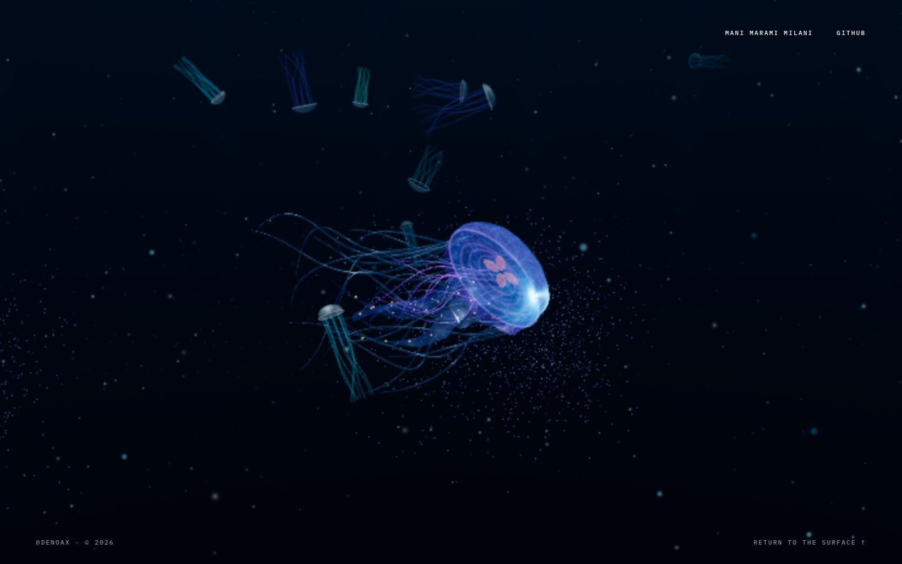

2. **Automatic idle — needs investigation.** The first naturally triggered idle capture has bubbles but no visible clock; a fresh shortened-delay visit does show the clock. This is an observed intermittent visual symptom, not a diagnosed always-broken clock. Both states retain the ocean beneath them.

   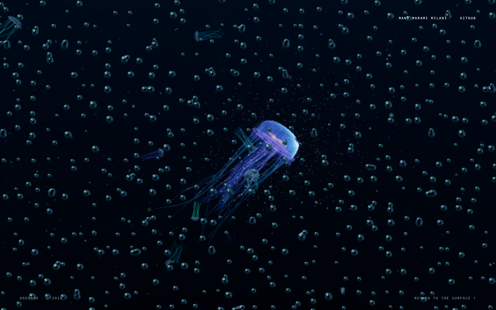
   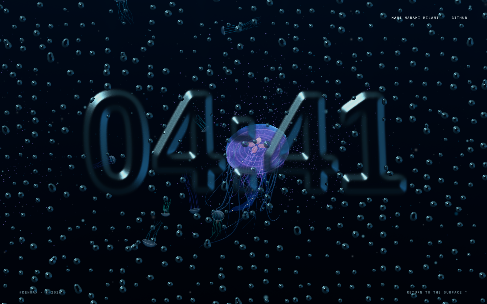

3. **Idle manipulation / dismissal — works in part, visual quality mixed.** Pointer input reaches the gel field and Escape dismisses it without resetting the journey. The saved sweep still has no visible digits, so it cannot demonstrate successful clock distortion. Tiny similarly scaled cells compete with the ocean, particularly near the center.

   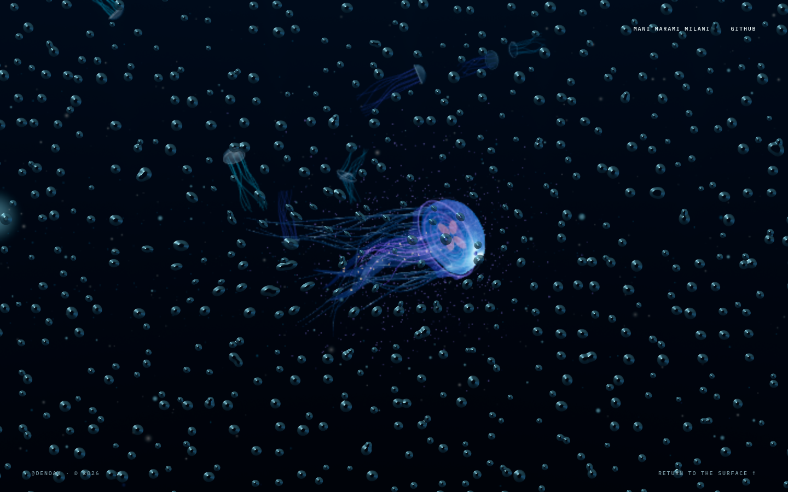

4. **Mid-water aggregation — functional, crowded.** Multiple large animals produce overlap and depth, but their bright particle clouds compete with anatomy. A cropped animal at the left edge feels incidental in this sampled composition. Background model differences remain conspicuous.

   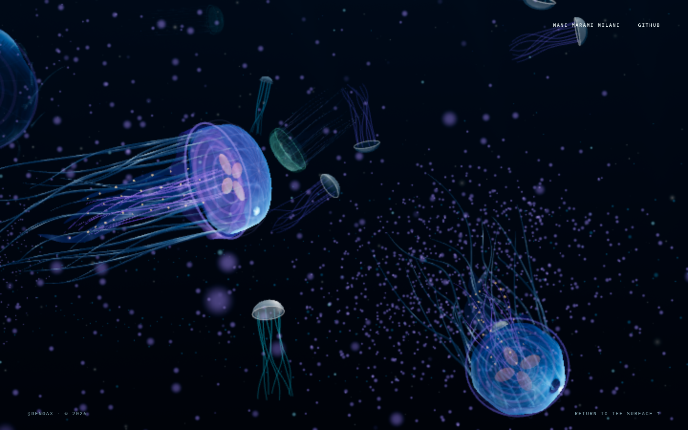

5. **Deep approach — functional, under-composed.** The twilight lasts and the animals remain readable. The water is mostly an empty dark field with points; there is little environmental structure establishing depth beyond size and overlap.

   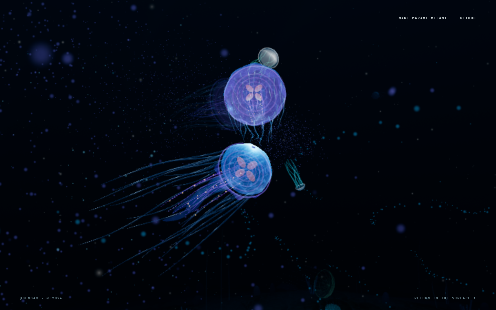

6. **Seafloor endpoint — functional, weak payoff.** No exposed floor edge was visible in this frame. Assets report ready. Texture exists, but geological silhouette layers, contact, and localized light are not persuasive enough. Orange marks look disconnected; thin upright props read as poles. A featured animal is largely leaving the frame rather than completing a deliberately composed ending.

   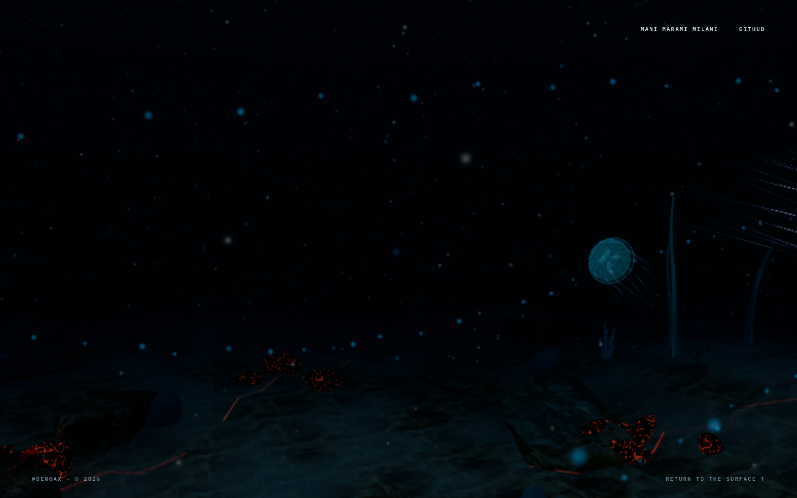

7. **Portrait layout — fits, needs its own composition.** No horizontal overflow was observed. The main animal sits relatively low/right with substantial emptiness above. Tiny footer labels are difficult to read. This is not evidence of a mobile renderer failure.

   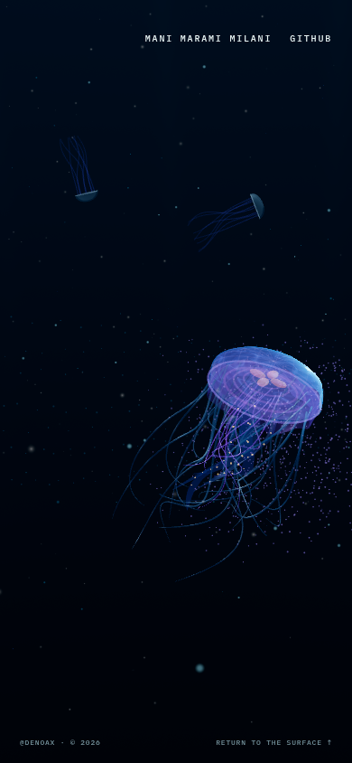

8. **Clicking a jellyfish — passed this sample.** A real browser pointer press/release increments activation count from 0 to 1, targeting actor 0. The captured bell is visibly illuminated. Local glow/recoil/social echo already exist in source; they must not be proposed again as if missing.

   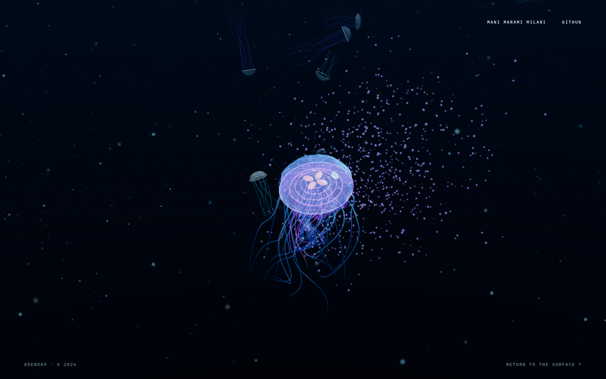

9. **Graphics unavailable — recovery state passed.** Deliberately denying graphics contexts produces explanatory text and a compatibility link over a still image, rather than silent black. The image is a failure fallback, not the removed startup splash. Clicking recovery while all contexts remain forcibly denied cannot establish successful recovery.

   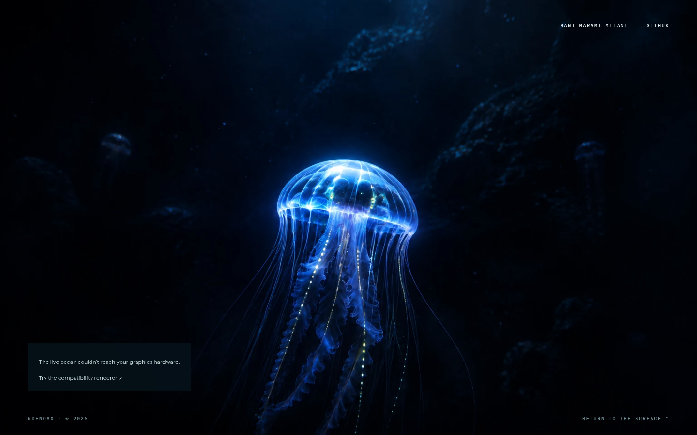

10. **Return to surface — passed pointer navigation.** The existing footer link returns to `#intro`, with scroll position 0 and the living scene still running. Its small hit area remains an accessibility concern, not a broken link.

    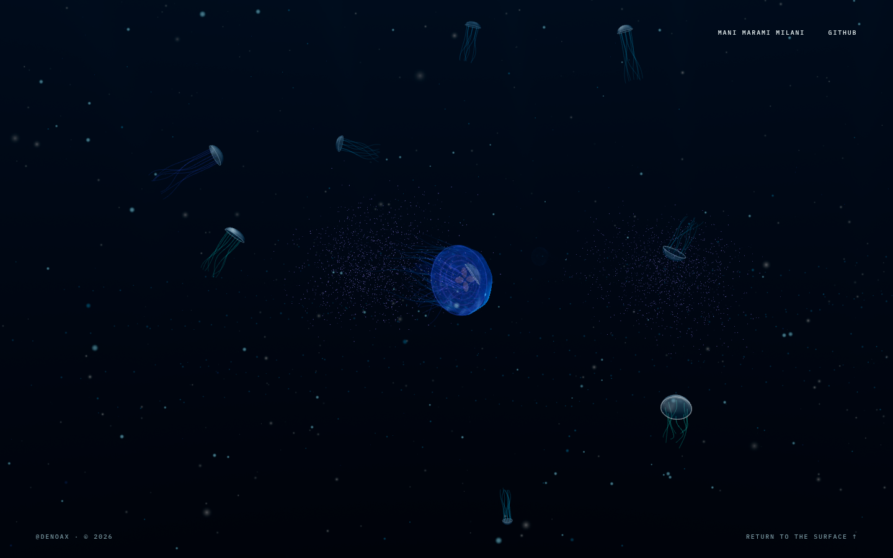

## Reference comparisons and specific adaptations

These are attributed developer/studio projects, with primary documentation wherever possible. That establishes authorship and technique references, not an independently verified guarantee about every tool used during production. Do not treat an attractive public demo as permission to reuse its code or assets.

### 1. Medusae — Ash Weeks: anatomy before ornament

[Live work](https://milcktoast.com/medusae/) · [author's repository](https://github.com/milcktoast/particulate-medusae)

Fresh captures show a more unified translucent mantle and luminous inner crown, with fine appendages organized around that body. The repository documents soft-body physics and interpolated rendering. Some legacy interface labels did not display usefully in this Brave session; it is an anatomy reference, not a universal UX benchmark.

**Adapt:** tissue hierarchy and restrained particle contrast. Our long bright cords and visible bell rings need better integration, not extra strands. Keep our multi-animal journey rather than copying its composition. Its Artistic-2.0 license is not interchangeable with MIT; review obligations before any reuse.

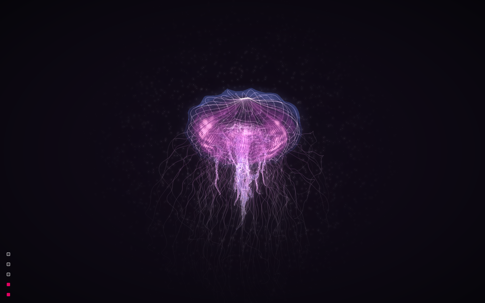

### 2. FluidGlass — chiuhans111: continuous material transformation

[Live work](https://chiuhans111.github.io/fluidglass/) · [source description](https://github.com/chiuhans111/fluidglass)

The fresh sweep produces connected flowing bands across digits and surrounding cells. The author describes reaction-diffusion, fluid simulation, and glass shading. Our field is an elastic/advection treatment, not the same simulation; its visibly isolated droplets are a different result. The reference also develops a regular cell field, so avoid claiming it has no repetition.

**Adapt:** continuity between stretched numbers, cell boundaries, and shading. Retain our HH:MM clock, slow ambient disturbance, and fullscreen coverage. No repository license was established during this review: inspiration only, not source or asset copying.

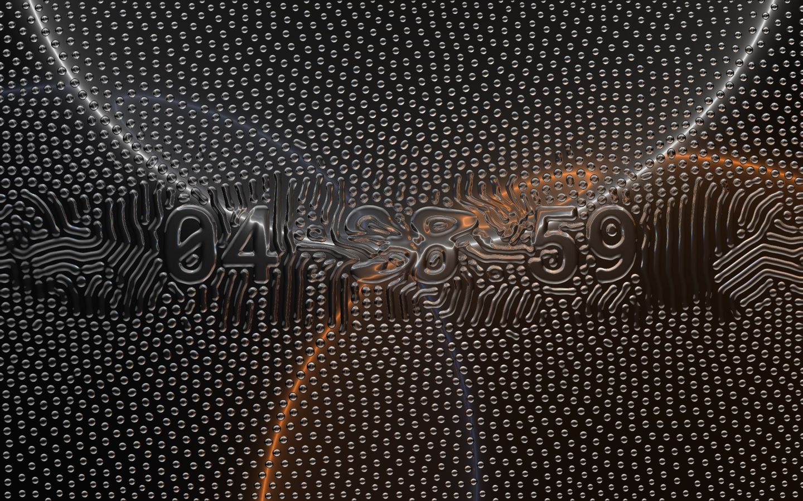

### 3. Interactive Glass Xylophone — Sujen Phea: readable cause and effect

[Live work](https://tympanus.net/Tutorials/Xylophone/) · [author walkthrough](https://tympanus.net/codrops/2026/08/04/building-an-endless-interactive-glass-xylophone-with-three-js/)

Fresh hover captures show local color and shape variation along a coherent helix. The walkthrough connects pointer-triggered motion, flow-field color, glass rendering, instancing, and lower-cost mobile settings.

**Adapt:** one input producing a clearly localized physical/material response, with cheaper quality tiers designed intentionally. Our click pulse should remain legible against quieter surroundings. Do not transplant its candy palette, endless helix, sound control, or tutorial UI into the ocean. Verify code and model licenses separately if implementation reuse is proposed.

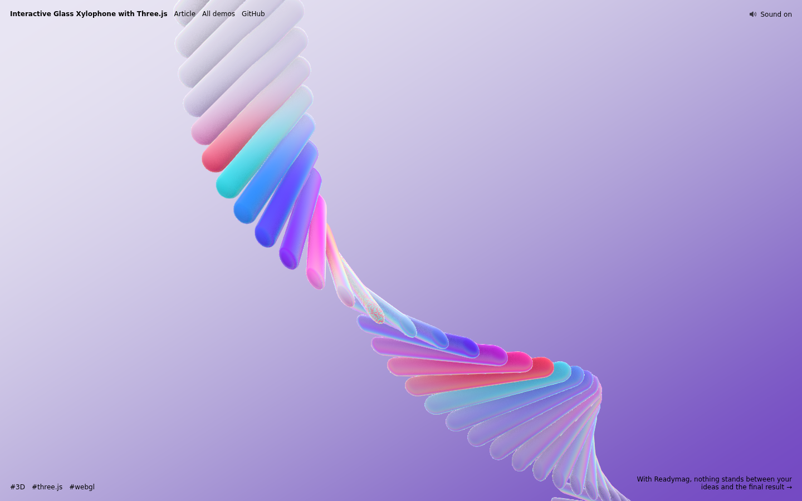

### 4. Volatile Nexus — Frank Reitberger: optical and physical agreement

[Live work](https://dasprinzip.com/tinker/day42/) · [author walkthrough](https://tympanus.net/codrops/2026/08/31/volatile-nexus-tinkering-with-glass-caustics-cubes-and-sound-in-three-js/) · [code](https://github.com/prinzipiell/tsl/tree/main/volatile-nexus)

The captured glass visibly contains a refracted scene. Its author explains bounded spring repulsion and displaced normals shared with refraction, caustics, and reflections. This is a particularly useful reference for making different effects acknowledge the same disturbance.

**Adapt:** consistent surface normals and bounded impulses. Prototype ocean-backed refraction for our idle layer before adding more decorative highlights. Do not copy the bright stage, confetti, flare, or automatic audio. Our established WebGL fallback must survive any TSL/render-target changes; public source availability alone is not a reuse license.

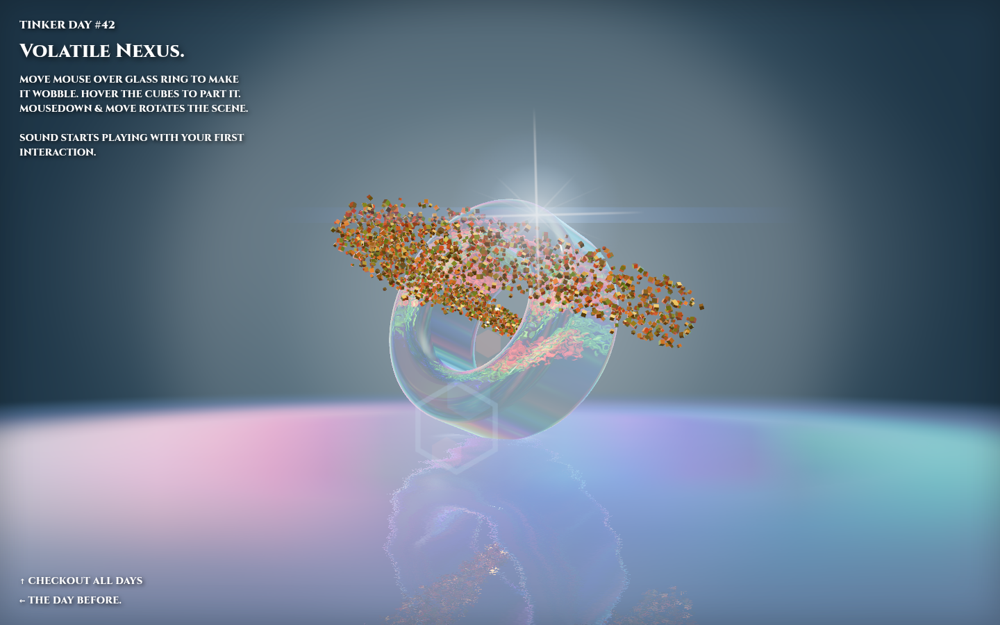

### 5. Nature Beyond Technology — Robin Navas: authored spatial structure

[Live work](https://nature-beyond.tech/) · [author walkthrough](https://tympanus.net/codrops/2025/12/04/crafting-nature-beyond-technology-a-project-from-roots-to-leaves/)

The fresh opening presents a cohesive tree/root object. The author describes nested camera control, artist-defined curves, particles, and refractive rain. Our capture of the next step was still a scanning transition, so it is not evidence of the completed later chapter.

**Adapt:** authored camera/current curves with bounded runtime variation, plus materials that help explain spatial relationships. Our distant organisms should share a water flow without synchronized loops. Do not copy the technical HUD, headings, scanning interstitial, or tree assets. Each credited asset has separate terms.

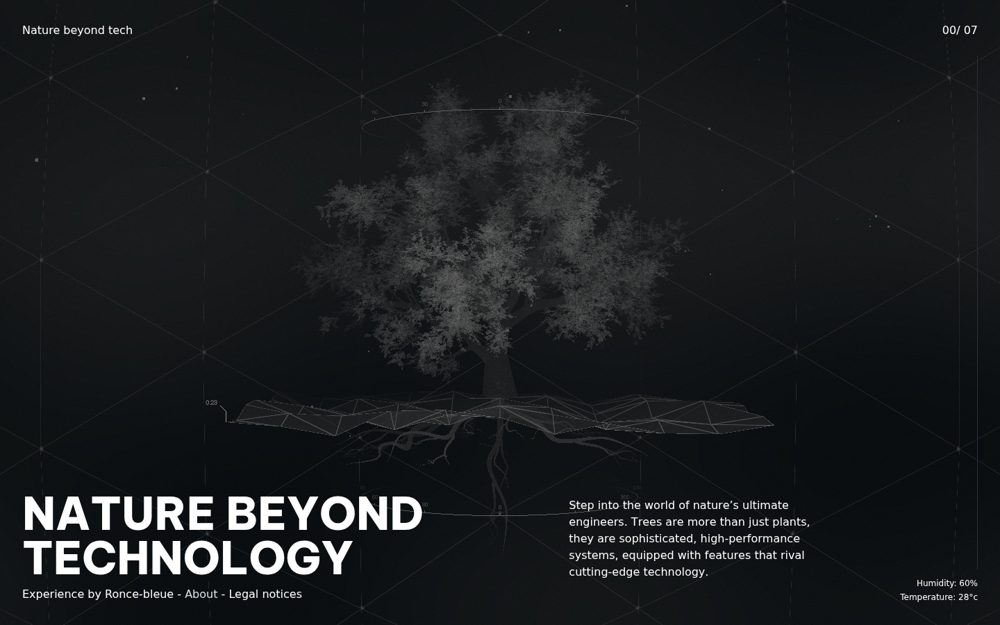

### 6. The Sea We Breathe — Unseen Studio: distinct underwater places

[Studio case study](https://unseen.co/projects/blue-marine-foundation/)

The studio documents three distinct underwater environments and gestures tied to conservation themes. The standalone live URL was not successfully inspected in this review; this is primary case-study research, not a tested browser journey.

**Adapt:** distinguish our depth bands through lighting direction, suspended matter, organism distribution, and geology—not darkness alone. Avoid its educational copy, narration, and entry exercise. Its separate 360-degree marine VR work is not evidence that this experience uses the same rendering pipeline. Studio assets are not cleared for reuse.

### 7. Symphony of Vines — Unseen Studio: environmental consequences

[Live project](https://symphonyofvines.unseen.co/) · [studio interview](https://tympanus.net/codrops/2026/07/20/the-craft-behind-memorable-digital-experiences-inside-unseen-studio/)

The studio describes geological chapters and interactions that transform the setting. Not live-tested here.

**Adapt:** one restrained environmental consequence per region: a current uncovers a school; near-floor motion briefly lifts sediment. These are proposed Pelagic ideas, not existing features claimed for the reference. Avoid adding tasks, prompts, or a collection game. A sequence should remain enjoyable without interaction. No asset reuse assumed.

### 8. WebGL Water — Evan Wallace: a shared physical event

[Author's demo and implementation notes](https://madebyevan.com/webgl-water/)

The author's feature list connects an interactive water height field to reflection, refraction, caustics, and shadows. This is a mechanism reference, not an infinite-ocean example: it is a bounded pool. No new live interaction capture was made here.

**Adapt:** nearby water and light should respond to the same event rather than unrelated sine waves. Use restrained localized approximations first; a complete ocean fluid solver is not justified by this reference. Do not import the pool's palette, walls, or presentation.

## Highest-impact changes

### A. Unify the organisms across distance — high priority, medium/high effort

**Evidence:** steps 1, 4, 7 and 8. Far animals are simplified enough to look like a different asset family, even when they enter comparable screen space. More geometry everywhere would be expensive and may leave the actual silhouette/material mismatch intact.

**Proposal:** use projected screen size to select anatomy tiers; preserve mantle volume, internal tissue, rim softness, taper, and pulse timing in every tier. Use gradual transitions. Keep the distant system instanced; reserve expensive tissue simulation for the few animals that can justify it. Vary proportions within a coherent family before adding species.

**Accept when:** a distant animal approaching the camera does not switch visual identity or pop; paused frames at 100% browser scale retain readable anatomy; 10-second motion clips show attached roots, delayed tips, and bell-led propulsion without tangles or rigid rods. Compare equal apparent animal size with Medusae, not arbitrary full-page screenshots.

### B. Separate tissue, light, and particles — high priority, medium effort

**Evidence:** the hero's repeated bright rings and cords read as a diagram in steps 1/8; the cloud in step 4 competes with the bodies. Round, independently moving particles are already implemented. Replacing squares or unparenting the cloud again would not address this finding.

**Proposal:** soften ring contrast, give oral arms a broader tissue role, retain thin edge light, and reduce particle brightness near dense anatomy. Keep some flecks in the wake but avoid a permanently conspicuous personal halo. Establish large/medium/tiny marine-snow scales with different visibility distances, sparse near-camera defocus, and restrained shimmer.

**Accept when:** the organism remains the first focal point in grayscale and at small preview size; a wake can be followed without looking like a rotating emitter sphere. Do not use a global blur to hide low-quality geometry or stronger bloom to conceal aliasing.

### C. Make the water carry the scene — high priority, medium/high effort

**Evidence:** steps 4–6 establish depth chiefly with overlap, size, and darkening. The scene often reads as organisms in a star field.

**Proposal:** a low-frequency shared current influences swimming headings, appendage drag, and particle transport, with independent pulses and local variation. Add sparse oblique shafts in shallower water, changing haze scale through twilight, and an asymmetric near-floor opening. Preserve large quiet areas. These should build on the existing water-distance attenuation, not replace it with a full-screen gradient.

**Accept when:** a current is recognizable across at least two nearby systems but does not synchronize the school; reverse scrolling preserves continuity; water does not become a milky fog sheet. Compare a short clip with and without each added layer and remove layers that contribute only noise.

### D. Compose the ending and environmental milestones — high priority, medium effort

**Evidence:** step 6 has no visible edge failure, but lacks a compelling endpoint. Hiding more terrain would sacrifice the detail that now exists.

**Proposal:** position three overlapping geological masses with a clear channel between them; anchor warm fissures inside dark crust and let their light affect nearby surfaces. Reduce isolated orange dots and pole-like props. Route the final animal through that composition at stable scale; hold a satisfying view before natural departure. Reuse the existing scanned assets first.

**Accept when:** the endpoint reads at thumbnail size; the floor has no exposed boundary at portrait, desktop, ultrawide, and intermediate camera positions; close stone detail remains visible without lifting the entire abyss. Do not restore a bright reef or expand into a lava spectacle.

### E. Make idle glass continuous and reliable — investigate first, high-effort optical upgrade

**Evidence:** steps 2–3 and source. The initial missing clock did not repeat on a fresh visit. The glass shader currently has no actual ocean-color texture input; its highlights cannot refract the real animal behind it. This is an architectural limitation, not merely a parameter that needs stronger displacement.

**Proposal:** first isolate minute-mask updates, font readiness, repeated idle visits, resize, and visibility changes. Then prototype a single shared ocean render texture sampled by a displaced glass surface. Reconstruct normals from the same field used to bend digits/cells. Start with a low-resolution optical pass and a safe non-refractive fallback. Keep direct manipulation responsive but ambient waves slow; do not conflate their timing.

**Accept when:** clock survives repeated visits and minute rollover; a sweep deforms digits and cells coherently and recovers; a jelly passing behind the glass visibly bends with it; no opaque transition or extra steady-state render cost outside idle. A reference-inspired original implementation is required, not a FluidGlass source copy.

### F. Improve loading without a splash — high priority, profile-led

**Fresh measurements:** the cache-disabled desktop journey recorded ready at ~2.51 seconds and ~3.07 MB of Resource Timing transfer bytes over the captured visit. The 1.62 MB Smithsonian coral model was the largest request. Main and scene JavaScript transferred ~207 KB and ~209 KB respectively. These are this run's transfer measurements, not universal load times or full decoded memory size.

The independent no-screenshot run recorded a 989 ms main-thread long task near 1.48 seconds and another 179 ms task near 4.73 seconds. The second renderer was created near 4.74 seconds. That temporal association warrants profiling idle prewarming; it does not prove which internal operation consumed all the time. Source also awaits deep assets and scene compilation before declaring the opening ready (`HeroScene.jsx`).

**Proposal:** render the minimal open-water scene first; schedule geology download, parsing, and warmup before it is needed, in bounded stages. Separate idle code from the eager startup path where beneficial. Use a profiler to attribute the stalls before a large rewrite. Preserve the user's explicit no-poster/no-splash request.

**Measured counter-evidence:** steady ocean p95 callback interval was ~16.7 ms. Actual opacity-based idle entry and exit samples had ~16.7 ms p95 and ~16.8 ms maximum. This run does **not** support calling the current idle fade universally choppy. See `performance-clean.json`; entry test uses `?idle=12`, not a changed production default.

A separate 12-second programmatic descent recorded 706 post-settle callback samples, p95 ~16.7 ms, maximum ~16.8 ms, and none above 33.4 ms. This isolates changing scroll position without screenshot overhead; it does not test trackpad inertia or bursty physical wheel input. The subsequent held endpoint (`12-final-hold.png`) confirms the weak geological composition remains after the camera settles, rather than being solely a transient scroll frame.

**Accept when:** first-live-frame timing improves across repeated cold runs; prewarming does not introduce a conspicuous interaction stall; error and reduced-motion behavior remain intact. Target frame-time distributions and input latency on weaker hardware, not just average FPS on the RTX 4070.

### G. Make sparse controls and nonvisual access intentional — medium priority, low/medium effort

**Evidence:** header links have 44 px height; desktop footer links measure only 13 px. Portrait footer type is very small. Source retains invisible section labels such as “services scene” despite the art-only direction, and pointer-only organism interaction has no equivalent discoverable keyboard action.

**Proposal:** expand invisible footer hit areas, preserve tiny visual styling where readable, rename semantic sections for the artwork, and provide keyboard-accessible activation plus a concise hidden artwork description. Focus states can appear only during keyboard use. Do not restore service copy, a HUD, or permanent interaction instructions. Any visible onboarding hint would need separate approval.

**Accept when:** keyboard users can navigate and return, activate an organism, and dismiss idle without losing focus; actual touch targets work at narrow widths. The present evidence identifies risks, not a complete WCAG failure or conformance verdict.

## Features worth considering only after the quality pass

| Candidate | Why it could belong | Boundary / risk |
| --- | --- | --- |
| Current-driven school split and rejoin | Makes nearby animals acknowledge the same water | Bounded separation, no frantic avoidance or identical flock turns |
| Local sediment wake near the floor | Gives cursor/animal motion an environmental consequence | Rare and distance-gated; no screen-wide dust cloud |
| Two coherent anatomical families | Adds discovery beyond color swaps | Finish one consistent near/far family first; avoid expensive full simulations everywhere |
| Regional lighting moments | Makes descent memorable without text | A few authored encounters, not continuous flashes or extra UI |
| Ocean-backed idle refraction | Connects the screensaver to the living artwork | Separate proof-of-concept, quality tiers, WebGL compatibility gate |

Do not add autoplay audio, bloom stacks, chromatic aberration everywhere, motion toggles, achievements, cards, loading illustrations, or another navigation system merely because a reference has them. Optional sound would require the user's approval and an intentional way to enable it; it is not part of this proposed pass.

## Implementation order and release gates

1. Diagnose the intermittent clock symptom and profile startup/prewarm long tasks. Capture baselines before changes.
2. Unify foreground/distant anatomy and quiet the competing particle/material contrast.
3. Improve shared water cues, then compose the deep region and final shot. Preserve the already extended twilight.
4. Prototype actual ocean refraction for idle separately; integrate only if it improves appearance within budget.
5. Complete portrait framing and invisible accessibility controls; validate full journeys on real weaker devices.

For each stage, compare fresh matched-state screenshots and 10–15-second clips against the selected mechanism reference. Review still frames and motion separately. Test normal and reverse scroll, stop/resume, background-tab return, pointer/touch/keyboard, minute changes, reduced motion, WebGL fallback, actual graphics denial and recovery, and final floor boundaries. Set device-specific quality tiers from measured limits. Do not mark a change successful just because it compiles or a single hero screenshot looks good.

Technical basis: [Three.js render-target/post-processing concepts](https://threejs.org/manual/en/post-processing.html) explain rendering a scene for subsequent effects; the classic WebGL examples are not drop-in WebGPU code. [MDN WebGL best practices](https://developer.mozilla.org/en-US/docs/Web/API/WebGL_API/WebGL_best_practices) support explicit resource/back-buffer budgets. For anatomy, [Monterey Bay Aquarium's moon jelly description](https://www.montereybayaquarium.org/animals-the-ocean/animals-a-to-z/moon-jelly) is a useful check: the present long-tentacled artwork is stylized, not a strict moon-jelly reconstruction. Keep that distinction honest.

## Output inventory

- This report and `capture-notes.md`: findings, evidence limits, and acceptance criteria.
- Numbered PNGs: fresh deployed-site evidence. `07-seafloor-motion.png` is excluded from motion claims because idle activated before its delayed capture.
- `refs/`: fresh comparison captures. `nature-beyond-scroll.png` is transition evidence only, not a completed chapter.
- `desktop-journey.json`, `desktop-end.json`, `portrait.json`, `idle-repeat.json`, `click-response.json`: browser observations; screenshot-contaminated timings are not performance benchmarks.
- `performance-clean.json`: independent no-screenshot desktop timing sample.
- `scroll-clean.json`: separate programmatic descent timing sample; exact measurement window recorded in `capture-notes.md`.
- `11-blocked.json`: simulated graphics-denial result; its expected graphics error is not a normal-session crash.
- `browser-review.mjs`: research driver using an isolated Brave profile; no access to the user's personal browser session.
