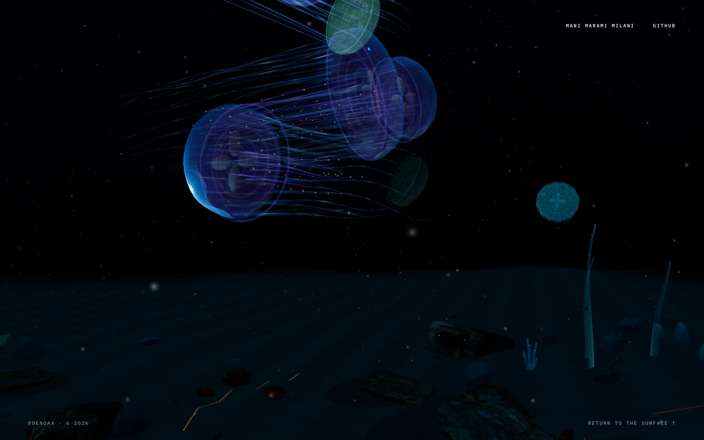
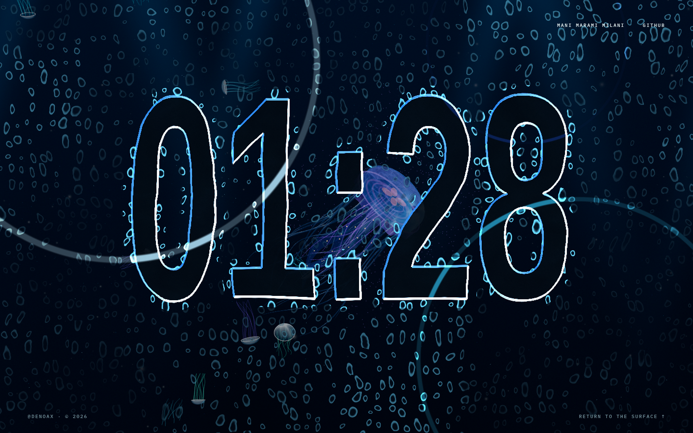
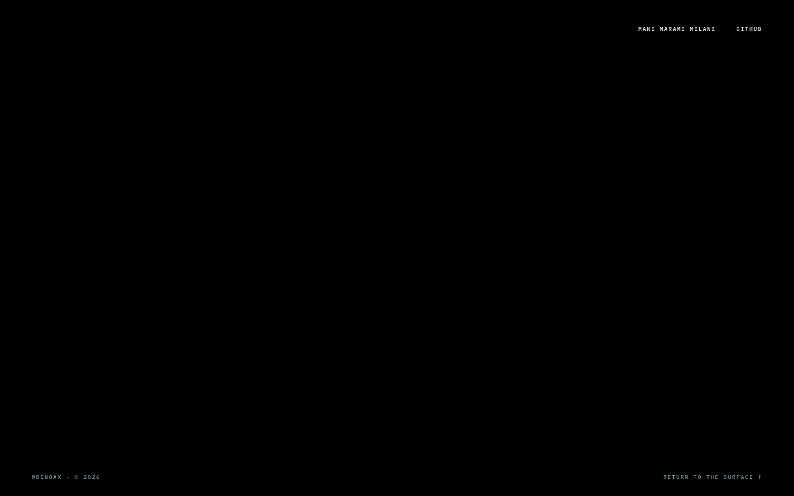
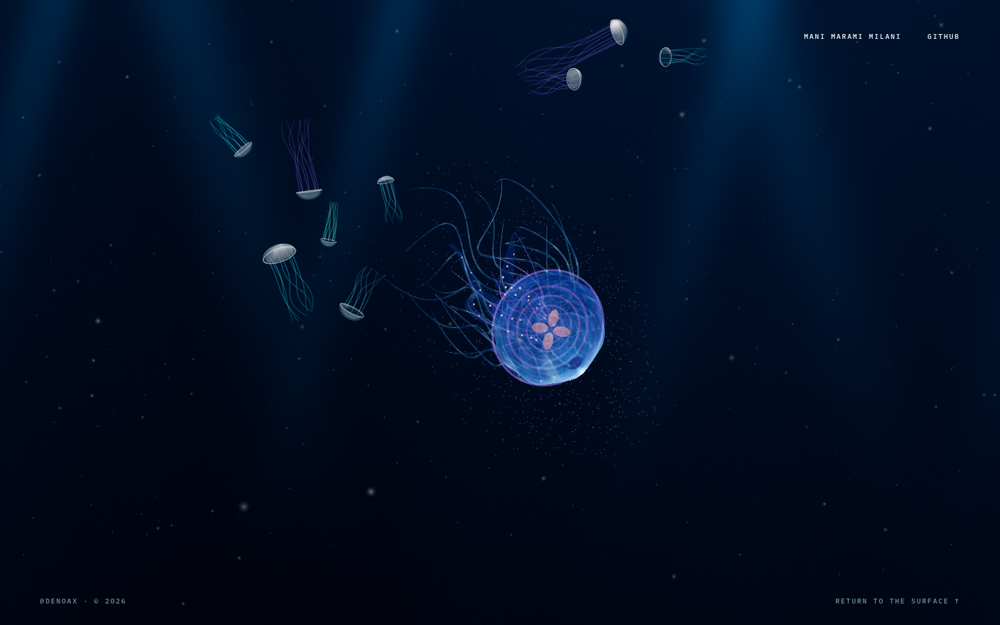
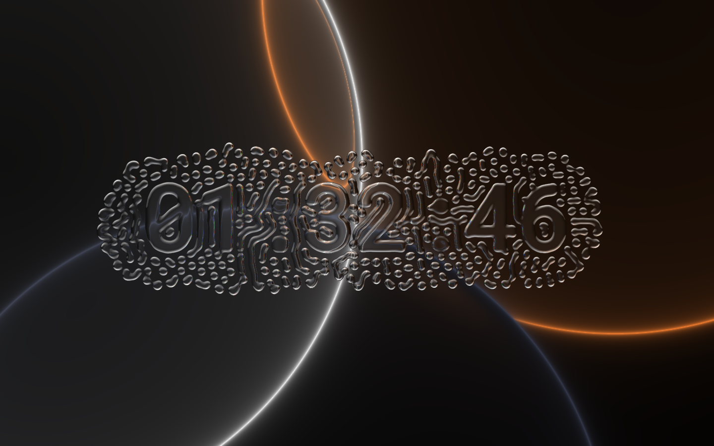
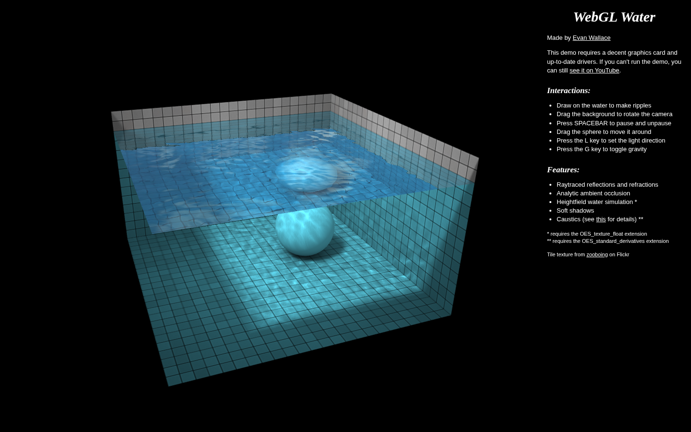
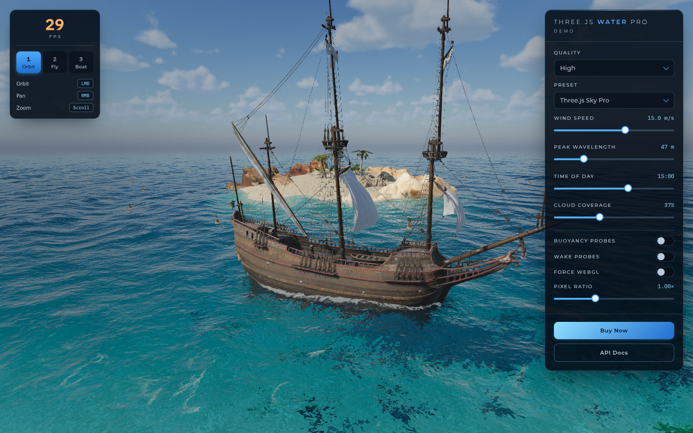

# Pelagic: water visibility, browser failures, and liquid idle research

Research and diagnostic audit, 2026-09-05. Audited application revision: `3c012bfef21e83c8e056299aef3d3e27ffd5a51b`.

This is a research deliverable, not a release. No application fixes are included. The user rejected the previous seafloor treatment and requested substantial research into credible ocean rendering, visitor black screens, liquid displacement, and the choppy idle entrance.

## What the investigation established

The seafloor problem is primarily inconsistent water visibility and surface shading, not insufficient polygon count. The idle effect lacks persistent spatial simulation and starts expensive graphics work inside its entrance transition. A separate, reproducible renderer-selection bug can make the entire ocean black while its internal status still says ready.

The previous local average-FPS result did not establish cross-browser reliability or smooth idle transitions. The findings below replace that overly broad assurance.

## 1. Fresh audit evidence

Browser: isolated Brave sessions on Linux, ANGLE/OpenGL, NVIDIA RTX 4070. Application inspected at the existing local production preview. Screenshots use 1440×900; the clean performance run uses 1920×1080 at device scale factor 1. Browser access used the repository's established Brave/CDP method; no in-app browser tool or browser skill was available in this session.

| Step | What was inspected | Health and evidence |
| --- | --- | --- |
| 1 | Startup and open water | Scene renders on this desktop, but the clean run includes a 1,235 ms startup main-thread task. The exact internal attribution requires a CPU/GPU trace. |
| 2 | Final descent and seafloor | Visually weak: a broad flat-looking floor silhouette meets black water; lava still reads as thin angular strokes; circular contact shadows are visible. |
| 3 | Idle entrance | Reproduced hitch: a second WebGL context starts at 12.17 s in the accelerated idle test; a 125 ms main-thread task overlaps that startup. A 116.5 ms animation-frame interval occurs in the entry window. |
| 4 | Idle interaction and dismissal | Clock renders and Escape dismisses it. Deformation is attached to the current pointer region; it has no persistent spatial velocity/displacement field. The reference's material behavior is not reproduced. |
| 5 | WebGPU advertised, adapter unavailable | Reproduced silent black canvas. A real WebGL2 context is created, but app metadata says WebGPU and the application chooses the post-processing path associated with that assumption. No console errors. |
| 6 | Same failed-adapter conditions, explicit WebGL | Ocean renders. This is the control for step 5, using `?renderer=webgl&idle=300`. |
| 7 | Graphics access denied at startup | Reproduced empty dark page. Internal status is error, but there is no visible explanation, fallback artwork, or recovery action. |
| 8 | Graphics context lost after successful startup | Reproduced empty dark page. Drawing stops while application status remains ready. No application recovery occurs in the observed interval. |

### Seafloor, step 2

The organisms remain readable and the sparse interface is appropriate. The environment below them does not yet read as a coherent volume of water: the distant terrain remains a separate visible surface, while its details and shadows do not disappear consistently with distance.

### Idle, steps 3–4

The clock has strong contrast, but the sharp luminous outline and repeated small rings look more like an outlined mask than rounded liquid thickness. This is a rendering observation; screenshots alone cannot establish motion quality. The timing and source inspection establish the entrance and displacement findings.

### Silent renderer fallback failure, step 5

### Control: explicit WebGL, step 6

### Measurement limits

The final performance run deliberately took no screenshots during measurement. Screenshot capture in the first exploratory run produced unrelated frame gaps; those gaps are excluded from conclusions. In the clean run, established ocean and idle animation had approximately 16.67 ms frame intervals, while the idle entrance still stalled. Browser animation callbacks and intercepted drawing calls are not GPU completion timestamps and do not establish presented FPS on other devices.

A requested software-rendering experiment still identified the NVIDIA GPU. It is invalid as a low-end/software benchmark and is not presented as one. Safari/iOS, Firefox, Android hardware, battery modes, 4K/retina output, and the visitors' actual devices have not been validated. Denied graphics, context loss, and failed adapter acquisition are deliberately induced conditions, not proof of which condition affected a particular visitor.

Accessibility observations: decorative idle is disabled by the existing reduced-motion preference, and Escape dismissal worked. Error status exists only inside an aria-hidden stage; visitors receive no accessible recovery explanation. No full accessibility compliance claim is made.

## 2. Human-authored reference projects and what they contribute

| Reference | Evidence inspected | Useful principle and relevance |
| --- | --- | --- |
| [Crest, Wave Harmonic](https://crest.readthedocs.io/en/4.20.1/user/underwater.html) | Official underwater documentation, project illustration, and [underwater shader source](https://github.com/wave-harmonic/crest/blob/master/crest/Assets/Crest/Crest/Shaders/Underwater/UnderwaterEffectIncludes.hlsl) | Applies channel-dependent exponential fog using distance through water and a scattering color. Transparent surfaces need compatible treatment. This is the strongest reference for dissolving the floor into water. Unity implementation; principles must be adapted. |
| [Jasper Flick / Catlike Coding](https://catlikecoding.com/unity/tutorials/flow/looking-through-water/) | Tutorial, depth diagrams, fog and refraction explanation | Shows why alpha transparency alone cannot represent light traveling through water. Its specific camera setup looks through a surface, so it is conceptual support rather than a drop-in underwater-camera implementation. |
| [Evan Wallace, WebGL Water](https://madebyevan.com/webgl-water/) | Live browser capture and author feature description | Coherent refraction, moving heightfield, caustics, and contact shading make simple geometry feel physical. A pool is intentionally bounded, so it is not a reference for hiding an infinite seafloor. Useful for liquid response and light integration. |
| [Dan Greenheck, Three.js Water Pro](https://www.threejswaterpro.com/) | Live surface demo at High quality, visible quality and pixel-ratio controls | Water detail has several scales, a continuous horizon, and a quality strategy. The visible demo readout was 29 FPS in one capture; that is not a benchmark or comparison ranking. Its underwater mode was not exercised in this audit. Treat commercial code as reference, not something to copy. |
| [David Li, Ocean Wave Simulation](https://github.com/dli/waves) | Author repository, README and [author demo listing](https://experiments.withgoogle.com/ocean-wave-simulation) | Dedicated wave simulation separates evolving water shape from its display. Useful surface-motion precedent, but FFT surface waves do not fix an underwater floor by themselves. The live URL failed in the web retrieval; no live visual audit is claimed. |
| [SimonDev, Procedural Terrain Part 5](https://github.com/simondevyoutube/ProceduralTerrain_Part5) | Terrain shader source and repository license | World-space triplanar material sampling, corrected normal blending, and texture repetition breakup address the floor's material problem. MIT source, with attribution required if reused. This is terrain technique research, not a live underwater comparison. |
| [chiuhans111, FluidGlass](https://github.com/chiuhans111/fluidglass) | Live capture, author README, repository structure | Author identifies reaction–diffusion, Navier–Stokes, and glass shading as the ingredients. The rounded cells and numbers emerge from coupled fields. No license was listed or present at repository root when checked; implement an original system rather than copy its shaders/assets. |
| [Robin Delaporte, Codrops/OGL flowmap](https://tympanus.net/codrops/2019/09/25/mouse-flowmap-deformation-with-ogl/) | Author tutorial and [OGL Flowmap implementation](https://github.com/oframe/ogl/blob/master/src/extras/Flowmap.js) | Two alternating textures preserve a velocity trail and its decay. A very useful inexpensive displacement baseline. It does not itself provide incompressible fluid, cell merging, or elastic restoration. |
| [Pavel Dobryakov, WebGL Fluid Simulation](https://github.com/PavelDoGreat/WebGL-Fluid-Simulation) | Source pipeline, settings, fallback handling and MIT license | Separates simulation resolution from visual output; uses velocity advection, divergence, pressure solving, and correction. This supplies the persistent-flow behavior the current idle effect lacks. |
| [Ash Weeks, Medusae](https://milcktoast.com/medusae/) | Author credits and project description | Maintains the original anatomical/art direction reference. This particular reference identifies Three.js and Particulate; it should not be described as evidence of a modern WebGPU implementation. No fresh interactive capture was made here. |

Reference screenshots are study material, not assets proposed for shipping:

## 3. Why the current floor fix is insufficient

The current floor is 96 units square, with 160×160 desktop subdivisions. Its edge fade depends on local X/Z extent, from 58% to 94% of the half-width. The camera far plane is 48 units. These settings do not guarantee that the floor has visually disappeared before the camera clips it from every view.

More fundamentally, the floor's fading color is unrelated to the animated water behind it. The background has its own depth/color function; various jellyfish materials have their own haze; terrain and many environmental objects have no shared water-distance treatment. Darkening a geometric border does not make the entire visible floor recede naturally.

The floor also contains explicit emissive shading, two repeated sine patterns, low-frequency height variation, and hard circular meshes used as contact shadows. Increasing subdivisions cannot repair those material and integration cues. The sine combination is visible as regular bands. The new lava ribbons remain visually thin segmented strokes; darkening them further would only hide that problem.

### Recommended water and terrain approach

Use one shared optical model for underwater visibility. In a simplified model, transmission is `T = exp(-extinctionRGB × distanceThroughWater)`, and the observed color blends the attenuated surface light with scattered water light. Keep camera depth, visibility distance, local light, and material brightness as separate controls. This recommendation follows the Crest/Three.js fog principles, adapted to our moving camera.

For a first implementation, analytically shade distance in the terrain/environment materials and use the same far-water color as the background. This can be substantially cheaper than a full volumetric ray march. Apply equivalent attenuation to rock highlights, emissive cracks, particles, and transparent organisms. If a later depth-based composite is used, account for transparent jellyfish explicitly; opaque depth alone cannot locate their surfaces correctly. [Three.js fog guidance](https://threejs.org/manual/en/fog.html) also emphasizes matching the fog and background.

Author the visible terrain as a recessed basin with irregular low ridges. Concentrate geometry and material detail near the camera; the far region should lose contrast before any mesh boundary or far-plane cut. With this bounded camera path, several authored terrain patches or a compact ring arrangement should be enough. Full infinite-terrain streaming is unnecessary unless free exploration is introduced. [Geometry clipmaps research](https://developer.nvidia.com/gpugems/gpugems2/part-i-geometric-complexity/chapter-2-terrain-rendering-using-gpu-based-geometry) is a useful LOD principle, not a requirement to rebuild the entire renderer.

Use material layers at three scales: broad basalt/sediment deposits, medium crevices and grit, and fine normal/roughness detail. Blend by slope, height, and authored masks; break obvious repetition in world space. A [CC0 rocky terrain material](https://polyhaven.com/a/rocky_terrain_02) is a candidate to evaluate, not an already-approved asset. Favor selective 1–2K maps and appropriate mipmaps over indiscriminate 4–8K downloads. Replace circular shadow stickers with soft, terrain-conforming contact occlusion. Higher-quality scanned rocks should intersect and share sediment with the floor.

Volcanic detail should come from cracks in actual crust, with warm internal surfaces and localized reflected light. Rounded basalt lobes need crevice emission masks instead of uniform red material. Small bubbles should have a visible birth, slow ascent, and cooling/fade, not teleport visibly from top to bottom. Keep this secondary to the ocean and animals.

## 4. Browser reliability: confirmed causes and remaining hypotheses

### Confirmed: backend selection becomes stale after automatic fallback

`HeroScene.jsx` derives `forceWebGL` from a query, `navigator.gpu`, and `navigator.brave`. Three.js 0.175 independently chooses a fallback in `Renderer.init()`. Our code continues to use the original boolean for metadata, prewarming and render-path selection. The experiment exposed WebGPU but returned null from adapter acquisition, which is a valid unavailable-adapter condition. The library created WebGL2; the application still reported WebGPU. The result was black with no console error. Explicit WebGL restored the image in the control.

Read the actual initialized backend and select a validated rendering path from that result. Use the same selection for compilation, normal frames, scrolling, post-processing and diagnostics. A successful `init()` or a ready flag cannot prove correct pixels. This is consistent with [Three.js renderer fallback documentation](https://threejs.org/manual/en/webgpurenderer) and [MDN adapter acquisition semantics](https://developer.mozilla.org/en-US/docs/Web/API/GPU/requestAdapter). Current documentation must be checked against our installed 0.175 source before code changes.

### Confirmed: missing application recovery

Initialization catch only sets an internal error status. The rendered JSX has no visible failure experience. Context loss triggers library behavior but no application rebuild or usable substitute. Per-frame failures only log, allowing an indefinitely failing animation loop.

Implement a bounded state machine for loading, running, reduced quality, recovering and unavailable graphics. Retry once through a verified basic WebGL2 path where possible; restore a useful visual with working navigation on terminal failure. A fallback poster would be an accessibility/compatibility substitute only, while supported devices retain live geometry. Handle device/context loss and prevent uncontrolled retry loops. [MDN context-loss guidance](https://developer.mozilla.org/en-US/docs/Web/API/HTMLCanvasElement/webglcontextlost_event)

### Risks not yet proven on visitors' devices

The default scene quality follows viewport width rather than measured rendering capacity. It runs costly transparent geometry and full-screen shading, and idle adds another canvas/context. Device pixel ratio increases fragment work quadratically. Backend-specific floating-point render targets and post-processing may fail on other GPU/driver combinations. These are credible risks, not diagnosed causes on unspecified visitor hardware.

Start with a conservative live scene and adapt after sampling actual work. Reduce render resolution, bloom/auxiliary passes and distant detail before degrading nearby organism silhouettes. Freeze or throttle hidden/offscreen work. Account for texture/render-target memory and use [GPU-compressed texture formats](https://threejs.org/docs/pages/KTX2Loader.html) where they materially help. Avoid a disruptive Three.js upgrade and shader migration in the same patch as the fallback fix. [MDN WebGL engineering guidance](https://developer.mozilla.org/en-US/docs/Web/API/WebGL_API/WebGL_best_practices)

## 5. Idle: better displacement and a smooth entrance

### Current implementation

The fragment shader calls `clockMask()` 13 times per pixel. Every call includes five noise octaves and samples both clock textures. Other fields add further noise. That is roughly 105 `noise21()` evaluations and up to 26 clock texture samples per fragment at the source level, before compiler optimization. Expensive minute-transition calculations still run between minute changes.

Pointer position, velocity and a decaying scalar are retained, but there is no spatial history texture. The current deformation follows the cursor, so a trail cannot keep circulating or spreading after the pointer leaves. Grid-generated cells have no state that lets them join, divide or move independently. Alpha overlay also does not refract the real ocean framebuffer; the glass-like color is fabricated in the overlay shader.

### Proposed simulation and shading

Use a persistent low-resolution two-dimensional field. A 128-cell short axis is a reasonable starting budget, with 256 considered only after measurement. Store velocity and either displacement/thickness or advected mask data. Inject motion along the cursor's traversed segment so fast input does not leave gaps. Advance with a fixed timestep, bounded substeps and time-based decay.

For a restrained gel effect, first implement advection plus a damped return toward a rest field. A simple OGL-style flowmap is a good low-cost baseline, but its decay alone is not elastic spring behavior. If the desired rolling liquid needs it, add pressure correction following the [GPU fluid methods described by Mark Harris](https://developer.nvidia.com/gpugems/gpugems/part-vi-beyond-triangles/chapter-38-fast-fluid-dynamics-simulation-gpu) and Pavel's independently inspectable implementation. Stronger vorticity must remain controlled; the user has repeatedly rejected chaotic motion.

For FluidGlass-like cells that merge and separate, add an original reaction–diffusion or smooth level-set layer coupled to velocity. The author's [README](https://raw.githubusercontent.com/chiuhans111/fluidglass/main/README.md) confirms that reaction–diffusion is part of the reference; more radial UV wobble cannot substitute for that behavior. The clock can supply an attractor/rest mask so deformation remains readable and the digits gradually reform.

Build rounded normals and highlights from field gradients. Cache a clock distance/thickness representation when the minute changes, rather than recomputing a noisy wide outline many times per pixel. Shade at display resolution from a few field samples. If the effect should refract the living ocean, composite from the ocean color target in the same renderer. Clamp displacement near the frame boundary and handle aspect ratio in all interaction terms.

### Entrance and exit

Current CSS already animates opacity, a generally efficient property. The measured hitch occurs when idle mounts a new renderer and resources while that fade is starting. A different easing curve will not remove a 125 ms main-thread task.

Preferred architecture: one renderer and one animation scheduler with an idle composite pass. Port the idle shader to the material system used by that renderer, rather than inserting raw ShaderMaterial into WebGPURenderer. A smaller interim fix can keep the separate canvas but prepare it gradually, render its first valid frame before setting visible opacity, and avoid rebuilding it at every idle entrance.

Use a lifecycle such as dormant → preparing → ready → entering → active → leaving. Opacity starts only after readiness; dismissal cancels pending entry; the exit frame remains available until opacity reaches zero. Shader compilation and texture preparation should be moved off the entrance boundary. [MDN parallel shader compilation](https://developer.mozilla.org/en-US/docs/Web/API/KHR_parallel_shader_compile) describes nonblocking completion checks, while [web.dev animation guidance](https://web.dev/articles/animations-guide) explains why opacity/transform can stay cheap when expensive work is not coupled to them.

Keep GPU memory ownership explicit if resources persist between idle periods. [Three.js disposal guidance](https://threejs.org/manual/en/how-to-dispose-of-objects.html) documents that textures, targets, geometries and materials need separate lifecycle management.

## 6. Concrete implementation order and release gates

1. **Reliability patch:** select the actual backend after initialization; reproduce failed-adapter fallback and compare pixels; add initialization/device-loss recovery and an accessible terminal state. Pass the same controlled cases that failed here.
2. **Idle lifecycle and budget:** remove renderer startup from the fade boundary, cache clock work, coordinate rendering budgets. Measure entry, exit, first interaction, repeat entry and minute rollover separately. Do not rely only on average FPS.
3. **Shared underwater visibility:** build a simple terrain/fog test with depth debug output; ensure all camera views dissolve before geometry/clipping boundaries. Then add terrain and animals to the same optical model.
4. **Material/art pass:** terrain layers, integrated scans, soft contact occlusion and crusted volcanic surfaces. Judge brightened diagnostic captures too, so darkness cannot conceal bad seams or geometry.
5. **Persistent liquid field:** validate a small displacement prototype, then clock/cell coupling and rounded glass shading. Compare a continuous cursor sweep, pause, reversal, and release against the research references.

Proposed acceptance targets, not current achievements:

- No silent black screen in adapter denial, graphics denial, failed post-processing, and context/device-loss cases.
- Stable 60 FPS target on a representative desktop; coherent reduced-quality live rendering at 30 FPS or better on a selected midrange mobile device. Real device measurements decide the budget.
- No main-thread task over 50 ms during the visible idle entrance/exit; inspect frame-time tails and dropped frames, not just mean FPS.
- Clean floor recession at 0.7, 0.85, 0.95 and 1.0 progress, portrait, landscape and ultrawide, with no visible clipping boundary.
- Clock/cells keep deformation history after the cursor leaves, recover smoothly, and stay stable under rapid movement and repeated idle cycles.
- Browser matrix includes actual Safari/iOS, Chrome/Android, Firefox and Brave/Chromium, plus WebGPU success, WebGL fallback, reduced motion, hidden-tab resume and graphics unavailable.

## Evidence files and reproducibility

`2026-09-05-evidence/` contains accepted captures, raw diagnostic JSON, and the isolated audit script. `profile.json` is the no-screenshot performance run. `fallback.json` and `fallback-control.json` are the most direct renderer-path comparison. These tests use isolated browser profiles and runtime instrumentation; they do not modify application behavior on the deployed site.

The compatibility state and image must both be checked. Step 5 deliberately demonstrates that a ready flag, a running requestAnimationFrame loop, submitted drawing calls and an empty error list can coexist with a completely black artwork.
