# Motion gallery

Actual browser recordings of approved runtime `bce3571b0300ecfe5dc6e5dd45f28a9cda57006e`. Full MP4s are staged outside Git. Open the local publication preview described in REPRODUCIBILITY.md for playback. All previews are optional; no autoplay is used on the companion page.

## S1 — Pulse, refill and coast

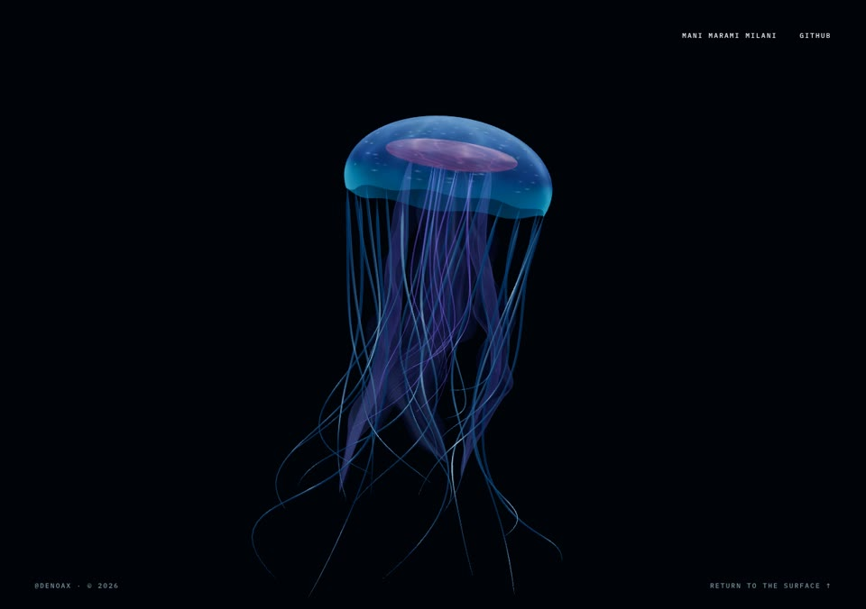

15.97 seconds; observed 29.99 fps; encoded 30 fps. [Metadata](media/S1.json). Source clip: supplemental-media/S1/motion.mp4 in the staged package. Frame timestamps are retained; encoding can repeat source frames.

## S2 — Body turn and appendage history

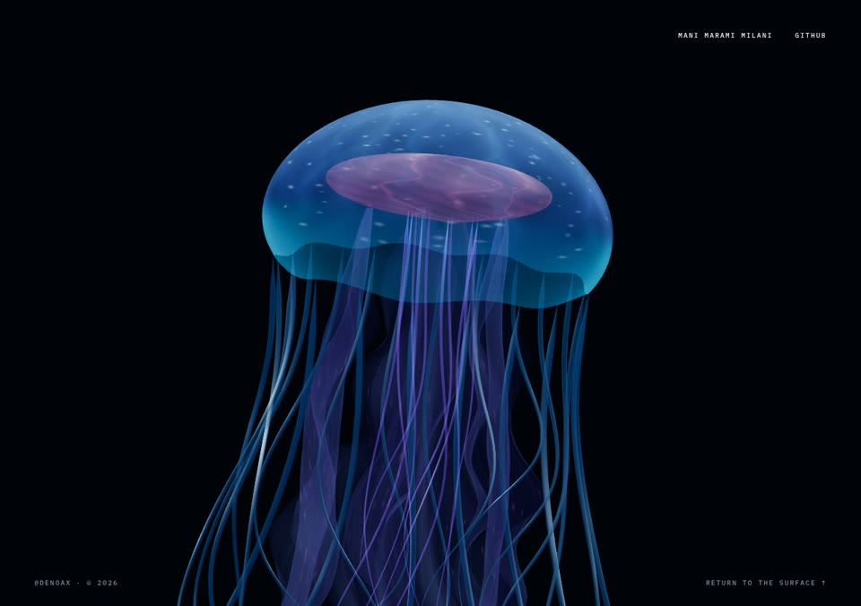

15.94 seconds; observed 29.99 fps; encoded 30 fps. [Metadata](media/S2.json). Source clip: supplemental-media/S2/motion.mp4 in the staged package. Frame timestamps are retained; encoding can repeat source frames.

## S3 — Activation and environmental decay

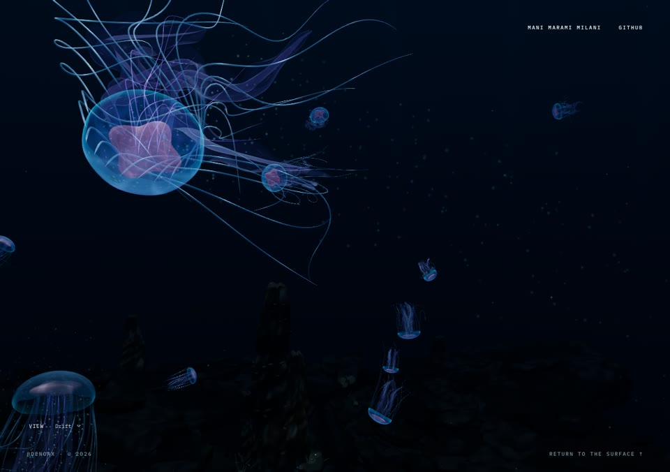

13.97 seconds; observed 30.00 fps; encoded 30 fps. [Metadata](media/S3.json). Source clip: supplemental-media/S3/motion.mp4 in the staged package. Frame timestamps are retained; encoding can repeat source frames.

## S4 — Projected detail during camera travel

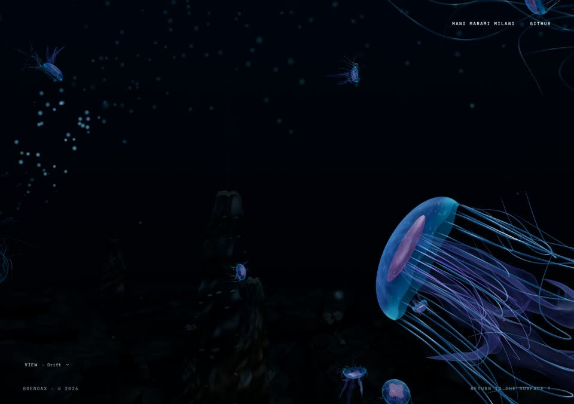

16.33 seconds; observed 30.00 fps; encoded 30 fps. [Metadata](media/S4.json). Source clip: supplemental-media/S4/motion.mp4 in the staged package. Frame timestamps are retained; encoding can repeat source frames.

## S5 — Live bubble passage

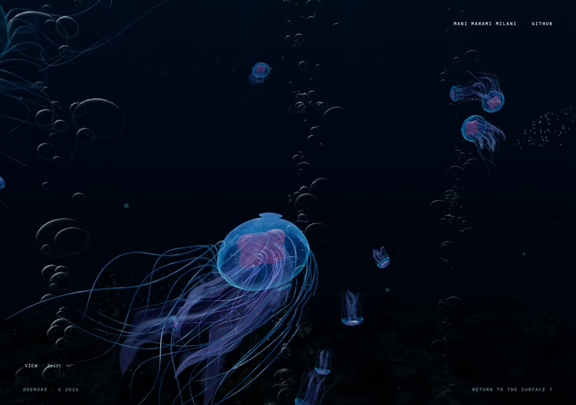

17.97 seconds; observed 30.00 fps; encoded 30 fps. [Metadata](media/S5.json). Source clip: supplemental-media/S5/motion.mp4 in the staged package. Frame timestamps are retained; encoding can repeat source frames.

## S6 — Four views and Explore

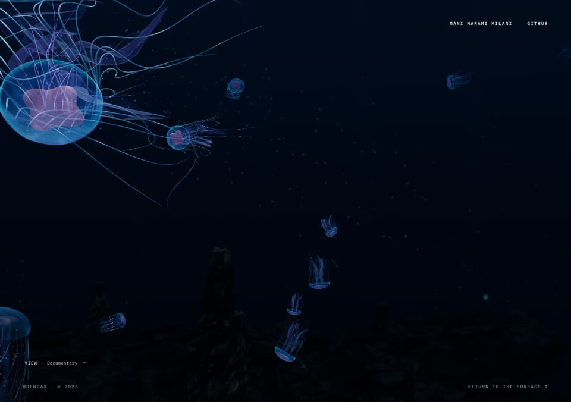

19.97 seconds; observed 30.00 fps; encoded 30 fps. [Metadata](media/S6.json). Source clip: supplemental-media/S6/motion.mp4 in the staged package. Frame timestamps are retained; encoding can repeat source frames.

## S7 — Sanctuary plume

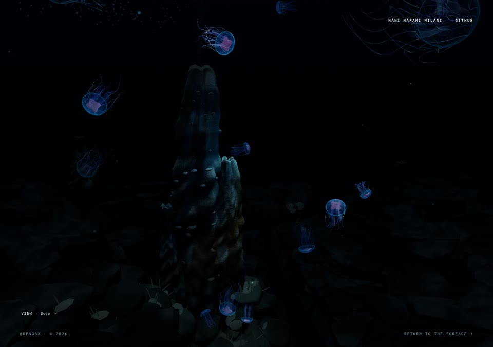

13.97 seconds; observed 30.00 fps; encoded 30 fps. [Metadata](media/S7.json). Source clip: supplemental-media/S7/motion.mp4 in the staged package. Frame timestamps are retained; encoding can repeat source frames.

## S8 — Ocean-to-clock entry

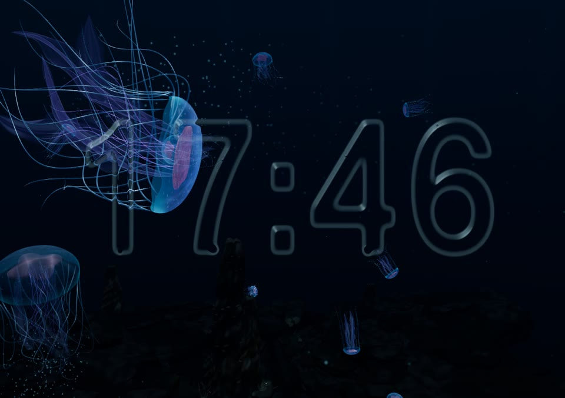

10.96 seconds; observed 30.01 fps; encoded 30 fps. [Metadata](media/S8.json). Source clip: supplemental-media/S8/motion.mp4 in the staged package. Frame timestamps are retained; encoding can repeat source frames.

## S9 — Contact and merge

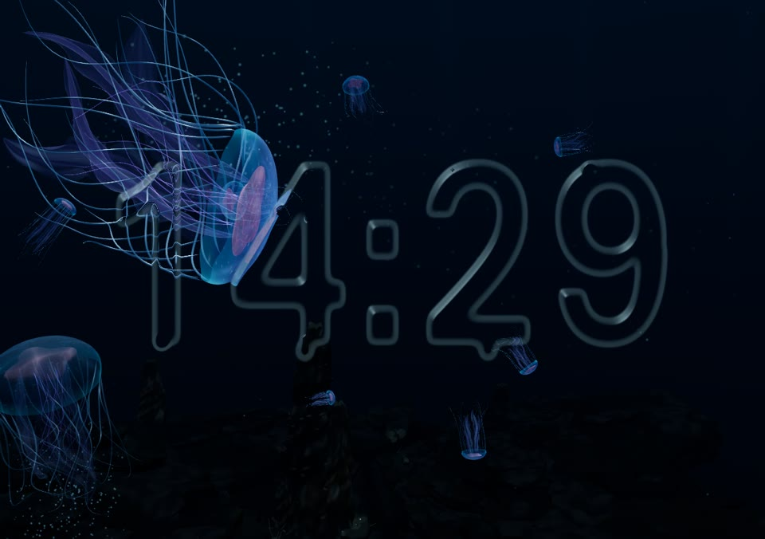

10.97 seconds; observed 30.00 fps; encoded 30 fps. [Metadata](media/S9.json). Source clip: supplemental-media/S9/motion.mp4 in the staged package. Frame timestamps are retained; encoding can repeat source frames.

## S10 — Pointer deformation and recovery

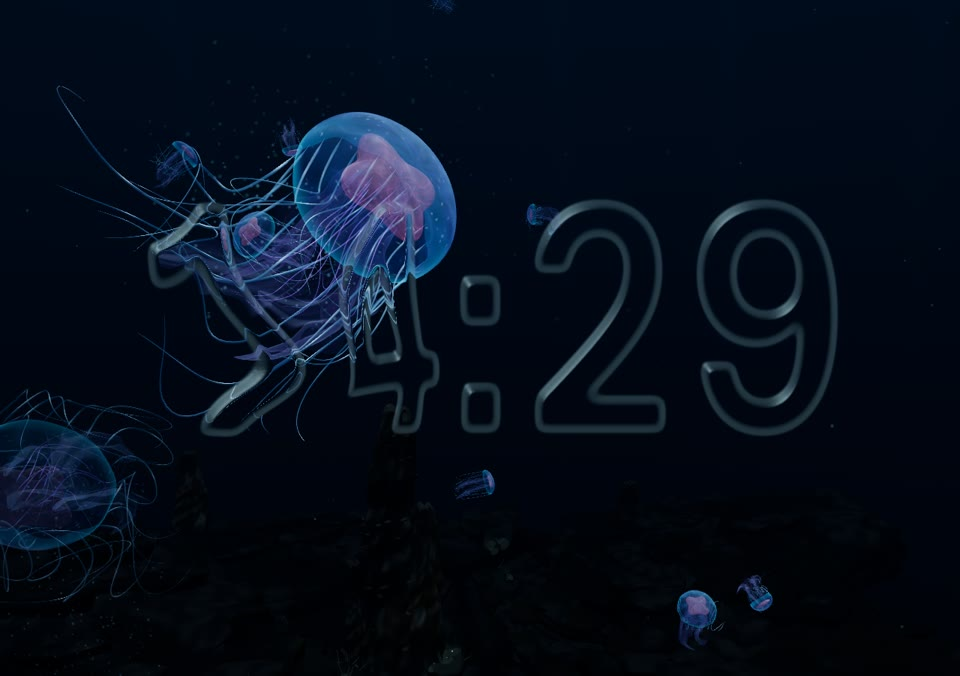

13.87 seconds; observed 30.00 fps; encoded 30 fps. [Metadata](media/S10.json). Source clip: supplemental-media/S10/motion.mp4 in the staged package. Frame timestamps are retained; encoding can repeat source frames.

## S11 — Minute change

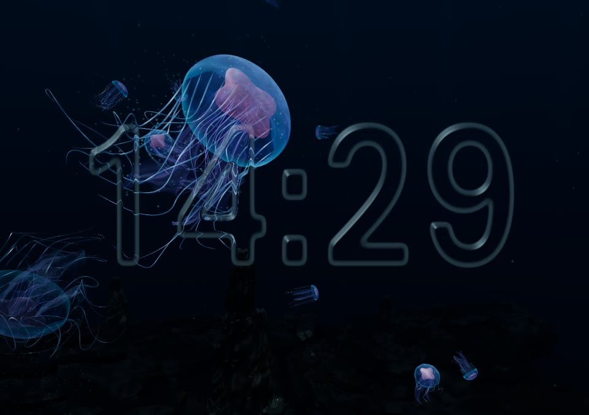

8.97 seconds; observed 30.00 fps; encoded 30 fps. [Metadata](media/S11.json). Source clip: supplemental-media/S11/motion.mp4 in the staged package. Frame timestamps are retained; encoding can repeat source frames.

## S12 — Pinch dismissal

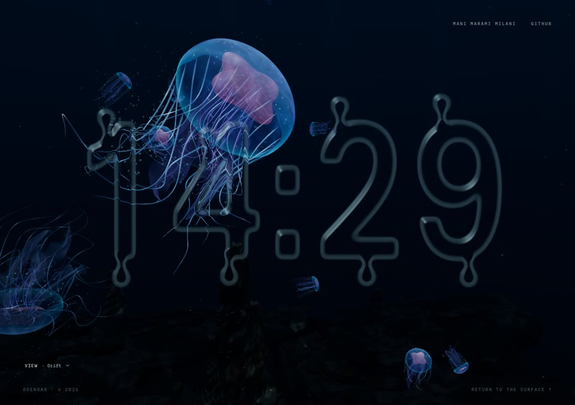

7.77 seconds; observed 30.00 fps; encoded 30 fps. [Metadata](media/S12.json). Source clip: supplemental-media/S12/motion.mp4 in the staged package. Frame timestamps are retained; encoding can repeat source frames.
